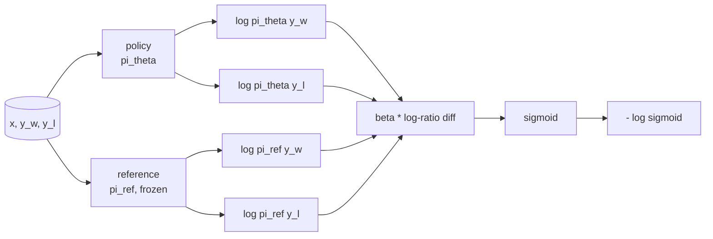
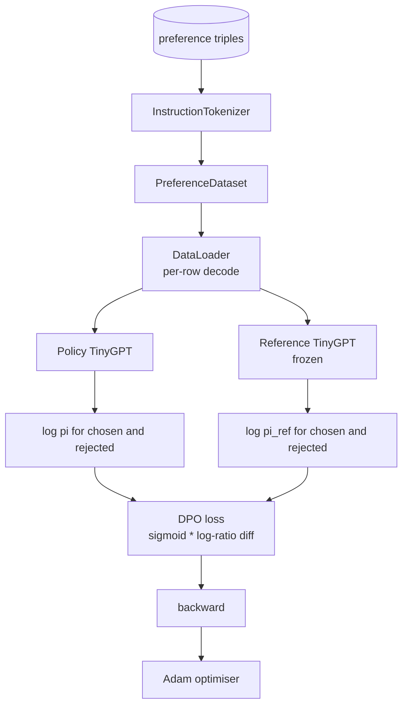

# 毕业项目第 40 课：从零实现 DPO（Direct Preference Optimization）

> 奖励模型加 PPO 是经典的 RLHF 技术栈。DPO 把这套技术栈压缩成一个单一的监督损失，直接用偏好对来拟合策略。本课从奖励差恒等式出发推导 DPO 损失，实现一个可用的参考模型与策略模型，计算逐 token 对数概率，并在一组由 chosen 和 rejected 补全组成的偏好数据上训练一个微型 transformer。测试会锁定损失的数学形式和梯度方向，让你确信实现与论文一致。

**Type:** Build
**Languages:** Python (torch, numpy)
**Prerequisites:** Phase 19 lessons 30-37 (NLP LLM track: tokenizer, embedding table, attention block, transformer body, pre-training loop, checkpointing, generation, perplexity)
**Time:** ~90 minutes

## 学习目标

- 将 DPO 损失推导为对缩放后的对数比值差取 sigmoid 的形式，并把它与隐式奖励联系起来。
- 构建一对参考模型与策略模型：参考模型冻结，策略模型可训练。
- 在两个模型下计算序列级对数概率，并对提示词（prompt）位置的 token 做掩码。
- 在 `(prompt, chosen, rejected)` 三元组上训练策略，观察 chosen 的对数概率相对 rejected 持续上升。
- 用测试锁定行为：损失的数学形式、梯度符号、以及参考模型的不变性。

## 问题背景

你手上有一个 SFT 模型。它能听从指令，但输出参差不齐；有的补全清晰准确，有的啰嗦或干脆错了。你还有一个小规模的偏好对数据集：对同一个提示词，人类标注者把其中一个补全标为 chosen，另一个标为 rejected。

经典的 RLHF 做法是一条两阶段流水线：先用偏好数据训练一个奖励模型，再用 PPO 让策略最大化奖励。这条路走得通，但代价高昂：PPO 训练时要在内存里同时放两个模型，要靠 KL 控制把策略约束在参考模型附近，而当奖励模型不够稳健时还会出现奖励作弊（reward hacking）。

DPO 用一个监督损失取代了这两个阶段。奖励模型从不显式存在。策略直接在偏好对上训练，同时带有一个指向 SFT 参考模型的显式 KL 惩罚。在 Bradley-Terry 偏好模型下，它得到与 RLHF 相同的最优解，但代码量少得多。

## 核心概念

从 Bradley-Terry 模型出发。给定提示词 `x` 和两个补全 `y_w`（chosen）与 `y_l`（rejected），人类偏好 `y_w` 的概率是

```text
P(y_w > y_l | x) = sigmoid( r(x, y_w) - r(x, y_l) )
```

其中 `r` 是某个潜在的奖励函数。RLHF 先从偏好数据拟合出 `r`，再训练策略 `pi` 在 KL 锚点约束下最大化 `r`：

```text
max_pi   E_{x, y~pi} [ r(x, y) ] - beta * KL(pi || pi_ref)
```

DPO 的推导注意到：在这个目标下，最优策略 `pi*` 可以用 `r` 写出闭式解：

```text
pi*(y | x) = (1/Z(x)) * pi_ref(y | x) * exp( r(x, y) / beta )
```

反解出 `r`：

```text
r(x, y) = beta * ( log pi*(y | x) - log pi_ref(y | x) ) + beta * log Z(x)
```

`log Z(x)` 这一项对 `y_w` 和 `y_l` 是相同的（它只依赖 `x`，不依赖 `y`），所以在计算偏好差时会相互抵消：

```text
r(x, y_w) - r(x, y_l) = beta * ( log pi_theta(y_w|x) - log pi_ref(y_w|x)
                                - log pi_theta(y_l|x) + log pi_ref(y_l|x) )
```

把它代回 Bradley-Terry 的 sigmoid，并对偏好对取负对数似然：

```text
L_DPO(theta) = - E_{(x, y_w, y_l)} [
  log sigmoid( beta * ( log pi_theta(y_w|x) - log pi_ref(y_w|x)
                       - log pi_theta(y_l|x) + log pi_ref(y_l|x) ) )
]
```

这就是损失函数。它对每个样本只是一个标量上的 sigmoid，由四个对数概率算出。没有单独的奖励模型。没有 PPO。损失里也没有 KL 项；KL 约束已经内嵌在闭式解的推导之中。



## 梯度的符号

这是任何训练运行之前都值得做的一项健全性检查。对 `log pi_theta(y_w | x)` 求梯度：

```text
d L_DPO / d log pi_theta(y_w | x) = - beta * (1 - sigmoid(z))
```

其中 `z` 是 sigmoid 的输入。这个梯度对所有 `z` 都是负的，含义是：提高策略对 chosen 补全的对数概率会降低损失。对称地，对 `log pi_theta(y_l | x)` 的梯度是正的：提高 rejected 的对数概率会增大损失。训练把 chosen 推高、把 rejected 压低。参考模型是冻结的，它不会移动。

## 数据

本课附带十二条偏好三元组，每条是 `(prompt, chosen, rejected)`。chosen 补全简短而准确，rejected 补全则啰嗦、跑题或干脆错误。这些偏好对覆盖与第 39 课相同的任务族（首都、算术、列表），因此从 SFT 基座出发的策略有一个合理的起点。

这组数据故意做得很小。生产环境中 DPO 通常在数万条偏好对上运行；这里的重点在于：损失的数学和训练循环能在一个微型数据集上端到端跑通，并且 chosen 与 rejected 之间的对数概率差距会肉眼可见地拉大。

## 参考模型不变性

DPO 的实现必须谨慎处理参考模型。参考模型就是被原地冻结的 SFT 模型。以下三条性质必须成立：

- 参考模型的参数永远不会收到梯度。
- 参考模型的对数概率在各个 epoch 之间永远不变。
- 策略从与参考模型完全相同的权重出发。（最优 `theta` 是参考模型加上一个学到的更新；把策略初始化为参考模型的副本是定义良好的起点。）

实现通过以下手段保证这些性质：

- 前向传播时把参考模型包在 `torch.no_grad()` 中。
- 给参考模型的每个参数设置 `requires_grad=False`。
- 在参考模型构建完成后，通过 `policy.load_state_dict(reference.state_dict())` 构造策略。

## 架构



模型与第 39 课使用的 TinyGPT 相同（仅解码器、因果掩码、字节级分词器）。参考模型与策略共享同一架构；训练过程中策略的权重逐渐偏离参考模型，而参考模型保持固定。

## 你将构建什么

实现由一个 `main.py` 加测试组成。

1. `InstructionTokenizer`：带 `INST` 和 `RESP` 特殊符号的字节级分词器。与第 39 课形态相同。
2. `TinyGPT`：仅解码器的 transformer。与第 39 课形态相同，因此即使跳过了第 39 课，本课也是自包含的。
3. `make_preferences`：返回十二条 `(prompt, chosen, rejected)` 三元组。
4. `sequence_log_prob`：给定模型、提示词前缀和补全，返回补全部分逐 token 下一个 token 对数概率之和（提示词位置不计入）。
5. `dpo_loss`：接收四个对数概率和 `beta`，返回逐样本损失张量以及用于日志的隐式奖励差。
6. `train_dpo`：每个 epoch 的循环，在策略和参考模型下计算 chosen 与 rejected 的对数概率，套用损失，并执行 Adam 更新。
7. `evaluate_margins`：在任意时刻返回策略下 chosen 与 rejected 对数概率差距的均值。
8. `run_demo`：通过一次小规模的预训练热身构建参考模型和策略，复制权重，训练三十步，打印每步的损失和差距，成功时以零退出码结束。

## DPO 为什么有效

在 Bradley-Terry 偏好模型下，DPO 在数学上与 RLHF 等价（差别仅在奖励的参数化方式）。隐式奖励 `r(x, y) = beta * (log pi(y|x) - log pi_ref(y|x))` 从偏好数据中可辨识到差一个只依赖 `x` 的函数，而该函数在求差时抵消。闭式解的策略让你可以跳过显式奖励模型。KL 约束在结构上得到保证：`pi` 偏离 `pi_ref` 越多，对数比值就越大，sigmoid 随之饱和，从而在策略走得太远时抑制梯度。参考模型就是你的安全网。

## 进阶目标

- 给对数概率之和加上长度归一化：除以补全长度。长度偏置是 DPO 已知的失效模式——模型会倾向于选择更短的补全，因为它们的对数概率在绝对值上更大。
- 加入损失的 IPO 变体：用 `(z - 1)^2` 替换 sigmoid + log。在本课数据上比较收敛情况。
- 加入一个标签平滑参数，在硬性的 chosen-rejected 标签与均匀的 0.5 之间插值。
- 用一个更小更便宜的模型替换参考模型（带知识蒸馏的味道）。

这份实现交付了损失函数、参考模型不变性和训练循环。数学是这节课的核心，代码让数学变得具体。
