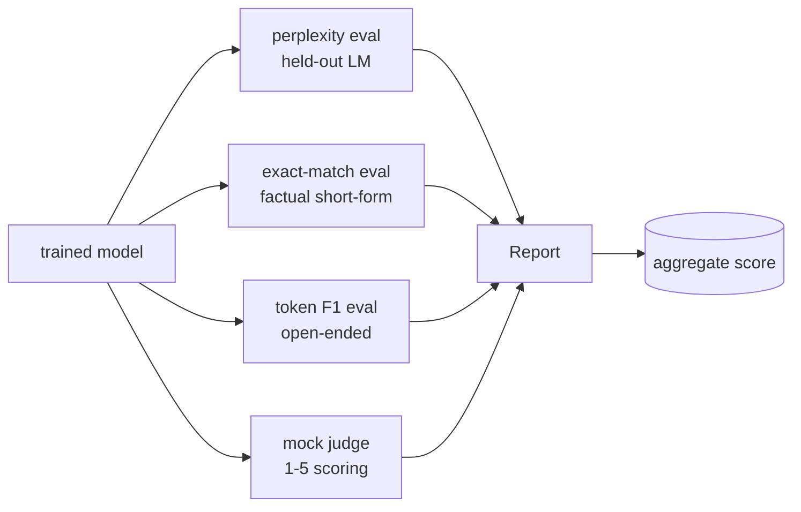
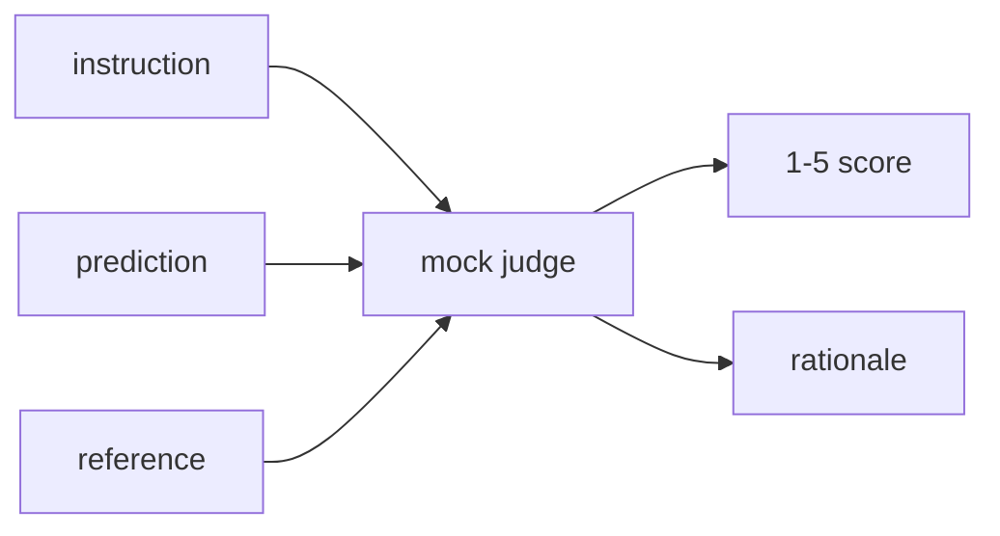
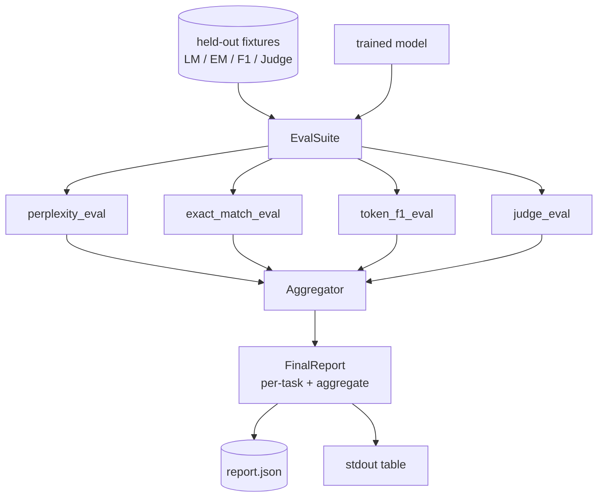

# 毕业设计第 41 课：完整评估流水线

> 训练是可以用损失曲线监控的部分，评估则是必须主动设计的部分。本课构建一条统一的评估流水线：接收任意训练好的语言模型，对它运行四种异构评估，把结果汇总成按任务拆分的报告，并内置一个本地 mock LLM-as-judge，让整个闭环无需联网即可运行。这四种评估覆盖了每个上线模型都需要的维度：语言建模（困惑度）、短答案正确性（精确匹配）、开放式相似度（token 级 F1）以及定性打分（judge 评审）。

**Type:** Build
**Languages:** Python (torch, numpy)
**Prerequisites:** Phase 19 lessons 30-37 (NLP LLM track: tokenizer, embedding table, attention block, transformer body, pre-training loop, checkpointing, generation, perplexity)
**Time:** ~90 minutes

## 学习目标

- 在一个微型 Transformer 上计算留出集困惑度，并正确处理掩码 token 的计数。
- 在短答案事实型提示上运行精确匹配（exact-match）评估。
- 在归一化之后计算预测字符串与参考字符串之间的 token 级 F1。
- 构建一个本地 mock LLM-as-judge，对模型输出按 1-5 分打分。
- 把四种评估汇总成一份带按任务拆分明细的加权报告。

## 问题背景

单一指标永远无法完整刻画一个语言模型。困惑度（perplexity）说明模型对语言分布拟合得多好，却完全不反映它能否回答问题。精确匹配能判断模型是否输出了标准答案字符串，却会惩罚正确的同义改写。token 级 F1 容忍改写，却会被内容错误但词汇重叠的输出欺骗。LLM-as-judge 能捕捉定性维度，却昂贵且带有随机性。

你真正需要的流水线应该四者兼备。每种评估都覆盖其他评估遗漏的某个维度；每种评估都运行在为该指标专门构造的留出数据子集上。最终报告把按任务的数字并排展示，并给出一个聚合分数，让评审者一眼看出模型正在做哪些取舍。

本课就在一个文件里端到端地构建这条流水线。

## 核心概念

每种评估都是一个 `(model, dataset) -> EvalResult` 形式的函数。结果中包含指标值、用于排查的逐样本明细，以及供聚合使用的名称。流水线通过一份配置把它们组合起来，配置指定要运行哪些评估以及如何加权。

## 困惑度：正确地计数

困惑度等于 `exp(mean negative log-likelihood per token)`。实现上有两个陷阱：

- 求均值必须按真实 token 位置计数，而不是按 batch * sequence。padding token 必须从分母中排除，否则困惑度会显得比实际更好。
- 模型预测的是下一个 token，因此位置 `i` 处的 logits 预测的是位置 `i+1` 的 token。这里的差一（off-by-one）错误是静默的：损失照样能训练，但指标已失去意义。

该评估先按 batch 累加非 padding 位置上的 `-log p(token)` 之和与对应的 token 数，最后再做除法。这种做法比对各 batch 的困惑度取平均（会低估短序列的权重）在数值上更安全，也与教科书定义一致。

## 精确匹配：带归一化

评测框架在比较前会同时对预测和参考做归一化：

- 转为小写。
- 去掉首尾空白。
- 把内部连续空白折叠成单个空格。
- 若两边仅差末尾标点，则去掉结尾的终止标点（`.`、`!`、`?`）。

归一化让精确匹配在实践中变得有用。模型回答 `"Paris"` 是对的；回答 `"Paris."` 也是对的；回答 `"  paris  "` 同样是对的。但该指标仍然要求归一化后的答案是同一个字符串。

## token 级 F1：正确的算法

token 级 F1 是在 token 词袋上计算的精确率与召回率的调和平均。步骤如下：

1. 对预测和参考做归一化（与精确匹配相同的规则）。
2. 把两者各自切分为 token 列表（按空白分词）。
3. 统计多重集合（multiset）的交集大小。
4. 精确率 = `intersection_count / len(pred_tokens)`，召回率 = `intersection_count / len(ref_tokens)`，F1 为两者的调和平均。

若预测和参考都为空，F1 为 1（空对空视为匹配）。若只有一方为空，F1 为 0。这一约定与 SQuAD 评估的参考实现一致，并且在各种改写下都能给出稳定的数值。

## 本地 Mock LLM-as-Judge

真正的 judge 是 API 背后的前沿模型。在本课中，judge 必须能离线运行。mock judge 是一个确定性的打分器：输入指令、模型预测和参考答案，返回一个 `{1, 2, 3, 4, 5}` 中的分数和一行理由。打分规则是显式的：

- 若归一化后的预测等于归一化后的参考，得 5 分。
- 若预测与参考的 token F1 不低于 0.8，得 4 分。
- 若 token F1 在 `[0.5, 0.8)` 区间，得 3 分。
- 若 token F1 在 `[0.2, 0.5)` 区间，得 2 分。
- 其余情况得 1 分。

这不是真正的 judge，但它具有正确的接口。之后只需替换一个函数就能换成真实模型，流水线对此毫不关心。

## 聚合

聚合分数是各项归一化评估得分的加权平均。每种评估都给出一个落在 `[0, 1]` 区间的数：

- 困惑度：按 `1 / (1 + log(perplexity))` 归一化。困惑度为 1 映射到 1，无穷大映射到 0。
- 精确匹配：本身已在 `[0, 1]`。
- token 级 F1：本身已在 `[0, 1]`。
- judge 评分：除以 5。

权重是可配置的。默认组合为：困惑度 0.2、精确匹配 0.3、token F1 0.3、judge 0.2。权重选择属于产品决策；本课把这个旋钮暴露出来，方便你自行实验。

## 架构

`EvalSuite` 是一个轻量的编排器。每个具体评估都是一个自由函数，接收 `(model, tokenizer, dataset, config)` 并返回 `EvalResult`。`Aggregator` 收集结果并生成最终报告。演示程序会打印表格，同时写出一份 JSON 副本，供下游 CI 消费。

## 你将构建什么

实现由一个 `main.py` 加测试组成。

1. `TinyGPT`：与第 38-40 课相同的 decoder-only 架构，为使本课自成一体而内置。
2. `InstructionTokenizer`：带 INST / RESP / PAD 特殊符号的字节级分词器。
3. 四套测试数据（fixture）：一个 LM 语料、一个精确匹配集、一个 F1 集、一个 judge 集。各 20 个样本，全部确定性生成。
4. `perplexity_eval`：返回含困惑度值和逐 token 损失直方图的 `EvalResult`。
5. `exact_match_eval`：返回平均 EM 和逐样本记录。
6. `token_f1_eval`：返回平均 token F1 和逐样本记录。
7. `mock_judge` 与 `judge_eval`：逐样本的分数和理由，以及全集的平均分。
8. `Aggregator.normalise`：每种评估各自的归一化规则。
9. `Aggregator.aggregate`：加权平均与组装好的报告。
10. `run_demo`：简短训练一个微型模型，运行全部四种评估，打印报告表格并写出 JSON，成功时以零退出码结束。

## 解读报告

报告分三层。最顶层是聚合分数；其下是四项评估各自的数字；再往下是用于诊断的逐样本明细。失败的 CI 运行通常只需要看聚合分数，而追查回归的评审者则需要逐样本明细，来定位模型答错了哪些输入。

JSON 输出使用稳定的键名，方便 CI 仪表盘跨版本绘制趋势线。美观打印的表格则是给训练结束后盯着终端的人看的。

## 进阶目标

- 增加一个校准（calibration）评估：模型的 softmax 概率与其准确率是否匹配？按置信度对预测分桶，报告每个桶的实测准确率。
- 增加一个鲁棒性评估：给每个样本打上扰动标签（拼写错误、改写、干扰项），报告每种扰动下的指标下降幅度。
- 把 mock judge 换成 HTTP 调用背后的真实模型。函数签名不变。
- 增加按任务的权重学习：不再使用固定权重，而是拟合权重以匹配模型间的目标偏好排序。

这套实现交付了四种评估、聚合器和报告。真实的评估流水线会在此之上叠加更多维度，但模式不变：每种评估一个函数，一个聚合器，一份报告。
