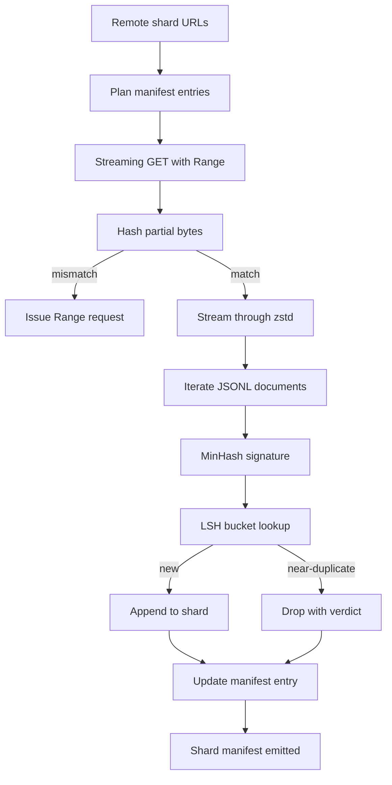

# 大规模语料下载器

> 训练语言模型的工作早在第一次前向传播之前就开始了。语料必须先落到磁盘上：解压完成、去重完成、可按地址访问，而且断点续传方案要在网络于 4% 处掉线之前就设计好。本课构建一个流式下载器：拉取压缩分片，用 Zstandard 边下边解压，通过 MinHash 加局部敏感哈希（locality-sensitive hashing）为近似重复文档生成指纹，并写出一份后续流水线可以信赖的分片清单（shard manifest）。

**Type:** Build
**Languages:** Python
**Prerequisites:** Phase 19 lessons 30-37
**Time:** ~90 minutes

## 学习目标

- 用 `urllib` 流式获取远程分片，并用 `zstandard` 解压，全程不把整个文件缓冲进内存。
- 针对已验证的字节偏移量发起 HTTP `Range` 请求，恢复未完成的下载。
- 为每个文档构建 MinHash 签名，并用 LSH 分桶，使近似重复的文档发生碰撞。
- 输出包含内容哈希、字节大小、文档数和去重判定的分片清单。

## 问题背景

第一次在 200 GB 语料上训练时，网络在 41% 处掉线，脚本抛出一个 `urllib` 异常退出。第二次在 78% 处掉线。到 99% 时你已经把这个循环重写了三遍。从第一分钟起就必须为之设计的两类失败是：部分下载的断点续传，以及重复文档的剔除。两者都有成熟的解决方案；两者也都经常被跳过，因为流水线最初只是一行 `requests.get` 调用，后来才长出獠牙。

断点续传是一个 HTTP 问题。服务端必须支持 `Range`，客户端必须对照磁盘上的记录跟踪已验证偏移量，而且这个已验证偏移量必须能在进程死亡后存活。只要偏移量和文件哪怕偏差一个字节，恢复的下载就会写入垃圾数据，语料就以一种只有在分词时才会暴露的方式被损坏。

去重是一个签名问题。精确哈希去重会漏掉近似重复：同一篇 Wikipedia 文章带着三种不同的模板页脚出现，同一个代码文件换了一个许可证头，同一篇博客文章每个链接上多了一个跟踪参数。MinHash 加 LSH 能以亚线性的代价捕获这些情况。代价是每个文档一个签名、每个签名一次桶查询。

## 核心概念



### 用 `urllib` 流式下载

标准库的 `urllib.request.urlopen` 返回一个类文件对象。把它包进 `zstandard.ZstdDecompressor().stream_reader`，字节流就从网络穿过解压器流入文档迭代器，压缩分片和解压后的分片都不会在内存中完整成形。唯一的内存开销是行缓冲区、当前文档的 MinHash 签名，以及 LSH 索引。

### 用 `Range` 恢复下载

下载器为每个分片写两个文件：分片本身和一个 `.partial.json` 检查点。检查点记录 `verified_bytes`、`expected_size`、`sha256_prefix`（对前 `verified_bytes` 个字节计算）以及源 URL。启动时，下载器读取检查点，对磁盘上的字节重新计算 `sha256_prefix`，只有在重算的哈希匹配时才恢复下载。如果哈希不对，部分文件被丢弃，下载从字节零重新开始。静默损坏不可能发生，因为已验证字节是经过校验的，而不是凭空假设的。

### MinHash 加 LSH

MinHash 在固定空间内估算两个集合的 Jaccard 相似度。对一个文档而言，这个集合就是其文本的 shingle（重叠 n-gram）。签名由 `k` 个最小哈希值组成，每个值对应一个独立的哈希函数。Jaccard 相似度为 `s` 的两个文档，在签名的任意单个分量上一致的概率为 `s`。

LSH 随后把这 `k` 个分量分成 `b` 个条带（band），每个条带 `r` 行，满足 `k = b * r`。两个文档至少在一个条带中碰撞的概率为 `1 - (1 - s^r)^b`，它在你通过调节 `(b, r)` 设定的 `s` 值附近形成一个陡峭的阈值。典型语料去重的阈值是 `s = 0.8`，LSH 研究文献用 `k = 128`、`b = 32`、`r = 4` 达到这个阈值。

### 作为契约的分片清单

下载器唯一的持久产出就是清单。清单为每个分片记录 URL、解压后字节数、文档数、去重后的唯一文档数，以及最终分片文件的 sha256。下游的分词读取的是清单，而不是目录列表。如果某个分片缺失或其 sha256 不对，清单会告诉下一阶段拒绝启动。清单是「数据已下载」和「数据已下载且可验证」之间的决定性分界。

## 从零实现

`code/main.py` 实现了：

- `ShardPlanner` - 读取分片 URL 列表，生成计划中的清单条目。
- `StreamingDownloader` - 打开一个可选带 `Range` 的 `urllib` 流，写入临时文件，每个数据块都更新 `.partial.json` 检查点，并在恢复下载时验证 sha256 前缀。
- `ZstdDocIterator` - 把类文件流包进 `zstandard.ZstdDecompressor`，每行产出一个文档。
- `MinHasher` - 用一组固定的哈希种子为字符串生成 `k` 分量签名。
- `LSHIndex` - 按条带为签名分桶并报告碰撞。
- `Dedup` - 组合哈希器和索引，把每个文档标记为 `keep` 或 `near_duplicate`，并附上发生碰撞的分片 id。
- `ManifestWriter` - 收集每个分片的统计数据并写出 `manifest.json`。

文件底部的演示在磁盘上构建一个小型合成语料，用 `zstandard` 压缩，通过 `file://` URL 下载，执行去重，然后打印清单。

运行它：

```bash
python3 code/main.py
```

脚本以零退出码结束，并打印清单摘要。

## 生产模式

四个模式能把本课扩展到真实语料的规模。

**先写检查点，再写数据。** `.partial.json` 必须在字节追加到分片之前完成 `fsync`。否则一次断电会颠倒顺序：分片字节已在磁盘上，检查点却没有记录它们，下次恢复时下载器以为已验证字节比实际少，重复追加的后缀字节就会损坏文件。先写检查点，再写数据。这与预写日志（write-ahead log）是同一种纪律。

**分片化的 LSH 索引。** 在 200 GB 规模下，覆盖整个语料的单一 LSH 索引装不进内存。按第一个条带哈希对 LSH 索引进行分区，把分区存到磁盘上，新签名只查询它会落入的那个分区。代价是每个文档多一次磁盘读取；收益是 LSH 索引不再是一道硬性的内存天花板。

**用墓碑标记，而不是删除。** 被丢弃的重复文档以 `near_duplicate` 判定记入清单，并附上与之碰撞的文档所在的分片 id。直接删除会丢失重复文档与其保留者之间的关联。墓碑标记（tombstone）保留了审计线索，并允许下游环节对阈值改变主意。

**清单中每个分片有 sha256，清单本身也有 sha256。** 清单自身也获得一个内容哈希。下游阶段先验证清单哈希，再信任其中的分片条目。没有这一步，清单就是静默的攻击面：能编辑单个文件的攻击者就能破坏整条流水线。

## 生产实践

生产模式：

- **每次 CI 运行都要能恢复。** CI 运行器是临时性的。下载器必须假设每次运行都是全新磁盘，并从缓存或远端恢复。`--cache-dir` 是一个一等公民标志。
- **去重在分词之前。** 分词代价高昂。对同一文档跑两次分词，成本翻倍而损失曲线不变。去重在分词的上游，不在下游。
- **清单作为合并门禁。** 训练任务从固定（pinned）的提交中读取清单 sha256。新的数据集版本需要一次新的清单提交。代码与数据之间的纽带是 git，而不是口口相传。

## 交付产物

在真实项目中，`outputs/skill-corpus-downloader.md` 会描述哪些 URL 供给下载器、检查点目录如何布局、去重使用什么样的 shingle 宽度和 `(k, b, r)` 三元组，以及清单在版本控制中的位置。本课交付的是引擎本身。

## 练习

1. 添加一个 `--shingle-width` 标志，测量宽度为 3、5、9 时去重判定如何变化。为所选默认值给出论证。
2. 通过嗅探魔法字节（magic bytes），在 zstd 之外增加 gzip 支持。下载器不应要求调用方指定编解码器。
3. 添加一个 `--resume-only` 模式：找不到检查点时拒绝开始全新下载。在 CI 中很有用，可以防止某次运行意外重新拉取 200 GB。
4. 把 LSH 索引迁移到 shelf 或 sqlite 文件中，对比其与内存版本的吞吐量。
5. 在启动时增加清单 sha256 校验。当磁盘上的清单与 `manifest.lock` 中的清单哈希不一致时，下载器应当失败关闭（fail closed）。

## 关键术语

| 术语 | 大家怎么说 | 实际含义 |
|------|-----------------|------------------------|
| 分片（Shard） | 「一个文件」 | 语料中自包含的一个切片，拥有自己的 sha256，是断点续传和去重的基本单元 |
| MinHash 签名 | 「指纹」 | 集合的 `k` 分量草图（sketch），每个分量是一个独立哈希函数在集合上的最小值 |
| LSH 条带（band） | 「桶」 | 一组 `r` 个签名分量，作为单个桶键用于碰撞检测 |
| 已验证字节 | 「续传偏移量」 | 磁盘上 sha256 前缀与检查点匹配的字节；唯一可以安全续传的偏移量 |
| 清单（Manifest） | 「索引」 | 下载器产出内容的唯一持久记录，包含内容哈希 |

## 延伸阅读

- [RFC 7233](https://datatracker.ietf.org/doc/html/rfc7233) - HTTP Range 请求，断点续传协议
- [Zstandard format specification](https://datatracker.ietf.org/doc/html/rfc8478) - 让流式解压安全可行的帧格式
- [MinHash](https://en.wikipedia.org/wiki/MinHash) - 本课使用的签名族
- [Locality-sensitive hashing](https://en.wikipedia.org/wiki/Locality-sensitive_hashing) - 去重阈值背后的条带方案
- Phase 19 · 43 - 下载器供给的 HDF5 分词语料
- Phase 19 · 44 - 在该语料上训练的余弦调度
- Phase 19 · 45 - 消费该调度的 AMP 训练循环
