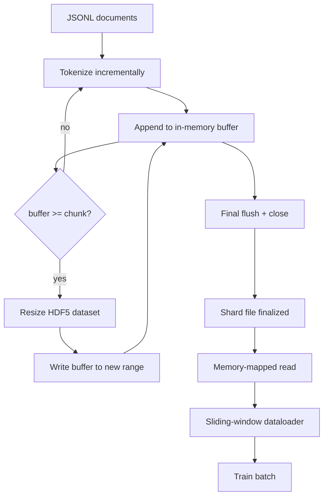

# HDF5 分词语料库

> 下载好的语料必须落地为一种训练器能以满线速流式读取的布局。磁盘上的 JSONL 扛不住 16 个 dataloader worker 的并发，而带有可扩容、分块整数数据集的 HDF5 可以。本课构建：流式分词写入可扩容的 HDF5 数据集、跨多文件的分片写入、训练时的内存映射读取，以及按正确打包规则产出定长序列的滑动窗口 dataloader。

**Type:** Build
**Languages:** Python
**Prerequisites:** Phase 19 lessons 30-37
**Time:** ~90 minutes

## 学习目标

- 将文档流式写入一个可扩容（resizable）的 HDF5 整数数据集，并采用确定性分块（chunking）。
- 把写入分片到多个 HDF5 文件，使故障影响有界、并行成为可能。
- 通过 HDF5 基于页缓存（page cache）的分块布局读回 token，让 dataloader 只在组 batch 时才向批处理缓冲区拷贝数据。
- 实现一个滑动窗口 dataloader，按显式打包规则产出定长训练序列。

## 问题背景

一次现代语言模型训练要在数十个 worker 上以每秒数十万样本的速度读取 token。磁盘上的 JSONL 在第一次冷缓存缺页时就会崩盘：JSON 解析器很慢，文档边界不可寻址，要定位到「第 4,217,884 个样本」必须扫描整个文件。即便是压缩率不错的 Parquet 也并不合适，因为训练器要的不是列，而是一个支持 O(1) 随机访问的扁平 token 流。

HDF5 之所以合适，是因为它提供了一种分块、可扩容、纯整数的数据集，其分块在读取时对页缓存友好。训练器请求一个切片 `tokens[3,200,000 : 3,200,8192]`，HDF5 就把对应的超切片（hyperslab）从页缓存拷贝到一个新分配的 NumPy 数组中。代价只是每个 worker 一个打开的文件句柄和一份分块大小的页缓存占用，相比解码 JSONL 的开销可以忽略不计。

构建难点在于让写入端做得规矩。可扩容数据集很容易被误用：一次写一个文档，HDF5 文件就会碎片化到不可用的地步；一次 resize 写入全部文档，进程一旦死亡就丢掉整个分片。正确的纪律是「先缓冲、再扩容」，缓冲区大小与分块大小一致，再加上把工作负载切分到多个文件的分片写入，这样崩溃最多损失一个分片。

## 核心概念



### 正确使用可扩容 HDF5

token 数据集以 `maxshape=(None,)` 和固定的 `chunks=(chunk_size,)` 创建。写入时先把 token 缓冲到一个长度为 `chunk_size` 的 NumPy 数组中。缓冲区写满后，数据集恰好扩容 `chunk_size`，缓冲区写入新扩出的区间。分片结束时，剩余缓冲写入最后一个不完整区间。除最后一次外，每次写入都是连续且与分块对齐的；读取端会按分片 HDF5 属性中记录的 `token_count` 截断最后一段。

### 分片写入

单个 HDF5 文件就是单点故障。流水线并行写入多个分片：Phase 19 第 42 课产出的每个输入分片，对应生成一个 HDF5 输出分片。一个 `shards.json` 索引为每个分片记录文件路径、token 数、文档数，以及对 token 的 sha256 校验值。训练器读取 `shards.json` 来计算全局偏移并校验语料。

### 内存映射读取

训练时，每个 worker 以 `swmr=True` 模式打开分到自己名下的 HDF5 文件，并请求 `tokens[start:stop]`。得益于 HDF5 的分块布局，一旦分块进入热缓存，这就是一次由页缓存支撑的读取。worker 从不把整个文件载入内存：切片被拷贝进 dataloader 的批处理缓冲区，dataloader 再在组 batch 时把它拷贝进锁页内存（pinned-memory）的训练张量。热路径上每跨越一个分块只有一次系统调用，其余全是内存访问。

### 滑动窗口 dataloader

dataloader 是唯一知道训练序列长度的阶段。它在全局 token 流中随机选一个起始下标，读取 `window_size + 1` 个 token，返回 `(input, target) = (tokens[:-1], tokens[1:])`。它不强制文档边界：一个窗口可以横跨两篇文档，文档之间放一个显式的 `boundary_token_id`，让模型学会利用这个分隔符。这是标准的打包规则；也是新手最容易忘掉的规则——结果语料里 8% 是训练边界 token，92% 才是自然文本。

## 从零实现

`code/main.py` 实现了：

- `Tokenizer` —— 一个字节级的确定性分词器，足以支撑演示。接口是 `encode(text) -> list[int]` 和 `vocab_size`。
- `HDF5ShardWriter` —— 打开一个可扩容的整数数据集，把 token 缓冲到分块大小，按固定步长扩容并写入，关闭时把 `token_count` 和 `sha256` 记录为 HDF5 属性。
- `ShardedTokenizationPipeline` —— 遍历输入文档，分发给对应的 writer，并产出 `shards.json` 索引。
- `MmapTokenStore` —— 以内存映射方式打开分片文件，计算全局偏移，对外暴露单一的 `get_slice(start, stop)` API。
- `SlidingWindowDataloader` —— 从全局流中随机选取窗口，产出 `(input_ids, target_ids)` 的 NumPy 数组。

文件底部的演示构建一个内存中的小语料，分词写入两个分片，再通过内存映射打开，运行 dataloader 取 10 个 batch，并打印每个 batch 的形状和校验和。

运行：

```bash
python3 code/main.py
```

脚本以零退出码结束并打印各 batch 的校验和。

## 生产模式

四个把本课扩展到真实训练的模式。

**分块大小等于典型读取量。** 训练器每个样本读 `window_size + 1` 个 token。把 HDF5 分块设为 `window_size` 的整数倍，读取就能与页缓存对齐。分块不匹配会让吞吐减半，因为每个样本都要碰到两个分块。

**token 数放在属性里，而不是靠数据集本身。** 数据集末尾的切片可能只填了一部分，因为分块大小未必整除文档边界。把真实的 `token_count` 存为数据集上的 HDF5 属性，并让读取端按该值截断。不这样做，读取端会越过真实末尾、读到补零的 token，模型就学会了预测零。

**分片级 sha256 加并行校验。** 每个分片对其 token 字节有自己的 sha256。训练器可以在训练开始前并行校验所有分片。sha256 不匹配会让任务尽早失败，而不是在第三个 epoch、跑了十六个小时之后才发现。

**两侧都用 `swmr=True`，写入端加上 `libver="latest"`。** 单写多读（Single-Writer-Multiple-Reader）模式要求写入端以 `libver="latest"` 打开，预先创建好所有数据集，然后设置 `file.swmr_mode = True`。此后写入端每次 resize 之后必须调用 `dataset.flush()`，以 `swmr=True` 打开的读取 worker 才能看到一致的数据。漏掉 `libver="latest"`，或在结构性变更之后才启用 SWMR，是「file is locked」失败的常见来源。

## 生产实践

生产模式：

- **每个源分片对应一个 HDF5。** 下载器（第 42 课）按 URL 产出分片；分词（本课）按源分片产出 HDF5。1:1 的映射让断点续传和部分失败恢复变得简单。
- **边界 token id。** 边界 token 是分词器词表的一部分，也是 dataloader 唯一注入的 token。如果希望模型忽略它，训练损失就对边界 token 做掩码；否则模型会学着把它当作序列分隔符使用。
- **`shards.json` 作为唯一事实来源。** 新增分片就是写 HDF5、算 sha256、追加一条索引。训练器启动时读一次该文件，之后从不依赖目录列表。

## 交付产物

在真实项目里，`outputs/skill-hdf5-tokenized-corpus.md` 会描述：哪个分词器为流水线供料、什么分块大小匹配训练器的窗口、`shards.json` 在版本控制中的位置，以及 dataloader worker 如何按文件分片。本课交付的是这台引擎本身。

## 练习

1. 给 HDF5 writer 加一个 `--compression gzip` 参数，在演示语料上测量吞吐代价。为你选定的默认值给出理由。
2. 给滑动窗口 dataloader 加一个确定性种子，验证相同种子的两次运行产出完全一致的 batch。
3. 加一个 `--validate` 模式：读取每个分片，重算其 token 的 sha256，并与 `shards.json` 比对。CI 应在训练开始前运行它。
4. 在分块大小等于、等于一半、等于两倍窗口大小时，比较 dataloader 吞吐。报告页缓存效应。
5. 加一个 `--max-document-tokens` 参数，在写入时截断超长文档。论证这相对于在读取时再决定的权衡。

## 关键术语

| 术语 | 常见说法 | 实际含义 |
|------|-----------------|------------------------|
| 可扩容数据集 | 「只追加」 | `maxshape=(None,)` 的 HDF5 数据集，通过按分块大小步进的 `resize` 调用增长 |
| 分块布局 | 「HDF5 的存储方式」 | 固定大小的磁盘页，内核可以内存映射、dataloader 可以连续读取 |
| `swmr` 模式 | 「边写边读」 | 单写多读模式，让 dataloader worker 安全地共享文件 |
| 分片索引 | 「shards.json」 | 所有 token 分片的持久索引，带偏移量和内容哈希 |
| 滑动窗口 | 「训练样本」 | 全局 token 流的定长切片，训练器将其与右移一位的目标配对 |

## 延伸阅读

- [HDF5 chunking documentation](https://docs.hdfgroup.org/hdf5/v1_14/) —— 本课所用的分块、可扩容数据集布局
- [h5py user guide](https://docs.h5py.org/en/stable/) —— HDF5 的 Python 绑定
- [NumPy memory mapping](https://numpy.org/doc/stable/reference/generated/numpy.memmap.html) —— HDF5 通过 h5py 暴露的读取侧原语
- Phase 19 · 42 —— 本课对其输出做分词的下载器
- Phase 19 · 44 —— 消费这个 dataloader 的余弦调度
- Phase 19 · 45 —— 包裹训练步的 AMP 循环
