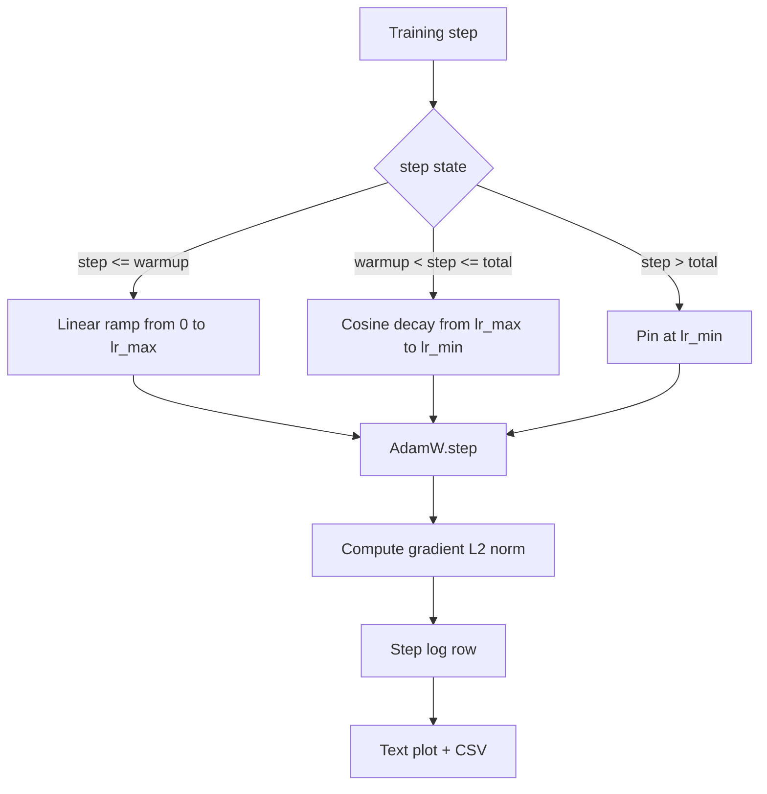

# 余弦学习率与线性预热

> 学习率调度（learning-rate schedule）是仅次于损失函数的第二重要的决策。AdamW 搭配余弦衰减加线性预热（linear warmup）是当今语言模型训练的默认方案，因为它让模型在脆弱的前一千次更新中只看到很小的有效步长，随后爬升到配置的峰值，再平滑地衰减回接近零。本课将构建这个调度器，绘制学习率随训练步数变化的曲线，把梯度范数与调度值并排记录，并验证调度严格遵守预热、峰值和衰减的边界条件。

**Type:** Build
**Languages:** Python
**Prerequisites:** Phase 19 lessons 30-37
**Time:** ~90 minutes

## 学习目标

- 实现一个接入余弦学习率调度（带线性预热）的 AdamW 优化器。
- 计算调度在任意步的精确取值，且多次运行之间不出现浮点漂移。
- 将梯度 L2 范数与学习率并排记录，使训练健康状况可观测。
- 把调度渲染成肉眼可读的文本图，以及任何工具都能消费的 CSV。

## 问题背景

最初一千次训练更新是最"喧闹"的。模型权重仍接近初始化状态，优化器的二阶矩滑动估计尚未稳定，梯度范数又大又嘈杂。如果在这些更新期间学习率正处于峰值，模型要么直接发散，要么陷入一个再也逃不出来的损失平台。两个广为人知的对策是梯度裁剪（Phase 19 第 45 课的主题），以及一个从小起步、逐渐爬升的学习率调度。

带预热的余弦调度分为三个区间。从第 0 步到第 `warmup_steps` 步，学习率从零线性增长到配置的峰值 `lr_max`。从第 `warmup_steps` 步到第 `total_steps` 步，学习率沿余弦曲线的上半段从 `lr_max` 衰减到 `lr_min`。超过 `total_steps` 之后，学习率固定在 `lr_min`，这样即使训练器配置错误、步数越界，也不会悄无声息地脱离调度。

构建时的难点在于调度器极易出现差一（off-by-one）错误。这种差一错误会在训练跑了六小时后才显现：在模型开始过拟合的那一刻，学习率比预期高或低 1%——除非在边界处做穷尽测试，否则根本看不出来。

## 核心概念



### 预热公式

当 `step` 处于 `[0, warmup_steps]` 且 `warmup_steps > 0` 时，学习率为 `lr_max * step / warmup_steps`。退化情形 `warmup_steps = 0` 被视为"无预热"：调度在第 0 步直接从 `lr_max` 开始，并立即进入余弦衰减。有些测试框架会传入 `warmup_steps = 0`，以检验调度仍能产出可用的曲线。

### 余弦公式

当 `step` 处于 `(warmup_steps, total_steps]` 时，学习率为 `lr_min + 0.5 * (lr_max - lr_min) * (1 + cos(pi * progress))`，其中 `progress = (step - warmup_steps) / max(1, total_steps - warmup_steps)`。在 `step = warmup_steps` 处，余弦项取值 `cos(0) = 1`，结果恰为 `lr_max`，与预热段的终点严格吻合。在 `step = total_steps` 处，余弦项取值 `cos(pi) = -1`，结果恰为 `lr_min`，与衰减段的终点严格吻合。

两个端点处的连续性并非偶然。正因如此，调度才被实现为关于 `step` 的单一函数，而不是三段函数粘在一起。一旦修改 `lr_max`，拼接式的调度立刻会丢掉其中一个边界。

### 超过总步数后的下限

当 `step > total_steps` 时，学习率保持在 `lr_min`。契约是明确的：调度不报错、也不外推，而是固定在下限，由训练器记录一条警告。需要延长训练的训练器应该修改调度的 `total_steps`，而不是改训练循环。

### 与学习率并排记录梯度范数

调度只是训练健康状况的一半，梯度范数是另一半。训练循环每步同时记录两者。发散的训练在损失出问题之前，梯度范数会先飙升；调得好的预热阶段，范数随学习率线性上升；峰值设得过高，则表现为预热结束后范数居高不下。落盘的数据集是 `step, lr, grad_l2_norm, loss`。CSV 是唯一的持久记录。

## 从零实现

`code/main.py` 实现了：

- `CosineWithWarmup` —— 在配置好的调度上，一个无状态的函数 `lr(step) -> float`。
- `TrainState` —— 把模型、`AdamW` 优化器和调度包装成一个单一的 step 函数。
- `TrainState.step` —— 执行一次前向传播、一次反向传播，记录梯度 L2 范数，并把 `lr(step)` 应用到优化器上。
- `plot_schedule_ascii` —— 把调度渲染成肉眼可读的文本图。
- `write_schedule_csv` —— 每步输出一行，包含学习率。

文件底部的演示代码构建了一个极小的 `nn.Linear` 模型，在固定输入批次上训练 20 步，并打印每步的学习率、梯度范数和损失。调度同时被渲染成文本图，用于目视健全性检查。

运行：

```bash
python3 code/main.py
```

脚本以零退出码结束，打印逐步的训练日志和调度曲线图。

## 生产级模式

四个模式能把这个调度提升为生产级工件。

**调度写在配置里，不写在代码里。** 训练器从提交到 git 的 YAML 或 JSON 配置中读取 `warmup_steps`、`total_steps`、`lr_max`、`lr_min`。因为配置是内容寻址的，调度具有可复现性；因为配置出现在 PR 的 diff 中，调度具有可审计性。

**步计数器单调递增，且与 epoch 解耦。** 某些框架在数据集分片或 dataloader 重启时会混淆 step 和 epoch。调度从训练器的检查点读取 `global_step`，而不是用本地计数器。恢复训练时能从正确的调度位置继续，因为步计数器才是那条持久的坐标轴。

**调度曲线图放进运行目录。** 每次训练运行都把 `outputs/lr_schedule.png`（本课中是文本图）写入自己的运行目录。审阅者扫一眼目录就能对调度做健全性检查，无需重跑任何东西。这能在 PR 阶段就抓住"调度配置错误"这一类 bug。

**日志行的 schema 固定不变。** 按 `step, lr, grad_l2_norm, loss` 这个顺序。下游的 notebook 或仪表盘按此 schema 读取；不升版本号就重命名某一列，会让所有现存仪表盘失效。

## 生产实践

生产模式：

- **先扫峰值，再扫其他。** `lr_max` 是最敏感的旋钮。先在小模型上做超参扫描；最优 `lr_max` 随模型规模变化很弱，所以小模型的扫描结果是一个很强的先验。
- **预热按总步数的比例配置，不按绝对步数。** 一个 2 亿步的训练若只用 2,000 步预热，几乎一开始就到峰值；而一个 20,000 步的训练用同样的步数，预热占了 10%。把预热配置成比例（典型值：1-3%），调度才能随训练时长缩放。
- **`lr_min` 非零是刻意为之。** 一个等于 `lr_max` 10% 的下限能让优化器在长尾阶段继续学习。`lr_min = 0` 的调度会画出一条图上很好看的训练曲线，以及一个其实没训练完的模型。

## 交付产物

在真实项目里，`outputs/skill-cosine-warmup.md` 会记录调度由哪个配置承载、全局计数器从训练器的哪个 step 读取，以及上线的 `lr_max` 取值来自哪次扫描。本课交付的是这套引擎。

## 练习

1. 增加该调度的逆平方根（inverse-square-root）变体，在 200 步的玩具训练上对比两者。哪条曲线得到更低的最终损失？
2. 增加一个 `--restart` 标志，在 `total_steps / 2` 处加入第二次预热。论证在这个玩具训练上，热重启（warm restarts）是有利还是有害。
3. 增加一个单元测试，验证调度的连续性：对 `[0, total_steps]` 内的每个 step，差值 `|lr(step+1) - lr(step)|` 都不超过 `lr_max / warmup_steps`。
4. 把调度接入 `torch.optim.lr_scheduler.LambdaLR`，使其能与框架代码组合。本课用的是普通 step 函数；包装之后有什么变化？
5. 增加一个 `--plot-png` 标志，用 `matplotlib` 输出真正的图像。论证对 CI 运行而言，本课的文本图和 PNG 哪个是更好的默认选择。

## 关键术语

| 术语 | 人们常说的 | 实际含义 |
|------|-----------------|------------------------|
| 预热（Warmup） | "慢启动" | 在最初 `warmup_steps` 次更新内，从零线性爬升到 `lr_max` |
| 余弦衰减（Cosine decay） | "平滑下降" | 在剩余步数内，沿余弦曲线上半段从 `lr_max` 降到 `lr_min` |
| 下限（Floor） | "训练结束后" | 超过 `total_steps` 后调度固定取的 `lr_min` 值 |
| 梯度范数（Gradient norm） | "梯度的 L2" | 拼接后梯度向量的欧几里得范数，每步记录一次 |
| 全局步数（Global step） | "调度的坐标轴" | 一个跨重启存活、驱动调度的单调步计数器 |

## 延伸阅读

- [Loshchilov and Hutter, SGDR: Stochastic Gradient Descent with Warm Restarts (arXiv 1608.03983)](https://arxiv.org/abs/1608.03983) —— 余弦调度的原始论文
- [Loshchilov and Hutter, Decoupled Weight Decay Regularization (arXiv 1711.05101)](https://arxiv.org/abs/1711.05101) —— AdamW 的原始论文
- [PyTorch torch.optim.lr_scheduler](https://docs.pytorch.org/docs/stable/optim.html#how-to-adjust-learning-rate) —— step 函数如何与框架调度器组合
- Phase 19 · 42 —— 本调度所消费语料的下载器
- Phase 19 · 43 —— 与本调度协同演进的 dataloader
- Phase 19 · 45 —— 梯度裁剪与 AMP，训练循环中的下一层
