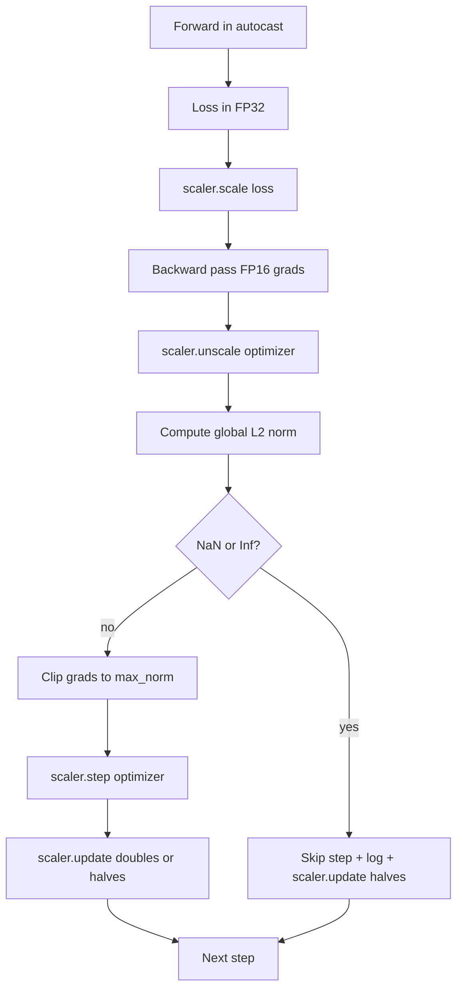

# 梯度裁剪与混合精度

> 上一课的优化器和调度器都假设梯度是正常的，但事实往往并非如此。一个坏批次就能让梯度范数飙升三个数量级。混合精度训练还会在损失端引入 FP16 溢出，进一步放大这个问题。本课构建生产级训练不可或缺的两条安全带：把梯度裁剪到配置的全局 L2 范数，以及一个基于 autocast 和 GradScaler 的混合精度循环——它能检测 NaN 和 Inf、干净地跳过该步，并记录缩放因子以便事后排查。

**Type:** Build
**Languages:** Python
**Prerequisites:** Phase 19 lessons 30-37
**Time:** ~90 minutes

## 学习目标

- 计算所有参数梯度的全局 L2 范数，并在超过配置阈值时进行原地裁剪。
- 用 autocast 加 GradScaler 包装训练步，使 FP16 的前向和反向传播能够安然渡过溢出。
- 检测损失或梯度中的 NaN 和 Inf，跳过优化器步并记录跳过事件。
- 每一步都汇报 GradScaler 的缩放因子，使连续大量跳过的情况能被立即发现。

## 问题背景

一次昨天还跑得好好的训练，损失曲线在第 8,217 步突然垂直拉升。罪魁祸首是一个梯度范数高达 4,200 的批次——是此前峰值的二十倍。没有裁剪时，优化器会执行一次把模型在过去一小时学到的所有东西全部抹掉的更新。而如果设置了范数为 1.0 的全局 L2 裁剪，同一个批次只贡献一次单位范数的更新；损失保持在原来的趋势线上；训练得以存活。

混合精度训练通过在 FP16 下计算前向传播和大部分反向传播，把吞吐量提升 2-3 倍。代价是 FP16 的指数范围很窄。一个在 FP16 下溢出的普通梯度会变成 Inf，Inf 在后续层中传播成 NaN，到了下一次优化器步就把所有权重都变成 NaN。PyTorch 的 GradScaler 用如下方式解决：在反向传播之前给损失乘上一个很大的缩放因子，再在优化器步之前把梯度除以同一个因子。如果在反缩放（unscale）时发现任何梯度是 Inf 或 NaN，scaler 会跳过这一步并把缩放因子减半；如果之前连续 N 步都是干净的，scaler 会把因子加倍。在整个训练过程中，这个因子会自动找到 FP16 范围所允许的最高值。

构建的难点在于把两者正确地接在一起。在 unscale 之前裁剪，阈值就作用在被缩放过的梯度上；在 unscale 之后裁剪，则要严格遵守 GradScaler 的操作顺序。正确的顺序是：`scaler.scale(loss).backward()`，然后 `scaler.unscale_(optimizer)`，然后 `clip_grad_norm_`，然后 `scaler.step(optimizer)`，最后 `scaler.update()`。任何其他顺序都会产生一个悄悄失效的训练循环。

## 核心概念



### 全局 L2 范数

全局 L2 范数是把所有梯度拼接成一个向量后的欧几里得范数，而不是逐参数的范数。PyTorch 用 `torch.nn.utils.clip_grad_norm_(parameters, max_norm)` 实现。该函数返回裁剪前的范数，因此本课可以同时记录原始值和裁剪后的值——要诊断出"我们每一步都在触发裁剪"这种情况，这是必需的。

### autocast 与 GradScaler

`torch.amp.autocast(device_type)` 是一个上下文管理器，它有选择地让符合条件的运算（大多数矩阵乘法类运算）在 FP16 下执行。`torch.amp.GradScaler(device_type)` 是一个辅助工具，在反向传播前缩放损失，在优化器步之前对梯度做反向缩放。这两者是配套设计的；只用其中一个而不用另一个是一种配置错误，测试应当能捕获它。

本课使用 CPU autocast，因为 CI 环境中只能跑 CPU；同样的模式只需把 `device_type="cpu"` 改成 `device_type="cuda"` 就能原样迁移到 CUDA。CPU 上的 GradScaler 是一个空实现（CPU autocast 默认就以 BF16 运行，不需要损失缩放），但本课保留了这些调用点，使整个接线方式与 GPU 训练循环完全一致。

### NaN 与 Inf 检测

检测发生在两个位置。其一，在反向传播前用 `torch.isfinite` 检查损失本身；Inf 或 NaN 的损失不会产生有用的梯度，应直接跳过，不进入优化器。其二，在 `scaler.unscale_(optimizer)` 之后，本课用 `has_non_finite_grad(...)` 扫描反缩放后的梯度，发现任何 Inf 或 NaN 都视为跳过。这两道检查合在一起，分别覆盖了前向传播和反向传播两种失败模式。

### 缩放因子诊断

缩放因子是 GradScaler 的内部状态。本课每一步都读取 `scaler.get_scale()`，并把它和学习率、梯度范数一起记录下来。健康的训练中，缩放因子会以 2 的幂逐级攀升，直到在 `2^17` 或 `2^18` 附近饱和。异常的训练中，该因子会在高低值之间来回振荡，这是模型梯度时而在范围内、时而超出范围的信号。不做日志记录，这个诊断信息就完全不可见。

## 从零实现

`code/main.py` 实现了：

- `clip_global_l2_norm` —— 对 `torch.nn.utils.clip_grad_norm_` 的封装，同时返回裁剪前和裁剪后的范数。
- `has_non_finite_grad` —— 扫描梯度中 NaN 和 Inf 的辅助函数。
- `AmpTrainState` —— 封装一个模型、一个 `AdamW` 优化器、一个 GradScaler 和一个 autocast 设备。对外暴露 `step(inputs, targets)`，执行完整的裁剪、缩放和遇 NaN 跳过的流水线。
- `StepLog` 和 `SkipLog` —— 结构化的逐步记录。
- 一个演示：训练一个小型 `nn.Linear` 模型 20 步，在第 5 步向梯度注入一个 Inf 以触发跳过路径，并打印最终日志。

运行：

```bash
python3 code/main.py
```

脚本以零状态码退出，并打印逐步日志，每行标记为 `STEP` 或 `SKIP`；至少有一行是 `SKIP`。

## 生产模式

四个模式把这个循环提升为生产级训练步。

**跳过计数器是告警，不是日志行。** 一次训练里出现寥寥几次跳过是健康的。每个 epoch 出现成百上千次跳过则是硬性告警：模型处于 FP16 撑不住的区间，循环正在悄悄失效。本课跟踪一个 1,000 步的滚动跳过率，在生产环境中，跳过率超过 5% 就应触发呼叫（page）。

**裁剪阈值放进配置文件。** `max_norm = 1.0` 是当前语言模型训练的默认值。先在小模型上做扫描；更大的阈值让模型能从真正困难的批次中恢复，更小的阈值则以更嘈杂的损失曲线为代价限制最坏情况。该阈值应与第 44 课的调度器放在同一个 YAML 或 JSON 配置里。

**范数日志与调度信息一起写入 CSV。** CSV 列为 `step, lr, grad_l2_pre_clip, grad_l2_post_clip, loss, skipped, skip_reason, scaler_scale`。审阅者打开文件，一行之内就能看到调度、梯度变化、缩放因子和跳过结果（及其原因）。把这些列拆散到多个文件里，注定会导致分析时对不上号。

**`scaler.update()` 每一步都要执行，包括跳过的步。** 在干净的一步里，scaler 读取其无 Inf 计数器，递增计数，并可能把因子加倍。在跳过的一步里，scaler 把因子减半并重置计数器。在跳过路径上忘记调用 `update()`，正是导致"缩放因子从未变化"的那个 bug。

## 生产实践

生产模式：

- **autocast 设备与优化器设备一致。** GPU 训练用 `torch.amp.autocast(device_type="cuda")`；CPU 用 `torch.amp.autocast(device_type="cpu")`。设备混用会产生静默的类型错误，表现为损失曲线看着正常但模型根本没在学习。
- **反向传播前检查损失。** `torch.isfinite(loss).all()` 只是一次张量归约；开销可以忽略不计，而在损失为 NaN 时省下的是整整一个训练步。务必执行。
- **`zero_grad` 中使用 `set_to_none=True`。** 把梯度置为 `None` 而不是清零，让优化器可以跳过未受影响的参数组的计算。这个设置是白捡的吞吐量提升，还略微缩小了 bug 暴露面。

## 交付产物

在真实项目中，`outputs/skill-clip-amp.md` 会描述训练步使用的裁剪阈值和 autocast 设备、逐步 CSV 在版本控制中的位置，以及生产环境的跳过率告警阈值。本课交付的是这台引擎本身。

## 练习

1. 把人工注入的 Inf 替换成真实的损失尖峰（将某个批次的目标乘以 1e8），验证跳过路径会被触发。
2. 添加一个 `--bf16` 模式，把 autocast 从 FP16 切换为 BF16。BF16 的指数范围比 FP16 宽得多，几乎不需要损失缩放；验证在同一个演示上跳过率降为零。
3. 添加一个单元测试，验证在未发生裁剪时，梯度裁剪封装函数能正确返回裁剪前和裁剪后的范数。
4. 添加滚动窗口跳过率的计算，以及一个 CLI 标志：当跳过率连续 100 步超过配置阈值时让运行失败。
5. 让循环写出标准 CSV（`step, lr, grad_l2_pre_clip, grad_l2_post_clip, loss, skipped, skip_reason, scaler_scale`），并通过每写一行就刷新缓冲区，确认文件能在 Ctrl-C 后幸存。

## 关键术语

| 术语 | 大家怎么说 | 实际含义 |
|------|-----------------|------------------------|
| 全局 L2 范数 | "裁剪目标" | 所有可训练参数的梯度拼接成一个向量后的欧几里得范数 |
| autocast | "混合精度" | 在 `with` 代码块内对符合条件的运算选择性地以 FP16（或 BF16）执行 |
| GradScaler | "损失缩放器" | 在反向传播前给损失乘上因子、在优化器步前对梯度做反向缩放的辅助工具 |
| 跳过（Skip） | "坏步" | 因梯度或损失非有限值而被拒绝执行的优化器步；scaler 会把因子减半 |
| 缩放因子 | "scaler 状态" | GradScaler 当前的乘数；连续干净若干步后加倍，每次跳过后减半 |

## 延伸阅读

- [Micikevicius et al., Mixed Precision Training (arXiv 1710.03740)](https://arxiv.org/abs/1710.03740) —— 损失缩放的原始提案
- [Pascanu, Mikolov, Bengio, On the difficulty of training recurrent neural networks (arXiv 1211.5063)](https://arxiv.org/abs/1211.5063) —— 梯度裁剪的参考论文
- [PyTorch torch.amp.GradScaler](https://docs.pytorch.org/docs/stable/amp.html) —— 本课封装的 scaler API
- [PyTorch torch.nn.utils.clip_grad_norm_](https://docs.pytorch.org/docs/stable/generated/torch.nn.utils.clip_grad_norm_.html) —— 本课使用的裁剪原语
- Phase 19 · 42 —— 为本循环提供语料的下载器
- Phase 19 · 43 —— 本循环消费的 dataloader
- Phase 19 · 44 —— 与本循环组合使用的调度器
