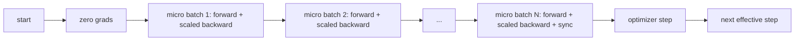
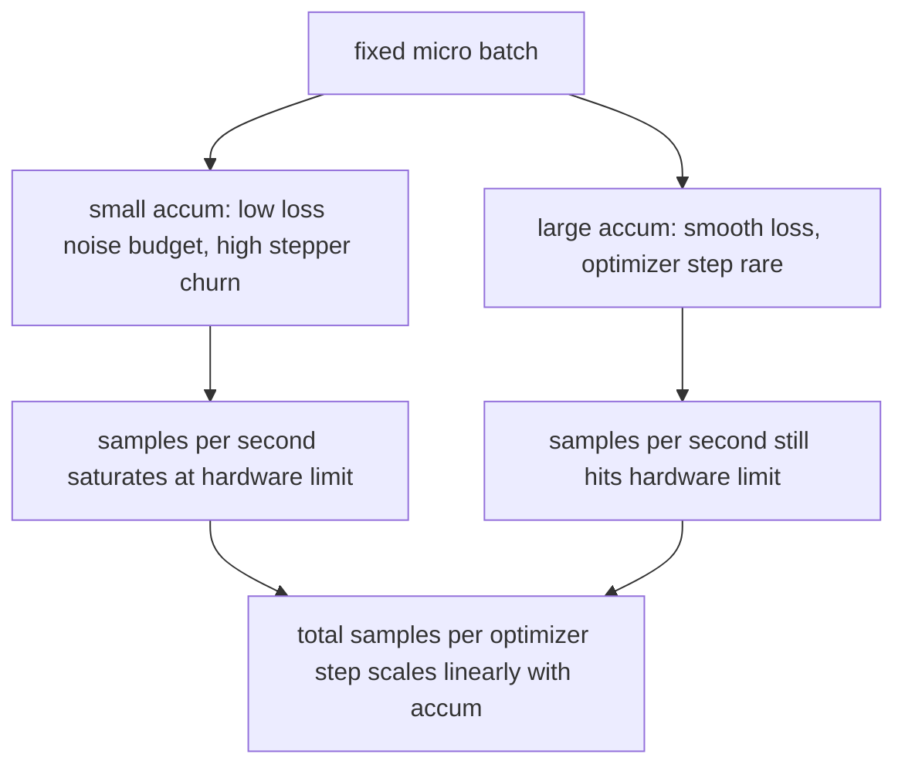

# 梯度累积

> 用一次只跑一个微批次的方式，训练出一个你本来负担不起的有效批次。缩放损失、按住优化器不动，让梯度慢慢堆起来。

**Type:** Build
**Languages:** Python
**Prerequisites:** Phase 19 lessons 42 to 45
**Time:** ~90 minutes

## 学习目标

- 推导有效批次恒等式：`effective_batch = micro_batch * accum_steps`。
- 实现按微批次的损失缩放，使累积出的梯度与一次完整大批次反向传播的结果一致。
- 把优化器同步推迟到最后一个微批次再做（sync-on-last-step，最后一步同步）。
- 读懂吞吐量随有效批次变化的曲线，并解释其中的收益递减。

## 问题背景

你想用 512 的有效批次来训练，因为在这个规模下损失曲线更平滑，优化器的每一步也更有意义。但桌上这块加速器最多装下 32 个样本，再多就会爆显存。把批次翻倍不可行，把模型砍半也不可行。这个领域从 2017 年起就一直在用、且从未放弃的技巧是：连续跑 16 次反向传播，让梯度在参数缓冲区里累积，等计数达到目标后才执行一次优化器步进。

风险在于，此时的损失已经不再等于大批次下的那个数字。把 16 个小批次的交叉熵直接相加，结果是单个完整批次损失的 16 倍。不做缩放的话，梯度方向是对的，但幅度是错的，优化器的步长会大 16 倍。修复只需要一次除法。但这次除法也极容易被忘掉。

## 核心概念



约定很简短：

- 每个微批次的损失在调用 `backward()` 之前先除以 `accum_steps`。PyTorch 默认把梯度累加进 `param.grad`；这次除法把累加和拉回到正确的尺度。
- 优化器步进每个有效批次只触发一次，发生在最后一个微批次的反向传播之后。在累积中途步进会扭曲所有参数，而后续整个训练都依赖这些参数。
- 优化器的状态（动量缓冲区、Adam 的各阶矩）每个有效步只前进一次，而不是每个微批次一次。否则指数移动平均会感知到错误的更新频率，过快地消耗掉整个调度计划。
- 在单设备上这只是记账。在多 rank 集群上，同样的模式会用 `no_sync` 上下文包住非最后的微批次，跳过梯度 all-reduce；最后一个微批次一次性归约完整的累积梯度，而不是为网络通信付 N 次代价。

### 用代码写出的等价性证明

```python
loss = criterion(model(x_full), y_full)
loss.backward()
opt.step()
```

等价于

```python
for x, y in chunks(x_full, y_full, n):
    scaled = criterion(model(x), y) / n
    scaled.backward()
opt.step()
```

差异仅限于浮点数求和顺序。循环结束时的累积梯度缓冲区，与单次完整批次反向传播产生的张量完全相同。本课代码在 `equivalence_check` 中用最大绝对差小于 1e-4 的断言验证了这一点。

### 代价花在了哪里

每个微批次的成本是一次前向加一次反向。累积的本质是用时间换内存。`outputs/accum-curve.json` 中的吞吐量曲线展示了在固定微批次下，有效批次增大时会发生什么：



天下没有免费的午餐。把 `accum_steps` 翻倍，每个优化器步的墙钟时间也跟着翻倍。真正变化的是梯度估计的方差：在相同的时间预算下，你做的优化器步数更少，但每一步都在更多样本上做了平均。文献把大批次和小批次视为两个不同的优化问题；这一课讲的是机制，不是统计。

## 从零实现

`code/main.py` 是可运行的产物。它做三件事。

### 第 1 步：等价性检查

`equivalence_check()` 用相同的随机种子构建同一个网络的两份副本。一份在一次前向传播中看到 16 个样本的批次。另一份看到四个 4 样本的分块，损失除以四。该函数在优化器步进前比较梯度缓冲区，步进后比较参数。断言是 `max_abs_diff < 1e-4`。

### 第 2 步：最后一步同步模式

`train_one_optimizer_step` 逐个遍历微批次。对除最后一个之外的每个微批次，它进入 `no_sync_context(model)`。在单进程上这个上下文是空操作；在 DDP 上，梯度 all-reduce 正是在这里被跳过的。无论哪种情况，记账逻辑都相同。一个 `sync_counter` 记录我们离开 no_sync 作用域的次数；对 N 个微批次而言，计数是每个有效步一次，而不是 N 次。

### 第 3 步：吞吐量曲线

`sweep_effective_batches` 用固定的微批次和一组累积步数运行同一个模型。对每种设置，它记录：

- `samples_per_sec`：看过的总样本数除以墙钟时间
- `median_step_ms`：每个有效步耗时的第 50 百分位
- `sync_calls`：触发的集合通信点次数
- `avg_loss`：本轮扫描中所有优化器步的平均损失

结果落在 `outputs/accum-curve.json`，可以直接在 notebook 里复用。

运行它：

```bash
python3 code/main.py
```

脚本依次打印等价性差异、扫描结果表、JSON 路径。退出码为零。

## 生产实践

在生产训练中，梯度累积藏在一个旋钮后面。PyTorch 的惯用写法是 `accumulation_steps = effective_batch // (micro_batch * world_size)`。那些这里不允许你用的框架封装的是同一个循环，但步骤完全一样：缩放损失、在非最后的微批次上跳过同步、累积、每个有效批次只步进一次。

实践中常见的三种模式：

- 微批次大小按吃满设备内存来选。再小就浪费加速器周期，再大就会崩溃。
- 有效批次由学习率调度决定。大的有效批次需要按比例放大学习率并配合预热（warmup）；这就是 2017 年以来一直被讨论的线性缩放法则。
- 累积步数是连接两者的桥梁，也是唯一一个无需重写数据加载器就能在运行时自由调节的旋钮。

## 交付产物

`outputs/skill-gradient-accumulation.md` 把这份配方记录下来，让同事可以直接搬进新仓库：损失按 `accum_steps` 缩放，非最后的微批次跳过优化器同步，每个有效批次步进一次优化器，并把吞吐量对有效批次的关系以 JSON 形式记录下来，让这笔交易变得可见。

## 练习

1. 用 `--num-steps 100` 重新运行扫描，绘制每秒样本数对有效批次的曲线。曲线在哪里变平？
2. 添加一个错误缩放的变体（不做除法），展示第 1 步时它与参考实现的参数差异。
3. 把 SGD 换成 AdamW，确认优化器状态是每个有效步前进一次，而不是每个微批次一次。
4. 引入真实的 `DistributedDataParallel` 封装，把 `no_sync_context` 接到它的方法上。确认 sync_calls 在每个有效批次中减少 N-1 次。
5. 修改等价性检查，比较两种不同的微批次切分方式（2 乘 8 与 4 乘 4），并解释你需要放宽的容差。

## 关键术语

| 术语 | 大家口中的说法 | 实际含义 |
|------|-----------------|------------------------|
| 微批次（Micro batch） | 你做前向的那个批次 | 单次前向传播能装进内存的那一片数据 |
| 累积步数（Accum steps） | 每步的反向次数 | 一次优化器步进之前累加的反向传播次数 |
| 有效批次（Effective batch） | 所谓的批次 | 微批次乘以累积步数乘以数据并行的 world size |
| 损失缩放（Loss scaling） | 除以 N | 按微批次做除法，使累加的梯度与完整批次一致 |
| 最后一步同步（Sync on last） | 其余的都跳过 | 只在窗口内最后一次反向传播时运行梯度集合通信 |

## 延伸阅读

- PyTorch 文档中关于 `DistributedDataParallel.no_sync` 的部分，是最后一步同步技巧的生产级版本。
- Goyal et al., 2017，关于大批次训练的线性缩放法则，是关心有效批次的经典理由。
- PyTorch issue tracker 上关于梯度累积与混合精度反缩放（unscaling）交互的讨论。
- Phase 19 第 42 至 45 课覆盖了本课所依赖的模型、数据加载器、优化器和训练器脚手架。
- Phase 19 第 47 课覆盖检查点与恢复，让长时间的累积训练能扛过墙钟时间上限。
