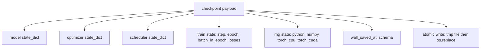
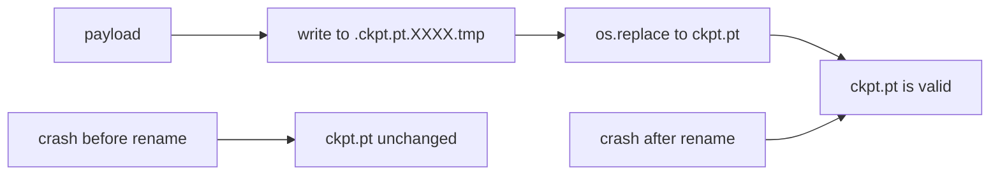
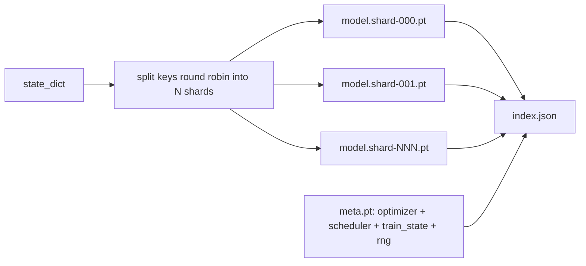

# 检查点保存与恢复

> 训练中断会毁掉整个运行，检查点（checkpoint）让它得以继续。原子化地保存模型、优化器、调度器、损失历史、步数计数器和随机数生成器（RNG）状态，这样无论在哪个时刻被杀掉进程，磁盘上都会留下一个有效的文件。

**Type:** Build
**Languages:** Python
**Prerequisites:** Phase 19 lessons 42 to 45
**Time:** ~90 minutes

## 学习目标

- 把完整的训练状态打包成一个 payload，使其可以在全新进程中重新加载。
- 实现原子化保存：先写入临时文件再重命名，确保崩溃永远不会留下写了一半的文件。
- 恢复 Python、NumPy 和 PyTorch 的 RNG 状态，使恢复训练后的损失与未中断的基线完全一致。
- 为单文件已装不下的模型构建分片（sharded）检查点布局，包含哈希校验的分片和一个 JSON 索引。

## 问题背景

你提交了一个 18 小时的训练任务。墙钟时间上限是 4 小时。第 11 个小时集群重启了，因为某位职级比你高的人批准了一次内核升级。没有检查点，你只能从头再来。没有恢复机制，你还会丢掉前 11 个小时学到的优化器状态——即使模型权重幸存下来，AdamW 的动量矩也没了，下一步会猛地冲向训练轨迹早已越过的方向。

正确的产物是一个包含继续训练所需全部内容的文件：模型参数、优化器状态、调度器状态、用于画图的损失历史、当前的 step、epoch 和 epoch 内 batch 计数器，以及每个随机源的 RNG 状态。没有 RNG 状态，恢复后的损失曲线就是另一条曲线。同样的模型，同样的数据，不同的 shuffle，不同的 dropout 掩码，仪表盘上就是不同的数字。

原子化保存是这份契约的另一半。直接写入最终文件名意味着写到一半崩溃会留下损坏的文件，恢复时读到的是垃圾。先写入同一目录下的临时文件再重命名，意味着写到一半崩溃时之前的好文件原封不动。在 POSIX 文件系统上，重命名是原子操作。

## 核心概念



### 五个状态桶

| 状态桶 | 为什么重要 |
|--------|----------------|
| 模型 | 权重和缓冲区；模型本身。 |
| 优化器 | 动量和自适应矩；没有这些，下一步就是另一个优化问题。 |
| 调度器 | 学习率在曲线上的位置；余弦调度尤其在意这一点。 |
| 训练计数器 | step、epoch、epoch 内 batch，加上绘制仪表盘的损失历史。 |
| RNG 状态 | 保证 dropout、数据 shuffle 以及模型内部任何采样的确定性。 |

### 原子化保存



两条规则。第一，临时文件必须与目标文件位于同一目录，保证重命名发生在同一个文件系统内；跨设备的重命名不是原子的。第二，每次尝试使用唯一的临时文件名，这样两个写入者不会互相踩踏。

### 分片检查点

当模型变大后，单文件 payload 会变得加载太慢、检查太难，而且当网络共享存储在读取中途抖动时尤其痛苦。解决办法是把参数状态拆分成多个分片，再写一个小索引把它们关联起来。



索引记录分片数量、每个分片的 sha256，以及 meta 文件的 sha256。任何哈希不匹配时，加载器都会大声报错。分片可以落在不同的物理磁盘上；meta 文件很小，最先读取。

### 从 epoch 中途恢复

直接跳到下一个 epoch 开头的恢复方式会浪费几分钟到一整天不等的时间。解决办法是 `(epoch, batch_in_epoch)` 加上 RNG 状态。加载之后，训练循环把随机数生成器快进过当前 epoch 中已经消费的那些 batch，然后从 `batch_in_epoch` 继续。本课代码正是这样做的；断言是恢复后的损失轨迹与未中断基线的差距在 1e-4 以内。

## 从零实现

`code/main.py` 提供了四个原语和一个演示驱动程序。

### 第 1 步：捕获和恢复 RNG 状态

`capture_rng_state` 返回一个字典，包含 Python 的 `random.getstate`、NumPy 的 `np.random.get_state`，以及 PyTorch CPU 和 CUDA 的 RNG 字节。`restore_rng_state` 执行逆操作。CPU 张量是一个 uint8 字节缓冲区，PyTorch 的 RNG 知道如何消费它。

### 第 2 步：原子化保存

`atomic_save` 把 payload 写入目标目录中的临时文件，然后用 `os.replace` 把它换成最终文件名。`atomic_write_json` 对分片索引做同样的事。

### 第 3 步：完整检查点往返

`save_checkpoint` 把模型、优化器、调度器、训练状态和 RNG 打包成一个字典。`load_checkpoint` 执行逆操作并返回一个 `TrainState`。schema 字段是升级钩子：未来格式变更时提升版本字符串，加载器据此分发处理。

### 第 4 步：分片变体

`save_sharded_checkpoint` 把参数键以轮询（round-robin）方式分配到 N 个分片，每个分片用各自的原子化保存写入，再写一个包含优化器、调度器和训练状态的 meta 文件，最后写带有分片 sha256 的 JSON 索引。`load_sharded_checkpoint` 在合并之前校验每一个分片。

### 第 5 步：恢复演示

`run_resume_demo` 训练一个小模型共 `total_steps` 步，在 `interrupt_at` 处保存检查点，然后继续。第二个进程恢复检查点并跑完剩余步数。该函数返回中断点之后两条损失轨迹的最大绝对差。在恢复了 RNG 的情况下，差值为零或只是浮点噪声。

运行它：

```bash
python3 code/main.py
```

单文件和分片两个演示都断言最大差值小于 1e-4。汇总结果落在 `outputs/resume-demo.json` 中。

## 生产实践

生产级训练框架把检查点功能作为训练器的一部分提供。形态都一样：模型 + 优化器 + 调度器 + 计数器 + RNG，原子化写入，按 step 命名以便轻松找到最新的那份。分片布局通过并行读取支撑大模型加载；index.json 正是让这一切成立的关键。

三个必须执行的模式：

- **schema 是 payload 中的一个字符串。** 迁移逻辑根据它分支。没有它，就无法在不破坏旧运行的前提下演进格式。
- **给每个分片做 sha256。** 静默截断的下载是最糟糕的 bug；加载器要么快速失败，要么很晚才失败。
- **保持诚实的检查点节奏。** 每 N 步保存一次，同时每隔若干墙钟分钟保存一次，取两者中更短的那个。否则一个崩掉的长 step 会浪费整整一个窗口的工作量。

## 交付产物

`outputs/skill-checkpoint-save-resume.md` 是适用于任何新训练脚本的配方：payload 形态、原子化写入、RNG 捕获、分片索引。把这个 skill 放进仓库，在周期性保存点接入 `save_checkpoint`，在启动时接入 `load_checkpoint`，训练运行就能扛住进程被杀。

## 练习

1. 把轮询分片替换为按参数组分片（以 `.weight` 结尾的层 vs 以 `.bias` 结尾的层）。两种布局各自在什么情况下更合适？
2. 扩展保存循环，只保留最近 K 个检查点并清理更早的。当磁盘空间紧张时，合适的 K 是多少？
3. 添加一个 `--ckpt-every-seconds` 参数，按墙钟时间间隔触发保存，而不只是按步数。
4. 添加一条校验和验证路径：在启动时运行，扫描目录中的每个检查点，报告哪些已损坏。
5. 实现一个 `migrate_v1_to_v2` 函数，给 payload 添加一个新字段并提升 schema 字符串。让加载逻辑同时兼容两个版本。

## 关键术语

| 术语 | 人们常说的 | 实际含义 |
|------|-----------------|------------------------|
| 原子化保存 | “写完听天由命” | 先写入同一目录下的临时文件，再用 os.replace 换成目标文件名 |
| State dict | “权重” | 以参数名为键的模型参数和缓冲区 |
| 分片检查点 | “大模型文件” | 多个文件，每个分片一个，外加一个 meta 文件和一个带 sha256 的 JSON 索引 |
| RNG 状态 | “随机种子” | python random、numpy、torch CPU、torch CUDA 的完整捕获状态；不只是种子 |
| epoch 中途恢复 | “重启” | 快进 RNG，从同一 epoch 中的下一个 batch 继续 |

## 延伸阅读

- POSIX `rename` 语义，它是 `os.replace` 所依赖的原子性保证的来源。
- PyTorch 关于 `torch.save` 和 `torch.load` 的文档，包括跨设备恢复用的 `map_location`。
- Phase 19 第 46 课讲解梯度累积，本课的检查点 payload 能够跨越它持续生效。
- Phase 19 第 48 课讲解分布式封装器，本方案兼容其 state dict 格式。
- Linux 内核的 `fsync` 文档，它是原子重命名背后持久性保证的来源。
