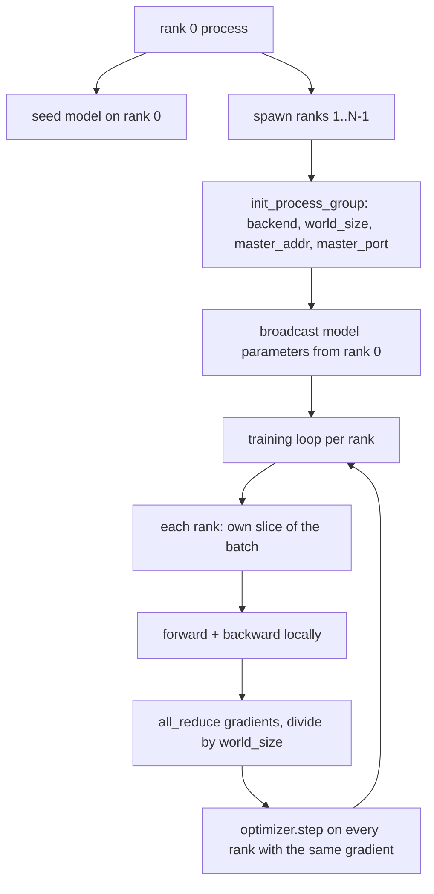
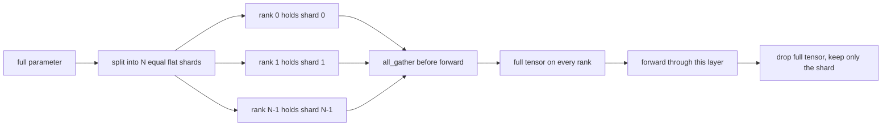

# 从零实现分布式数据并行与 FSDP

> 多 rank 训练就是两个集合通信操作加一条规则：启动时广播参数，反向传播后对梯度求平均，永远不要让各个 rank 对当前处于第几步产生分歧。

**Type:** Build
**Languages:** Python
**Prerequisites:** Phase 19 lessons 42 to 45
**Time:** ~90 minutes

## 学习目标

- 用 `gloo` 后端在 N 个 rank 之间拉起一个进程组，不需要任何特殊硬件。
- 实现一个极简的 DDP 包装器：构造时广播参数，反向传播后对梯度做 all-reduce。
- 证明各 rank 梯度经 all-reduce 后的结果，与单进程在拼接后的输入上算出的梯度一致。
- 勾勒 FSDP 的参数分片：每个 rank 只持有一个切片，前向传播时聚合出完整张量，用完即丢。

## 问题背景

模型放得进一台设备，数据集放不进。优化预算要求你每秒墙钟时间看到 N 倍的样本。第一个杠杆是数据并行：每个 rank 在批次的不同切片上运行同一个模型，然后在优化器更新前对梯度求平均。第二个杠杆是 FSDP：模型本身也放不进一台设备，于是每个 rank 只持有每个参数的一部分，前向传播时逐层重建完整张量。

痛点在于簿记工作。如果参数在各 rank 之间漂移，训练就会悄无声息地损坏。如果你对梯度求了平均却没有对损失求平均，监控面板就在撒谎。如果集合通信后端无法就拓扑达成一致，训练会永远挂起。解决办法是亲手把这些集合通信写一遍，再也不要信任一个你无法复现的封装。

本课在 CPU 上运行，不假设有 CUDA。`gloo` 后端随每个 PyTorch 构建版本一起发布，并接受 `torch.multiprocessing` 工作进程；同样的代码在多 GPU 节点上只需切到 `nccl`，结构不变。

## 核心概念



### 真正重要的两个集合通信操作

| 集合通信 | 作用 | 时机 |
|------------|--------------|------|
| `broadcast` | 把一个张量从某个 rank 复制到其他所有 rank | 参数初始化、调度器状态，以及任何一对多同步 |
| `all_reduce` | 对一个张量在所有 rank 上求和（或求平均、求最大值），每个 rank 都得到结果 | 反向传播后的梯度平均 |
| `all_gather` | 每个 rank 贡献一个张量，每个 rank 都得到拼接结果 | 收集 logits、FSDP 参数的解分片（unshard） |

DDP 的契约是：构造时 `broadcast`，反向传播后 `all_reduce`。FSDP 草图在每一层前向传播前再加一个 `all_gather`。

### 梯度平均与单进程梯度一致

一个在 N 个 rank 上、每个 rank 处理 B 个样本的模型，必须产生与单进程在 N*B 大小的批次上训练相同的梯度。窍门在于：把各 rank 的梯度求和再除以 N，得到的就是平均损失的梯度，而这正是带 mean 归约的交叉熵在完整批次上会产生的结果。本课代码用 `max-abs-diff < 1e-3` 断言手动 all-reduce 的梯度与单进程参考梯度一致。

### FSDP 草图



内存收益是精确的：每个 rank 的参数内存降到 1/N。代价是 gather，每次前向传播都要付一次。生产级 FSDP 会把 gather 与上一层的计算重叠起来，所以墙钟时间的开销远小于朴素估算。本课对每个参数完成一次完整的往返，并断言重建结果与原始张量逐位相等。

### CPU 与 gloo 后端

CUDA 是生产环境的目标，但同样的代码路径在 CPU 上也存在。`gloo` 是 CPU 上的集合通信后端。它在 GPU 上比 `nccl` 慢几个数量级，但 API 表面完全相同。本课的进程组用 `backend="gloo"` 初始化，rank 用 `torch.multiprocessing` 而非 `torchrun` 来派生；两者最终都落到同样的 `torch.distributed` 调用上。在多 GPU 节点上，唯一的变化是 `backend="nccl"`、设备上的张量，以及用 `torchrun` 启动。

## 从零实现

`code/main.py` 是可运行的产物。

### 第 1 步：拉起进程组

```python
os.environ["MASTER_ADDR"] = "127.0.0.1"
os.environ["MASTER_PORT"] = str(port)
dist.init_process_group(backend="gloo", rank=rank, world_size=world_size)
```

`MASTER_ADDR` 和 `MASTER_PORT` 是会合点（rendezvous）：每个 rank 都连到同一主机的同一端口。本课通过先绑定再关闭的小技巧挑选一个空闲端口，避免同一台机器上多次运行时发生冲突。

### 第 2 步：构造时广播

`MinimalDDP.__init__` 遍历每个参数和缓冲区，并调用 `dist.broadcast(tensor, src=0)`。rank 0 的值成为权威初始值。少了这一步，每个 rank 都会用自己的种子初始化，从第一步开始各 rank 就分道扬镳。

### 第 3 步：反向传播后对梯度做 all-reduce

```python
def all_reduce_grads_(module, world_size):
    for p in module.parameters():
        if p.grad is None:
            p.grad = torch.zeros_like(p.data)
        dist.all_reduce(p.grad.data, op=dist.ReduceOp.SUM)
        p.grad.data.div_(world_size)
```

最终每个 rank 都得到相同的平均梯度。优化器更新在每个 rank 上都是同一输入的函数，这正是参数能在整个训练过程中保持同步的原因。

### 第 4 步：证明等价性

`manual_all_reduce_matches_single_process` 在 rank 0 上构建同一个模型，把 all-reduce 之后的梯度与单进程在拼接后的输入上计算出的梯度做对比。最大绝对差约为 1e-8。

### 第 5 步：FSDP 往返

`fsdp_round_trip_sketch` 把每个参数展平，填充到 `world_size` 的整数倍，切片，再 all-gather，最后去掉填充。每个 rank 的重建结果都等于原始张量。这就是解分片（unshard）步骤；其逆操作（前向传播后重新分片）只需从聚合后的张量上切一刀。

运行它：

```bash
python3 code/main.py
```

默认 world size 为 2。两个 CPU 进程被派生出来，通过 `gloo` 互相通信，最后以零退出码结束。输出文件 `outputs/ddp-demo.json` 记录每个 rank 的参数和、all-reduce 后的梯度范数、FSDP 往返结果，以及手动梯度与参考梯度的差值。

## 生产实践

生产级训练栈调用的是同样的原语。PyTorch 的 `DistributedDataParallel` 在此之上增加了：反向传播后的梯度钩子（把 all-reduce 与反向传播重叠）、分桶 all-reduce（把多个小梯度合并成一次集合通信），以及第 46 课用过的 `no_sync` 上下文。

PyTorch 的 FSDP 在此之上增加了：每层一个扁平参数视图（每个 rank 持有一块连续缓冲区）、下一层的解分片与当前层计算的重叠，以及可选的分片 CPU 卸载。

整体形状不变：启动时广播，反向传播后归约，参数放不下时再分片。

## 交付产物

`outputs/skill-distributed-fsdp-ddp.md` 承载了一份新训练脚本的配方：用 `gloo`（CPU）或 `nccl`（GPU）拉起进程组，把模型包进一个 DDP 外壳（构造时广播、反向传播后归约），需要时再用 FSDP 草图里的 all_gather 模式对参数分片。

## 练习

1. 用 `--world-size 4` 运行，确认整个训练过程中参数差异保持在 1e-3 以内。
2. 把手动求平均换成 `dist.all_reduce(op=dist.ReduceOp.AVG)`，并计时对比差异。
3. 给 DDP 包装器添加一个反向传播后钩子，让 all-reduce 与剩余的反向计算重叠；测量墙钟时间的提升。
4. 实现 FSDP 的重新分片步骤：前向传播后，把完整张量重新替换回本地分片。确认每个 rank 的内存下降。
5. 在一台 CUDA 机器上把后端切换为 `nccl`。记录哪些环境变量变了，哪些保持不变。

## 关键术语

| 术语 | 大家常说的 | 实际含义 |
|------|-----------------|------------------------|
| 后端（Backend） | "gloo 或 nccl" | 实现集合通信操作的库；gloo 用于 CPU，nccl 用于 GPU |
| World size | "总 rank 数" | 进程组中的进程数量；进程组是集合通信操作的基本单位 |
| Rank | "worker 编号" | 进程在组内的标识符，从零开始编号 |
| All-reduce | "把梯度加起来" | 对一个张量在所有 rank 上求和，每个 rank 最终得到相同结果 |
| 解分片（Unshard） | "把参数聚合起来" | 通过 all_gather 从各 rank 的切片重建完整张量 |

## 延伸阅读

- PyTorch `torch.distributed` 文档，本课依赖的集合通信语义都在其中。
- `gloo` 库的集合通信操作列表，其形态与 CUDA 后端的 `nccl` 原语完全一致。
- Phase 19 第 46 课：用 `no_sync` 包裹 DDP all-reduce 的梯度累积模式。
- Phase 19 第 47 课：能在 DDP 与 FSDP 训练中存活的检查点布局。
- PyTorch FSDP 文档：本课勾勒的参数分片在生产环境中的实现。
