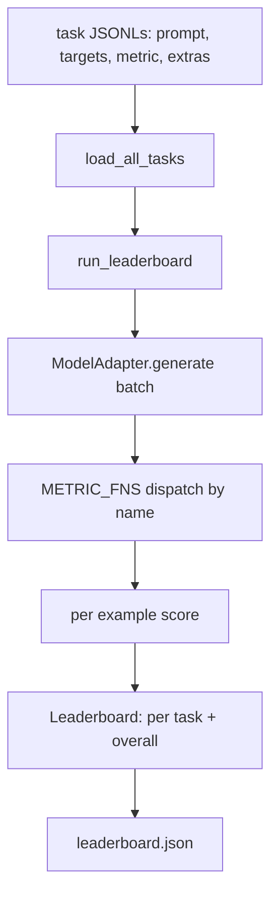
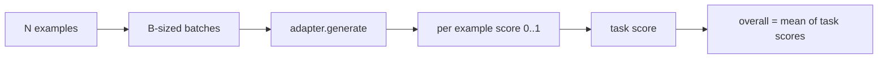

# 语言模型评测框架

> 一个在你无法定义的任务上表现良好的模型，只是碰巧表现良好。评测框架（harness）把任务定义、指标、运行器和排行榜整合在一个简短、可替换的结构里。

**Type:** Build
**Languages:** Python
**Prerequisites:** Phase 19 lessons 42 to 45
**Time:** ~90 minutes

## 学习目标

- 把任务定义成一个 JSONL 文件，每条样例包含 `prompt`、`targets`、`metric` 以及可选的 `extras`。
- 实现五种指标：精确匹配、rouge-l F1、可执行检查、多项选择和子串包含。
- 构建一个运行器，按任务对样例分批，并分发给可替换的模型适配器（adapter）。
- 输出一个排行榜 JSON，包含各任务得分、延迟和可复现的总体平均分。

## 问题背景

每周都有新的语言模型发布。营销话术说它表现优秀。诚实的问题是：在什么任务上优秀？诚实的答案是你自己写的排行榜，因为厂商的排行榜正是他们针对性调优过的那一个。

如果仓库里没有评测框架，你只能凭感觉比较两个模型。有了评测框架，你就能在固定任务集、固定指标上按得分比较它们，得到一个可以 diff 的 JSON 输出。评测框架是昨天的运行和今天的运行之间的契约。没有它，回归问题就会被发布出去。

陷阱在于把评测框架过拟合到单个模型上。解法是把同一个陷阱反过来用：评测框架小到十五分钟就能读完，任务小到可以直接放进仓库，指标从零写起以便同事审计，而适配器是唯一存放模型相关代码的地方。换掉适配器，排行榜会变；换掉任务，排行榜也会变。除此之外什么都不应该变。

## 核心概念



### 任务规范

每条样例就是一行 JSONL：

```json
{"id": "arith-00", "prompt": "compute: 2 + 2", "targets": ["4"], "metric": "exact_match"}
```

对于需要评分辅助数据的指标，`extras` 携带附加载荷：

```json
{
  "id": "code-00",
  "prompt": "python: write a function f that doubles its input",
  "targets": ["ok"],
  "metric": "code_exec",
  "extras": {"io_pairs": [[1, 2], [3, 6]]}
}
```

一个任务就是 `outputs/tasks/` 下的一个 `.jsonl` 文件。文件名即任务名。同一文件中的所有样例共用一个指标。

### 五个固定任务（fixture tasks）

| 任务 | 指标 | 测试内容 |
|------|--------|---------------|
| arithmetic | exact_match | 对确定性答案的 token 级正确性 |
| summary | rouge_l | 与一行参考摘要之间的最长公共子序列 F1 |
| code-exec | code_exec | 可执行测试：预测出的函数必须满足一组输入输出对 |
| multiple-choice | multiple_choice | 预测的首字母必须匹配允许的选项字母 |
| generation | substring_contains | 自由文本必须包含至少一个目标子串 |

### 指标契约

每个指标都是一个 `(prediction, targets, extras) -> float in [0.0, 1.0]` 的函数。评测框架对每条样例的得分取平均得到任务得分，再对任务得分取平均得到总体分。这些指标函数都非常小：

- `exact_match`：转小写、合并空白字符，然后判等。
- `substring_contains`：相同的归一化处理，再做子串检测。
- `multiple_choice`：取首字符并转大写。
- `rouge_l`：LCS 长度分别除以预测和参考的长度，再对精确率和召回率取 F1。
- `code_exec`：在受限命名空间中执行预测代码，对每个输入输出对调用 `f(x)`，统计匹配数。

code_exec 指标在剥离了内建函数的命名空间中运行预测代码。本课的测试断言 `import os` 会失败，因为 `os` 不在命名空间里；代码预测无法触及文件系统。

### 模型适配器

```python
class ModelAdapter(Protocol):
    def generate(self, prompts: Sequence[str]) -> List[str]: ...
    @property
    def name(self) -> str: ...
```

适配器就是接缝所在。本课提供了 `ToyAdapter`，一个确定性的模式匹配器，能对五个固定任务中的每条 prompt 返回正确答案。真正的适配器会调用模型并返回其输出。评测框架不关心用的是哪个。

### 运行器

`run_task` 每次以 `batch_size` 条 prompt 为一批，并分发给指标函数。`run_leaderboard` 遍历所有任务并取平均。`write_leaderboard` 输出带有 schema 字符串的 JSON，这样未来的格式变更不会悄无声息地弄坏仪表盘。



```figure
eval-harness-matrix
```

## 从零实现

`code/main.py` 是可运行的产物。

### 第 1 步：生成固定任务

`seed_fixture_tasks(target_dir)` 写出五个 `.jsonl` 文件。首次运行 `main.py` 时，若目录为空则会自动生成它们。

### 第 2 步：加载任务

`load_all_tasks(task_dir)` 读取每个 `.jsonl`，返回一个从任务名到 `Example` 记录列表的字典。以 `#` 开头的注释行和空行会被跳过，方便贡献者在文件中添加注解。

### 第 3 步：实现指标

每个指标都是一个带单元测试的小函数。本课的测试套件包含 13 个用例，覆盖归一化、部分重叠、代码执行和不安全代码拒绝。

### 第 4 步：编写运行器

`run_task` 迭代批次，产出一个包含得分、正确数、总数和延迟的 `TaskResult`。`run_leaderboard` 遍历所有任务，产出包含总体平均分的 `Leaderboard`。

### 第 5 步：输出 JSON

`write_leaderboard` 序列化排行榜。`--include-per-example` 标志会导出每条样例的记录，这样当得分变动时，你可以把预测结果和上一次运行做 diff。

运行：

```bash
python3 code/main.py
```

脚本在首次运行时生成固定任务，用玩具适配器（它能答对所有固定任务）打分，并写出 `outputs/leaderboard.json`。玩具适配器的总体得分是 1.0；`test_main.py` 中的桩适配器（stub adapter）测试表明，当适配器无法作答时，同一套评测框架会产出 0.0。

## 生产实践

要接入真实模型，写一个适配器即可。形态如下：

```python
class HttpAdapter:
    name = "vendor.v1"

    def __init__(self, endpoint, api_key):
        self.endpoint = endpoint
        self.api_key = api_key

    def generate(self, prompts):
        out = []
        for prompt in prompts:
            response = http_post(self.endpoint, prompt, self.api_key)
            out.append(response["text"])
        return out
```

在 `main()` 顶部把 `ToyAdapter` 换成 `HttpAdapter`。评测框架、任务、指标和排行榜全部保持不变。

在真实项目中部署评测框架时要坚持的三条模式：

- **锁定任务文件。** leaderboard.json 要么携带经哈希锁定的任务内容，要么把 JSONL 文件一并附上；否则任务文件一变，得分也会变，而你无从分辨是哪一个变了。
- **diff 预测结果，而不只是得分。** `--include-per-example` 标志让你在得分下降的那天能看到模型到底说了什么。
- **限制批大小。** 真实适配器有速率限制。较小的批大小能让评测框架在各家厂商之间保持兼容。

## 交付产物

`outputs/skill-lm-eval-harness.md` 承载了这套配方：JSONL 任务规范、五种指标、可替换适配器、分批运行器、带 schema 字符串的排行榜 JSON。`outputs/tasks/` 中的任务文件就是固定任务；把它们复制到真实项目里作为起点。

## 练习

1. 添加第六个任务，配上一个你从零编写的自定义指标（类 BLEU 的重叠度、类 BLEURT 的参考评分，任何契约清晰的指标都行）。
2. 扩展 `code_exec`，使其捕获 stdout，并接受一组期望的 stdout 作为 targets。
3. 添加一个排行榜 diff 命令：给定两个 `leaderboard.json` 文件，打印哪些任务的得分变动了以及变动多少。
4. 限制每条样例的延迟。给适配器调用包一层超时；在排行榜中单独呈现一个 `timeouts` 列。
5. 在排行榜中用 sha256 锁定任务内容，让未来的读者能验证他们评测的是同一批任务。

## 关键术语

| 术语 | 大家怎么说 | 实际含义 |
|------|-----------------|------------------------|
| 任务规范（Task spec） | "评测格式" | JSONL 文件，每条样例包含 prompt、targets、metric 和可选的 extras |
| 指标（Metric） | "怎么打分" | 从 (prediction, targets, extras) 到 [0, 1] 区间浮点数的函数 |
| 适配器（Adapter） | "模型客户端" | 拥有 generate(prompts) -> list[str] 方法的对象；唯一与具体模型相关的代码 |
| 排行榜（Leaderboard） | "记分板" | 包含各任务得分、总数、延迟和总体平均分的 JSON |
| 代码执行指标（Code exec metric） | "跑一下看看" | 在受限命名空间中执行预测代码，与输入输出对比对 |

## 延伸阅读

- 原版 lm-evaluation-harness，生产级参考实现，规模大得多但形态相同。
- HuggingFace 的 lighteval，同一契约的另一种实现。
- Phase 19 第 46 课讲解评测框架所评分的训练栈中使用的梯度累积模式。
- Phase 19 第 47 课讲解你要评测的 checkpoint 格式；在排行榜中锁定 checkpoint 哈希。
- Phase 19 第 48 课讲解产出被测模型的分布式训练栈。
