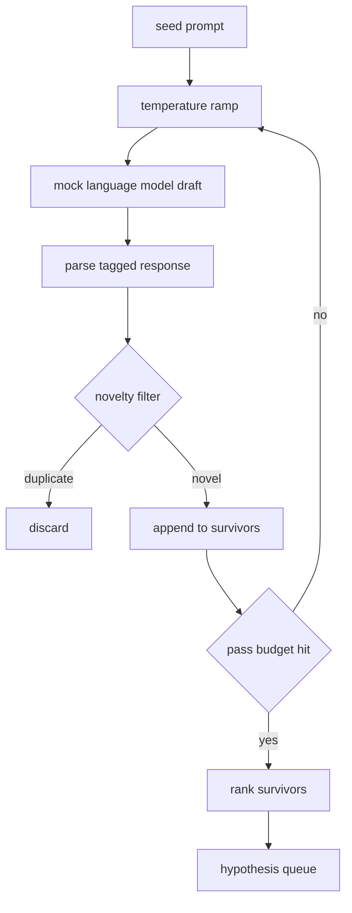

# 假设生成器

> 一个把同一个问题问两遍的研究智能体是在浪费 token。诀窍在于强迫每一稿都落在新的位置上。

**Type:** Build
**Languages:** Python
**Prerequisites:** Phase 19 Track A lessons 20-29
**Time:** ~90 minutes

## 学习目标
- 用种子提示词驱动采样器，并把它的输出转换成带类型的假设记录。
- 每一轮采样都提升温度（temperature），让下一稿离上一稿漂移得更远。
- 用一个小型嵌入模型和余弦距离阈值过滤近似重复项。
- 用一个融合新颖性、具体性和可检验性的打分函数对幸存者排序。
- 让每一步都保持确定性，使同一个种子总是产出同一个队列。

## 为什么先生成、再过滤

一个只问一个模型一次的规划器只能拿到一条假设。对演示例子来说这没问题，但对研究循环来说形状就不对了。循环需要的是一个有深度的排序队列：当第一条假设失败时，运行器手里已经有下一条候选，无需再付出一整轮采样的代价。

两个想法组合起来产出这个队列。第一个是温度爬升（temperature ramping）：每经过采样器一轮，温度就上调一档，鼓励后面的草稿往外游走。第二个是新颖性过滤（novelty filtering）：每生成一稿，生成器都会测量它与此前每个幸存者之间的嵌入距离，并拒绝任何落在已有聚类之内的草稿。

这节课配套了一个模拟语言模型，它对固定提示词返回写好脚本的 token 序列。这个模拟模型足以走通完整路径：种子提示词输入、应用温度爬升、解析候选、运行新颖性过滤、输出排序队列。

## Hypothesis 的结构

```text
Hypothesis
  id             : int           (monotonic within a run)
  text           : str           (the claim)
  variables      : list[str]     (what changes between conditions)
  metric         : str           (what the runner will measure)
  baseline_ref   : str | None    (which paper or run the comparison cites)
  draft_pass     : int           (which sampler pass produced this)
  temperature    : float         (the sampler setting at draft time)
  novelty_score  : float         (distance from prior survivors, 0..1)
  rank_score     : float         (weighted sum used for ordering)
```

`variables` 和 `metric` 不是自由文本。解析器从带标签的响应中提取它们。第五十二课的运行器在构建实验配置时会直接读取这些字段。

`baseline_ref` 是可选的，但推荐填写。第五十三课的评估器需要一个基线来做对比。如果假设没有提供基线，评估器会回退到同一指标上的上一次运行结果。

## 架构



循环本身很直白。有意思的地方在于每个方框都有一个硬性契约。

## 温度爬升

从 `t_min` 开始，到 `t_max` 结束，步长为 `(t_max - t_min) / (n_passes - 1)`。每一轮都用当前温度调用采样器，由 `GeneratorConfig.schedule()` 产出 `n_passes` 个均匀分布的取值。模拟模型通过在一小组以 `(prompt, temp_bucket)` 为键的脚本化响应之间切换来体现温度的作用。这些桶是开区间，因此温度的微小变化就会选中不同的桶、产出不同的草稿。在生产环境中，采样器会是一个真实模型，并把 `temperature=t` 透传下去。

默认调度是六轮，从 `0.2` 到 `1.2`。六轮足以填满队列，又不会为那些反正会被新颖性过滤器拒绝的样本白白付费。低于 `0.2` 时，模型只会把种子原样复述回来。高于 `1.2` 时，响应往往会跑题并通不过解析器。

## 新颖性过滤

每一稿解析完成后，生成器会对文本做嵌入，并与每条已接受的假设比较。这个嵌入是一个小型的哈希词袋（hashed bag of word tokens），归一化到单位长度。两个单位向量之间的余弦距离是 `1 - dot(a, b)`。当一稿与任何已有幸存者的最小距离高于 `novelty_threshold` 时即可通过，默认值为 `0.25`。

这个哈希嵌入并不花哨。它是确定性的、零依赖的，足以抓住最明显的情况：两稿共享了大部分名词。生产部署可以换成一个小型句向量模型，接口保持不变。

## 排序分数

```text
rank_score = w_novelty * novelty_score
           + w_specificity * specificity_score
           + w_testability * testability_score
```

三个子分数。`novelty_score` 是与已有幸存者之间的最小嵌入距离。`specificity_score` 是假设中具体变量的数量除以一个目标数量。`testability_score` 在假设同时指明了指标和基线时为一，只有指标时为零点五，否则为零。

默认权重是 `0.4`、`0.3`、`0.3`。这些权重放在生成器配置里，后续课程可以直接调整它们而无需复制一份代码。

## 模拟语言模型

```python
class MockLLM:
    def sample(self, prompt: str, temperature: float, seed: int) -> str:
        ...
```

给定 `(prompt, temperature, seed)` 三元组，采样器是确定性的。模拟模型维护一张以 `(prompt_signature, temperature_bucket)` 为键的脚本化响应表。如果表中没有对应键的条目，采样器会返回一个通不过解析器的兜底响应。有一个测试专门覆盖这条兜底路径。

种子会被混入响应，因此同一个 `(prompt, temperature)` 组合配上不同种子会产出不同草稿。测试中我们固定种子以保证结果可复现。在真实部署中，种子会来自系统时钟或一个计数器。

## 输出队列

输出是一个按 `rank_score` 降序排序的 `Hypothesis` 记录列表。第五十二课的运行器弹出队首，运行实验，第五十三课的评估器再把裁决写回来。如果裁决说这条假设是错的，运行器就弹出下一条。

队列是有限的。当它被清空时，编排器可以放宽种子提示词后再跑一遍生成器，也可以停下来并报告预算已耗尽。

## 如何阅读代码

`code/main.py` 定义了 `Hypothesis`、`MockLLM`、`HypothesisGenerator` 以及一个确定性的演示。生成器只暴露一个 `run(seed_prompt)` 方法，返回排好序的队列；轮数从 `GeneratorConfig.n_passes` 读取，而不是作为参数传入。嵌入是哈希词袋。新颖性过滤是一个函数。排序分数也是一个函数。任何部分都不依赖 `numpy`；嵌入计算全部使用纯标准库，保证这节课可移植。

`code/tests/test_generator.py` 覆盖了线性路径、重复拒绝路径、解析失败路径、温度爬升的边界，以及排序顺序。

## 在整体中的位置

第五十课产出队列。第五十一课取出队首，运行一次文献检索来证实或证伪它。第五十二课对同一个队首运行一次真实实验。第五十三课读取两边的输出并写下裁决。这四节课组合成一个没有人参与的研究循环；而人可以在任意边界介入。
