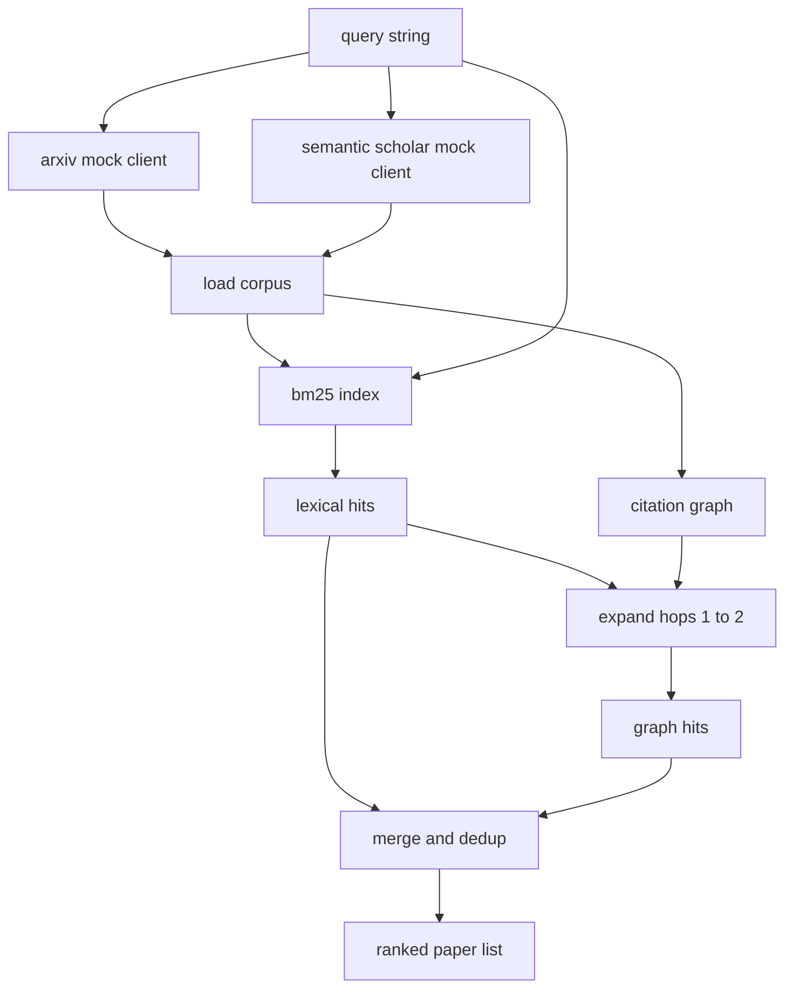

# 文献检索

> 提出一个假设很便宜，知道是否已经有人证明过它才是昂贵的部分。在 runner 启动沙箱之前，先构建出能回答这个问题的检索层。

**Type:** Build
**Languages:** Python
**Prerequisites:** Phase 19 Track A lessons 20-29
**Time:** ~90 minutes

## 学习目标
- 为论文建模一个小型记录结构，包含循环下游会读取的字段。
- 仅用标准库数据结构在摘要之上构建一个 BM25 索引。
- 遍历引用图，找出词法检索遗漏的论文。
- 按稳定的论文 id 对词法和图两轮检索的命中结果去重。
- 把两个 mock 外部 API 封装到同一个客户端之后，使真实接口上线时上游调用方无需改动。

## 为什么需要两轮检索

对摘要做关键词搜索，返回的是与查询共享词汇的论文。这能覆盖大部分情况，但会漏掉两类。第一类是奠基性论文使用了不同的词汇；例如搜索 "sparse attention" 会漏掉标题为 "block selection in transformer routing" 的论文。第二类是相关论文是引用了某个已知锚点论文的后续工作；与其在摘要池里暴力搜索，不如先找到锚点再沿引用向前遍历，效率更高。

本节课会构建这两轮检索。基于摘要的 BM25 负责捕获词法命中；引用图遍历则从种子集合出发，向前向后扩展一到两跳。两者的并集按论文 id 去重，再用一个简单的组合分数排序。

## Paper 的结构

```text
Paper
  id          : str           (stable identifier, "p001" for the mock corpus)
  title       : str
  abstract    : str
  year        : int
  authors     : list[str]
  references  : list[str]     (paper ids this paper cites)
  citations   : list[str]     (paper ids that cite this paper)
  source      : str           (which mock api supplied it, "arxiv" or "s2")
```

references 和 citations 两个字段构成有向引用图。两个 mock API 返回的字段有重叠但并不完全相同，所以语料加载器按 `id` 对它们做并集合并。

## 架构



检索客户端负责两轮检索和合并。调用方传入一个查询，得到一个排序列表，列表中每个条目都带有逐篇论文的分数字段（`bm25_score`、`graph_distance`、`recency_score`、`final_score`），用来解释排序依据。

## 从零实现 BM25

实现采用标准 Okapi BM25，默认参数 `k1=1.5`、`b=0.75`。索引由两个字典组成：`term -> doc_frequency` 和 `term -> list of (doc_id, term_count)`。文档长度是摘要的词元（token）数，平均文档长度在建索引时计算一次。对查询打分就是对查询中每个词项求 `idf * tf_norm` 之和，其中 `tf_norm` 是标准 BM25 的长度归一化词频。

分词器是先 `lower` 再按非字母数字字符切分，不做词干化。生产系统可以换成一个小型词干提取器，接口保持不变。

```text
idf(t)      = log((N - df + 0.5) / (df + 0.5) + 1.0)
tf_norm(t)  = (f * (k1 + 1)) / (f + k1 * (1 - b + b * dl / avgdl))
score(d, q) = sum over t in q of idf(t) * tf_norm(t)
```

## 引用图遍历

引用图从语料构建一次。前向边从一篇论文指向它引用的论文（references），后向边从一篇论文指向引用它的论文（citations）。遍历是以 BM25 排名靠前的命中为种子的广度优先搜索，上限两跳。

两跳是刻意设定的上限。一跳太浅；智能体往往需要直接的前驱或后继论文。三跳在连通图上会让结果规模爆炸，而且容易偏离主题。本节课把跳数上限暴露为配置项，下游循环可以按需收紧。

## 去重与排序

两轮检索返回的集合有重叠。合并以论文 id 为键。每篇论文的最终得分是一个加权混合。

```text
final_score = w_bm25 * bm25_score_norm
            + w_graph * graph_score
            + w_recency * recency_score
```

`bm25_score_norm` 是 BM25 分数除以合并集合中的最大 BM25 分数（因此该字段落在 0 到 1 之间）。`graph_score` 对直接词法命中为 1，一跳为 `0.6`，两跳为 `0.3`，其余为 0。`recency_score` 是一个线性斜坡：语料中最早年份为 0，最晚年份为 1。

默认权重是 `0.5`、`0.3`、`0.2`。权重是配置项；冷门陈旧的主题可以调低时效权重，快速演进的主题则可以调高。

## Mock 语料

语料共一百篇论文，由 `build_corpus()` 生成。每篇论文都有手写的标题和摘要，主题是五个方向之一：注意力稀疏化、检索增强、低秩适配器、数据集蒸馏、评测框架。references 和 citations 经过设计，使每个主题形成一个连通子图，并带有少量跨主题的边。

两个 mock API 客户端（`ArxivMockClient`、`SemanticScholarMockClient`）读取同一份语料，但暴露的字段不同。Arxiv 返回标题、摘要、年份、作者；Semantic Scholar 额外提供 references 和 citations。检索客户端按 id 取并集；跨客户端字段冲突的处理留到后续课程。

## 第 52、53 课会读取什么

第 52 课的 runner 读取 `paper.id`、`paper.title` 以及摘要的前三句话，作为实验上下文。第 53 课的 evaluator 读取 `paper.year` 和 `paper.references`，把基线归属到具体某篇论文。

检索客户端返回一个 `RetrievalResult`，既包含排序列表，也包含每次查询的指标：命中数量、平均分数、最高分数、总耗时。runner 会记录这些指标，供下游可观测性环节绘制质量随时间变化的曲线。

## 如何阅读代码

`code/main.py` 定义了 `Paper`、`ArxivMockClient`、`SemanticScholarMockClient`、`BM25Index`、`CitationGraph`、`RetrievalClient`，以及一个确定性的演示程序。mock 客户端和语料放在同一个文件里，让本节课保持可移植性。BM25 的实现是一个类，六十行。图遍历是一个方法。

`code/tests/test_retrieval.py` 覆盖了词法路径、图路径、合并、去重和空查询。

## 它在整体中的位置

第 50 课产出一个假设。第 51 课搜索文献，判断这个假设是否已有定论。第 52 课在没有定论时运行实验。第 53 课同时读取检索结果和实验指标，写出结论。检索客户端是四个阶段中成本最低的，在编排器中最先运行。
