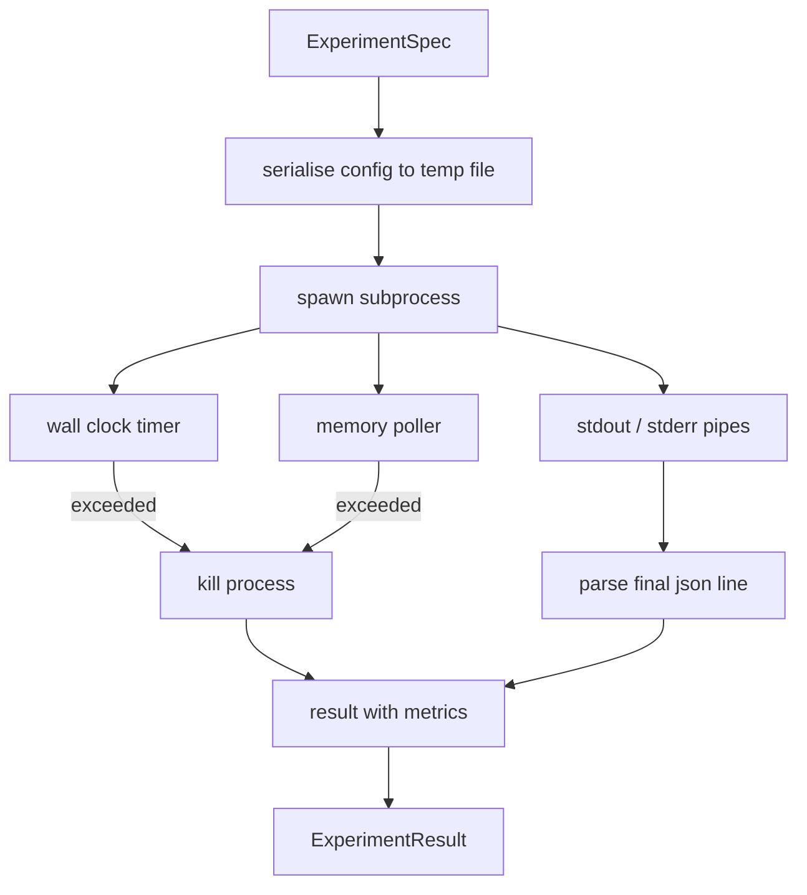

# 实验运行器

> 整个研究闭环的诚实程度，取决于它的测量有多可靠。本课构建一个运行器：接收一份实验规格（spec），在沙箱化的子进程中执行它，并输出一份评估器可以信赖的 json 指标数据。

**Type:** Build
**Languages:** Python
**Prerequisites:** Phase 19 Track A lessons 20-29
**Time:** ~90 minutes

## 学习目标
- 将一次实验编码为带类型的规格（spec），运行器可将其序列化后传给子进程。
- 启动一个带有硬性墙钟超时和软性内存上限的子进程，并将这两种限制都作为终止条件上报。
- 把 stdout、stderr 和结构化的指标数据捕获到同一条结果记录中。
- 构建消融表（ablation table）：在固定的基础 spec 上，每次只扫描一个配置旋钮。
- 在给定种子的前提下保证每条结果都是确定性的，使评估器在多次运行间看到完全相同的数字。

## 为什么用子进程

研究闭环运行的是不可信代码。假设来自采样器，实验脚本也来自同一条链路；把其中任何一个当作安全代码在进程内直接执行，等于主动邀请一次能把编排器一起拖垮的崩溃。子进程是这门语言自带的最简单的隔离手段：一个独立的进程、一块独立的地址空间、以及父进程一侧握有的信号句柄。

这里的运行器并没有实现完整的沙箱。没有 cgroup，没有 seccomp 过滤器，没有命名空间重映射。它有的是一个墙钟超时、一个轮询内存增长的循环，以及在任一限制被突破时终止进程的击杀路径。这正是所有更复杂的沙箱都在扩展的那份运行时契约。本课把这份契约保持在一口气就能读完的规模。

## ExperimentSpec 的结构

```text
ExperimentSpec
  spec_id        : str            (stable id, "exp_001")
  hypothesis_id  : int            (link back to the queue from lesson 50)
  script_path    : str            (path to the python script to run)
  config         : dict           (passed to the script as one json arg)
  seed           : int            (deterministic seed for the experiment)
  wall_timeout_s : float          (hard timeout, killed on exceed)
  memory_cap_mb  : int            (soft cap, polled; killed on exceed)
  metric_keys    : list[str]      (which fields the evaluator will read)
```

脚本存放在磁盘上；运行器把配置写入一个临时文件路径，由脚本读取。脚本需要在 stdout 上打印单行 json，其键集合必须是 `metric_keys` 的超集。stdout 上的其他内容会被捕获，但指标解析器会忽略它们。

## 架构



运行器是一个类加一个主方法。轮询器是一个小线程，每隔一个轮询间隔醒来一次，在平台支持时从 proc 文件系统读取子进程的 `psutil` 等价信息，平台不提供时则退化为空操作。

## 为什么是软性内存上限

硬性内存上限需要 `resource.setrlimit`，并且只在 POSIX 上可用。本课采用一种可移植的方案：从平台轮询常驻集大小（RSS），一旦超过上限就击杀子进程。之所以说上限是软性的，是因为轮询器的间隔不为零；进程可能在两次轮询之间冲高超过上限，然后又回落。运行器会记录观测到的最大 RSS，让评估器能看到这次运行距离上限有多近。

在不支持进程检视的系统上，轮询器会记录一次性警告并自行禁用。墙钟超时仍然生效。本课的测试覆盖了这两条路径。

## 捕获 stdout 和 stderr

运行器在进程结束时排空并读取两条管道。stdout 逐行扫描；最后一条能解析为 json 且包含全部所需 `metric_keys` 的行被认定为最终指标数据。更早出现的 json 行会以 `intermediate_metrics` 的形式保留在结果中；评估器可以用它们绘制学习曲线。

stderr 被原样捕获进结果。运行器在退出码非零时从不抛出异常，而是把退出码记录到结果里。任何非零退出都会被标记为 `"crash"`，即便脚本已经打印了指标——这样评估器默认会把部分完成的运行当作失败处理。

## 消融表

```python
def ablate(base: ExperimentSpec, knob: str, values: list[Any]) -> list[ExperimentSpec]:
    ...
```

给定一个基础 spec 和一个旋钮名，该辅助函数为每个取值返回一个 spec，并覆盖对应的 `config[knob]`。每个 spec 获得一个派生的 `spec_id`（`f"{base.spec_id}_{knob}_{value}"`）。运行器还提供一个 `AblationRunner`，按顺序运行这些 spec，并返回一张以旋钮取值为键的 `AblationTable`。

为什么每次只动一个旋钮。全因子扫描会指数级膨胀，而且产生的结果评估器无法解读。每次只动一个旋钮，得到的是评估器可以直接绘图的干净坐标轴。本课对多旋钮扫描的支持方式，仅限于由调用方自行组合多次单旋钮消融。

## 确定性

每个 spec 都携带一个种子。运行器通过配置字典把种子转发给脚本（`config["__seed"] = spec.seed`）。`code/experiments/` 中的模拟实验脚本会遵守这个种子，在多次运行间产生完全相同的指标。第五十三课的评估器依赖这一点；没有确定性，一次"回归"可能只是一次不同的随机初始化。

## 模拟实验脚本

本课提供一个实验脚本：`code/experiments/sparsity_experiment.py`。它是一个真实可运行的脚本：读取自己的配置文件，用一次 numpy 随机计算模拟一小段训练过程，然后打印一行 json 指标数据。脚本支持 `sleep_s` 旋钮用于测试超时，以及 `allocate_mb` 旋钮用于测试内存轮询器。

这个模拟并没有训练任何真实模型。它只是一次数值计算，模仿训练循环的形态：一条损失曲线、一个最终困惑度（perplexity）、一段墙钟耗时。本课的重点是运行器，不是模拟本身。真实的实验脚本会导入一个模型。

## 结果的结构

```text
ExperimentResult
  spec_id              : str
  hypothesis_id        : int
  exit_code            : int
  terminal             : "ok" | "timeout" | "oom" | "crash"
  wall_time_s          : float
  peak_rss_mb          : float | None
  metrics              : dict
  intermediate_metrics : list[dict]
  stdout_tail          : str
  stderr_tail          : str
```

评估器首先读取 `metrics` 和 `terminal`。如果 terminal 不是 `"ok"`，该实验就被记为一次失败运行，评估器的裁决自动给出。否则，指标会进入显著性检验。

## 如何阅读代码

`code/main.py` 定义了 `ExperimentSpec`、`ExperimentResult`、`ExperimentRunner`、`AblationRunner`，以及一个确定性的演示。子进程管理是一个类。内存轮询器是一个小线程。消融辅助函数只有一个函数。

`code/experiments/sparsity_experiment.py` 是测试中使用的模拟实验脚本。它从 argv 读取配置文件路径，并在结束时写出单行 json 指标。

`code/tests/test_runner.py` 覆盖了成功路径、超时路径、崩溃路径、消融表，以及跨两次运行的确定性检查。

## 它在整体中的位置

第五十课生成假设。第五十一课过滤掉文献中已有定论的内容。第五十二课为剩下的假设运行实验。第五十三课读取结果、运行显著性检验，并写下编排器将记录在该假设 id 名下的裁决。
