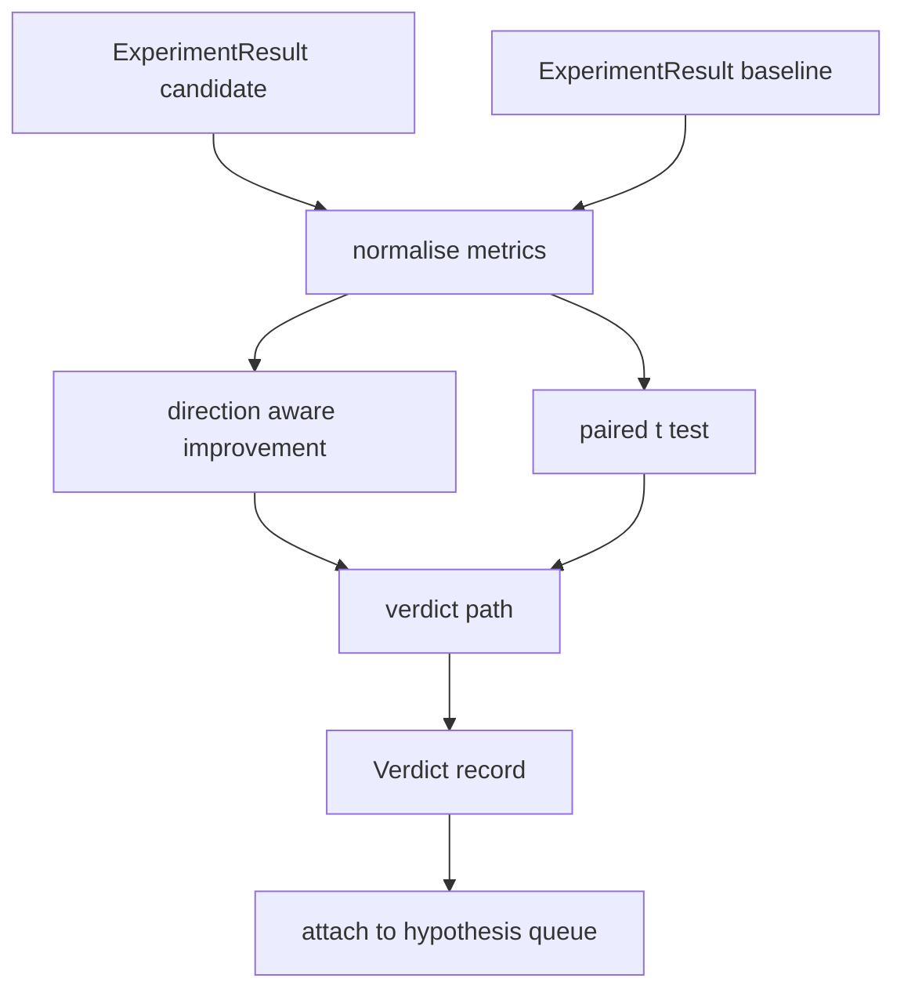

# 结果评估器

> 运行器产出了数字，评估器负责判断这些数字代表的是改进、退步还是噪声。本课构建一条裁决路径（verdict path），把指标变成一句话结论。

**Type:** Build
**Languages:** Python
**Prerequisites:** Phase 19 Track A lessons 20-29
**Time:** ~90 minutes

## 学习目标
- 使用方向感知的改进量和固定阈值，将候选运行与基线运行进行比较。
- 从零实现配对 t 检验（paired t test），在按种子的指标上运行并解读得到的 p 值。
- 对对数尺度的指标做归一化，使下游报告能把它们与线性指标混合呈现。
- 为每个假设输出一条裁决记录，供编排器附加到第五十课的队列中。
- 保持每一步都是纯函数，确保相同输入始终产生相同裁决。

## 为什么用配对检验

运行器给出的单个数字并不能说明这次改动是否真实有效。同样的配置换一个种子，就会得到不同的困惑度（perplexity）。这个变化可能只是噪声。正确的比较方式是配对：用相同的种子和相同的数据，分别在候选配置和基线配置下各跑一次。每个种子贡献一个差值。这些差值的均值就是效应量，差值的标准误就是噪声底线。

本课从零实现这个检验。不使用 `scipy.stats`。数学部分小到一屏就能读完。

```text
diffs    = [a_i - b_i for i in seeds]
mean     = sum(diffs) / n
variance = sum((d - mean) ** 2 for d in diffs) / (n - 1)
t_stat   = mean / sqrt(variance / n)
df       = n - 1
p_value  = two_sided_p(t_stat, df)
```

双侧 p 值通过正则化不完全 Beta 函数（regularised incomplete beta function）计算。本课自带一个小实现，使用 Lentz 连分数法。整个实现只有六十行标准库数学代码。

## 方向感知的改进量

有些指标越高越好（准确率、吞吐量），有些指标越低越好（损失、困惑度、墙钟时间）。评估器在每个指标上都带有一个 `direction` 字段。

```text
if direction == "higher_is_better":
    improvement = (candidate - baseline) / abs(baseline)
elif direction == "lower_is_better":
    improvement = (baseline - candidate) / abs(baseline)
```

改进量是有符号的。在一个越高越好的指标上得到负的改进量，意味着候选配置更差。裁决路径会同时读取符号和大小。

一个固定阈值（`improvement_threshold=0.02`，即百分之二）决定这次变化是否大到值得下结论。低于这个阈值时，无论 p 值如何，裁决都是 "noise"；这个循环对用户无法实际测量到的变化不感兴趣。

## 架构



评估器运行三个相互独立的计算，并在裁决路径中将它们汇合。每个计算都是没有共享状态的纯函数。

## 对数归一化

困惑度是损失的指数函数。损失下降 0.1，对应的困惑度下降幅度要大得多。在两个配置之间直接比较困惑度没有问题，但要在一份报告里把它与线性指标混合呈现，就需要归一化。

本课对所有 `scale` 字段为 `"log"` 的指标，在计算改进量之前先取自然对数。阈值随后在对数空间中应用。困惑度从 32 降到 28，在一个越低越好的指标上对应 `log(28) - log(32) = -0.133`，远超百分之二的阈值。

```text
if scale == "log":
    a = log(candidate)
    b = log(baseline)
else:
    a = candidate
    b = baseline
```

`scale="linear"`（默认值）的指标跳过这个变换。两种情况走同一条代码路径。

## 按种子的配对检验

第五十二课的运行器对每次运行输出一份最终指标数据。要做配对检验，评估器需要候选配置和基线配置各自按种子输出一份指标数据。编排器在两种配置下用同一组种子运行同一个实验，然后把两个 `ExperimentResult` 记录列表交给评估器。

评估器按种子配对（种子存放在 `result.metrics["seed"]` 中），并遍历指定的指标。如果两个列表的种子不能匹配，评估器会抛出 `PairingError`。这时编排器应当重新运行。

## Verdict 的结构

```text
Verdict
  hypothesis_id          : int
  metric                 : str
  direction              : "higher_is_better" | "lower_is_better"
  scale                  : "linear" | "log"
  candidate_mean         : float
  baseline_mean          : float
  improvement            : float       (signed, fraction; see direction rules)
  p_value                : float | None  (None if n < 2)
  significance_threshold : float
  improvement_threshold  : float
  verdict                : "improved" | "regressed" | "noise" | "failed"
  rationale              : str
```

裁决路径是一张小型决策表：

```text
1. If any candidate result has terminal != "ok": verdict = "failed"
2. else if |improvement| < improvement_threshold:  verdict = "noise"
3. else if p_value is None or p_value > significance: verdict = "noise"
4. else if improvement > 0:                          verdict = "improved"
5. else:                                             verdict = "regressed"
```

rationale 是一句人类可读的单行说明，编排器可以把它记录到对应的假设 id 下。

## 如何阅读代码

`code/main.py` 定义了 `MetricSpec`、`Verdict`、`Evaluator`、t 统计量和不完全 Beta 函数的辅助实现，以及一个确定性的演示。t 检验完全用标准库数学实现；numpy 只用来读取指标列表并计算均值和方差。

`code/tests/test_evaluator.py` 覆盖了以下场景：改进路径、退步路径、噪声路径（改进量太小）、噪声路径（样本数太少）、终止状态失败路径、对数归一化路径、与已知参考值对照的 t 检验，以及配对错误。

## 它在整体中的位置

第五十课产出了假设队列。第五十一课过滤掉了文献已有定论的内容。第五十二课在候选配置和基线配置下、跨多个种子运行了实验。第五十三课读取这些运行结果并写出裁决。编排器把这四部分串联起来：

```text
for hypothesis in queue:
    literature = retrieval.search(hypothesis.text)
    if literature_settles(hypothesis, literature):
        attach(hypothesis, verdict="settled")
        continue
    candidates = runner.run_all(specs_for(hypothesis))
    baselines  = runner.run_all(baseline_specs_for(hypothesis))
    metric_spec = MetricSpec("perplexity", direction=LOWER, scale=LOG)
    verdict = evaluator.evaluate(hypothesis.id, metric_spec, candidates, baselines)
    attach(hypothesis, verdict)
```

这个编排器不在本课范围内；四节课的产物可以直接组合成它，除了各自定义的 dataclass 之外不需要任何额外的胶水代码。
