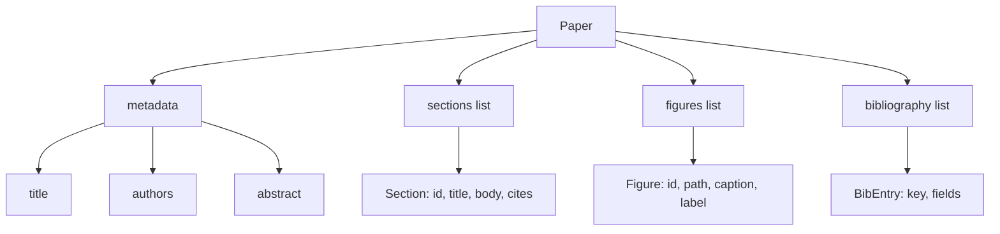
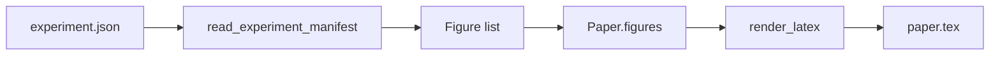
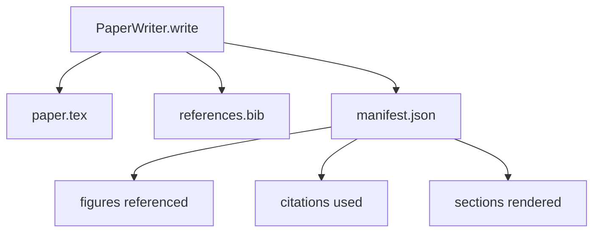

# 论文写作器

> LaTeX 骨架是研究者与排版器之间的契约。契约一旦被破坏，文档就无法编译，而且失败会非常显眼。先搭骨架，再填内容。

**Type:** Build
**Languages:** Python
**Prerequisites:** Phase 19 lessons 50-53
**Time:** ~90 minutes

## 学习目标

- 把研究论文当作一个带有已知章节图谱的结构化产物来处理，而不是一篇自由形式的文档。
- 在写下任何正文之前，先生成一个 LaTeX 骨架，声明摘要、章节、图表槽位和参考文献键。
- 通过确定性的槽位机制，把实验输出中的图表（路径与图注）注入骨架。
- 接入一个模拟的正文生成器，根据结构化大纲填充每个章节，让整个框架无需模型也可测试。
- 输出一个 `paper.tex`、一个 `references.bib`，外加一份清单（manifest），列出引用到的每张图和用到的每条引文。

## 为什么先搭骨架

从正文写起的草稿会不断累积结构性债务。引言里多出三段本该放进相关工作的内容；某张图在定义之前就被引用了；参考文献里同一篇论文出现了三个不同的键。等作者察觉到的时候，重写的代价已经高于写作本身的代价。

骨架把这个过程颠倒过来。结构以数据的形式预先声明。章节是带名称和顺序的槽位；图表是带 id 和图注的槽位；参考文献键在顶部声明，并指向各自的条目。正文逐个生成到这些槽位中。在写下任何正文之前，框架就能验证：每张图都有槽位，每条引文都有对应条目，每个章节都出现在目录里。

这与前面课程对计划、工具调用和追踪记录所采用的纪律完全一致。结构即契约。

## Paper 的形状

每个字段都是普通的 Python 数据。渲染器是一个从 `Paper` 到 LaTeX 字符串的纯函数。框架可以在渲染前对论文做内省：统计章节数、列出缺失的图表文件、检查每个 `\cite{key}` 是否都有匹配的 `BibEntry`。

## 渲染契约

渲染器保证三个性质。第一，骨架中的每个图表槽位都会输出一个 `\begin{figure}` 块，并带有形如 `fig:<id>` 的稳定标签。第二，每个章节都会输出一个 `\section{}`，带有形如 `sec:<id>` 的稳定标签，从而保证交叉引用可用。第三，参考文献部分输出一个 `\bibliography` 块，其对应的 `references.bib` 恰好包含论文上声明的全部条目，不多也不少。

违反其中任何一条都是渲染错误，而不是警告。骨架就是契约；一次悄悄丢掉某张图的渲染就是违约。

## 从实验注入图表

本系列前面的课程以 JSON 清单的形式产出实验结果。每份清单携带一个产物列表，包含路径和简短图注。论文写作器读取该清单并生成 `Figure` 记录。

注入过程是确定性的。图表 id 由实验名称加一个单调递增的计数器派生而来。图注来自清单。路径会被规范化为相对论文输出目录的形式，这样即使实验输出位于磁盘上的其他位置，LaTeX 也能正常编译。

## 模拟正文生成器

本课不调用模型。一个 `MockProseGenerator` 读取大纲并确定性地输出正文。大纲的形态是每个章节一个短字符串。生成器把这个字符串扩写成两个短段落，并把章节标题编织进去。当大纲声明了图表和引文时，生成的正文会在恰当的位置点名提及它们。

这足以测试写作器的全部行为。真实实现只需把生成器换成模型调用，外围的框架不需要任何改动。这正是把正文生成器声明为可调用对象（callable）的价值所在：测试时替换为确定性版本，生产中替换为模型版本，流水线的其余部分完全相同。

## 清单输出

写作器向输出目录写出三个文件。

清单是下游评估器或批评循环（critic loop）读取的对象。下游不去解析 LaTeX，而是读清单。下一课的批评循环就以这份清单作为输入，产出一份反馈列表。这就是为什么清单属于契约的一部分，而 LaTeX 不属于。

## 验证门控

写作器在写出任何文件之前会运行四道门控。

1. 论文内每个图表 id 都唯一。
2. 每个章节的 `cites` 字段引用的参考文献键都已在论文上声明。
3. 摘要非空。
4. 标题非空。

任何一道门控失败都会抛出 `PaperValidationError`，并附带精确的原因。框架将该原因作为失败模式呈现出来。不存在部分写入：要么三个文件全部写出，要么一个都不写。

## 如何阅读代码

`code/main.py` 定义了 `Paper`、`Section`、`Figure`、`BibEntry`、`PaperValidationError`、`MockProseGenerator`、`PaperWriter`，以及一个 `render_latex` 函数。`write` 方法接收一个输出目录，写出 `paper.tex`、`references.bib` 和 `manifest.json`。辅助函数 `read_experiment_manifest` 把一组实验清单转换成 `Figure` 记录。

`code/tests/test_paper_writer.py` 覆盖了：无章节时的骨架渲染、含两个章节和两张图的完整渲染、缺失引文门控、重复图表 id 门控、清单内容，以及 LaTeX 字符串契约（每个章节都输出一个 `\section{}`，每张图都输出一个 `\begin{figure}`）。

## 更进一步

真实实现会需要两个扩展。第一，多格式渲染：同一个 `Paper` 形状既能编译成 Markdown 用于博客文章，也能编译成 HTML 用于预览。渲染器变成 `Paper` 上的一个策略。第二，引文富化：写作器根据引文键从本地 DOI 缓存中获取 BibTeX 条目。两者都有价值，且都可以在不触碰骨架契约的前提下加入。

骨架就是这门课押下的赌注。章节、图表、引文以数据的形式声明，正文生成进槽位，清单与 LaTeX 一同输出。其余所有改进都在此之上组合叠加。
