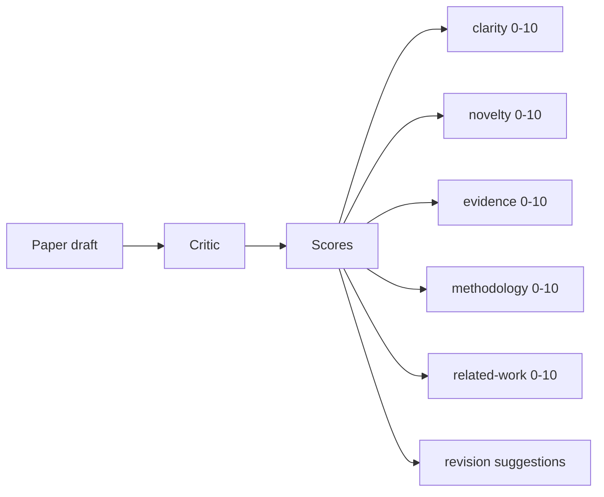
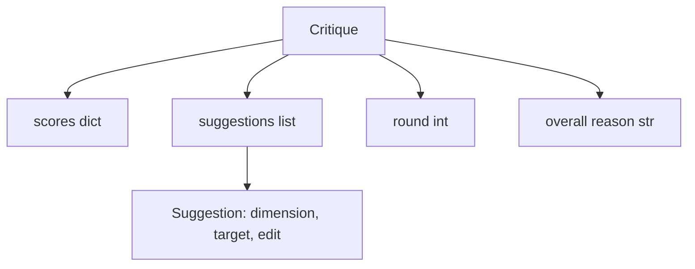
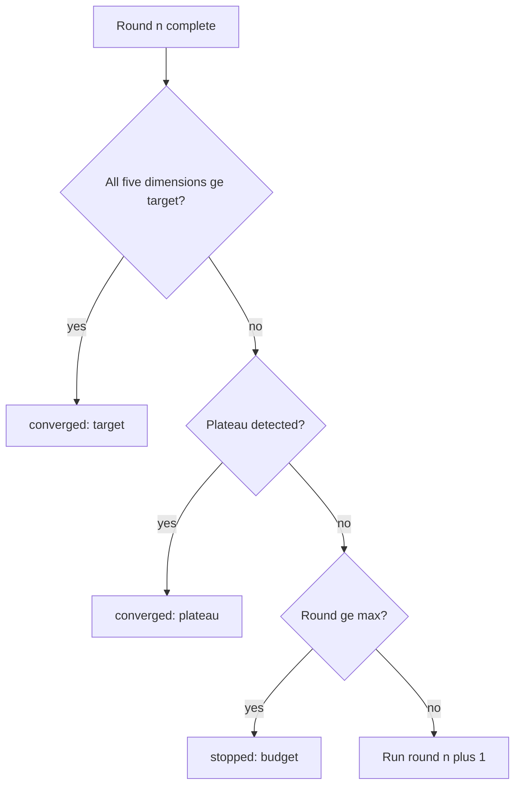
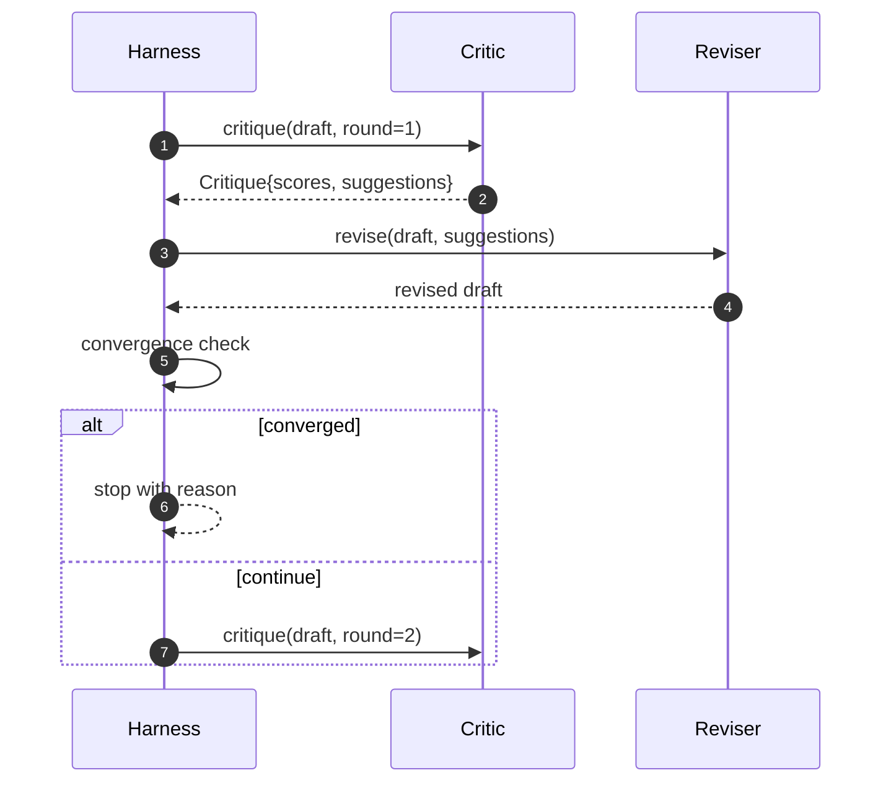

# 批评者循环

> 第一轮就返回"看起来不错"的批评者是坏的，永远返回"还需修改"的批评者也是坏的。有价值的批评者是能收敛的那一个——而收敛必须靠工程手段实现。

**Type:** Build
**Languages:** Python
**Prerequisites:** Phase 19 lessons 50-53
**Time:** ~90 minutes

## 学习目标

- 沿五个固定维度为论文草稿打分：清晰度（clarity）、新颖性（novelty）、证据（evidence）、方法论（methodology）、相关工作（related-work）。
- 把每一轮的批评意见作为结构化的修订差异（diff）来应用，而不是自由发挥的重写。
- 通过比较各轮分数来检测收敛；在分数停滞、达到目标或预算耗尽时停止。
- 用最大迭代预算限制轮数，让无法收敛的批评者不会无限运行下去。
- 输出每轮的追踪记录（trace），让仪表盘或下一阶段能够渲染分数变化轨迹。

## 为什么是五个固定维度

自由形式的批评者就是一个返回一段建议文字的模型。下一轮的修订只能把这段文字当作背景上下文。重写是否真正回应了批评无从验证，因为批评本身从未具备结构。

五个维度给了执行框架（harness）一份契约。



分数是一个向量。执行框架跨轮次监视每个维度。一次提升了清晰度却拉低了证据分的修订，在证据维度上就是一次退化，收敛检查能看到它。只靠模型的批评者无法提供这种保证。

## Critique 的结构



每条建议都带有它要改进的维度、它针对的章节，以及一条修订器（reviser）可以执行的 `edit` 指令。修订器同样是一个可调用对象。本课内置了一个确定性修订器，它把 edit 指令解释为"向指定章节追加内容"的操作。换成模型驱动的修订器，则会把同一个字段当作提示词来解释。契约本身不变。

## 收敛规则（按顺序）

只要三个条件中任意一个触发，批评者循环就终止。



目标条件是最严格的：五个维度（clarity、novelty、evidence、methodology、related_work）每一个都必须达到 `>= target_score`（默认 `8.0`），循环才会以成功返回。均值很高但有一个维度偏弱是不够的。停滞（plateau）检测把当前轮的均值与上一轮的均值做比较：如果连续两轮的提升都低于 `plateau_epsilon`（默认 `0.1`），循环以 `plateau` 退出。预算是对轮数的硬性上限（默认 `5`），触发时以 `budget` 退出。

顺序很重要：目标优先于停滞，停滞优先于预算。如果第三轮在同一次迭代中既达到了目标又会触发停滞，结果是 `target` 而不是 `plateau`。

## 为什么停滞检测要跨两轮

只看一轮的停滞是噪声。真实的批评者即使面对固定不变的草稿，每次迭代也会返回略有差异的分数，因为确定性打分仍然取决于哪些建议被应用了、以什么顺序应用。要求连续两轮停滞可以滤掉这种噪声。如果执行框架报告了停滞，就意味着草稿确实不再改进了。

## 本课的确定性批评者

本课不调用模型。内置的批评者是一个可调用对象，它依据三类信号给草稿打分：章节正文的平均长度（清晰度）、图表数量和引用数量（证据），以及论文元数据上的 `originality_tag` 字段（新颖性）。修订器知道如何把每一项分数往上推。

```text
clarity      grows when the average section body length increases
novelty      grows when originality_tag is set to "high"
evidence     grows when a section's figure_refs is non-empty
methodology  grows when a section titled "Method" exists with body
related-work grows when a section titled "Related Work" exists with body
```

修订器把每条建议解释为一次有针对性的追加。第一轮之后，执行框架就能观察到分数在上升。测试正是利用这一性质来断言循环在缩小差距。

## 完整的循环契约



执行框架掌管轮次计数器、追踪记录和收敛检查。批评者掌管分数。修订器掌管修订差异。三者互不触碰彼此的状态。

## Trace 输出

每一轮都会发出一条追踪事件，包含轮次编号、分数向量、建议数量和收敛裁决。完整的追踪记录会和最终草稿一起返回。下游仪表盘可以据此渲染每轮分数图表。下一课的迭代调度器会读取追踪记录，来决定这个分支是否值得保留。

## 用预算防御糟糕的批评者

一个产出的建议从不提升分数的批评者，会把循环锁死在最大迭代上限上。追踪记录让这一点清晰可见：跑满五轮、分数纹丝不动、裁决为 `budget`。用户读到的是批评者的 bug，而不是草稿的问题。换成只展示最终草稿的做法，诊断信息就被掩盖了。追踪优先（trace-first）的设计把它暴露出来。

## 如何阅读代码

`code/main.py` 定义了 `Critique`、`Suggestion`、`Critic` 协议、`Reviser` 协议、`CriticLoop`，以及一个 `make_deterministic_critic_pair` 工厂函数，它返回确定性批评者和与之配套的修订器。文件中还包含一个最小的 `Paper` 结构，让本课可以独立运行。

`code/tests/test_critic_loop.py` 覆盖：第一轮之后的单调改进、调好参数的草稿达到目标收敛、两轮平坦后的停滞检测、建议不带来任何改进时的预算耗尽、修订器对建议的应用，以及追踪记录的结构。

## 更进一步

真实实现会需要两个扩展。其一，维度权重：投 workshop 的论文把新颖性权重调高于方法论，期刊论文则反过来。收敛检查变成加权均值。其二，配对批评者：一个批评者打分，第二个批评者在修订器看到建议之前对它们做裁定。两者都有价值，两者都构建在同一个 `Critique` 结构之上。

下注的核心是分数向量。一旦批评意见被结构化，其他所有改进——收敛规则、仪表盘、配对批评者——都能直接接入而不必改动循环本身。
