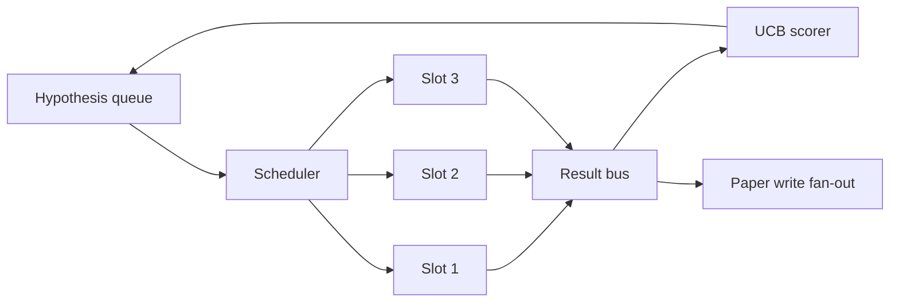
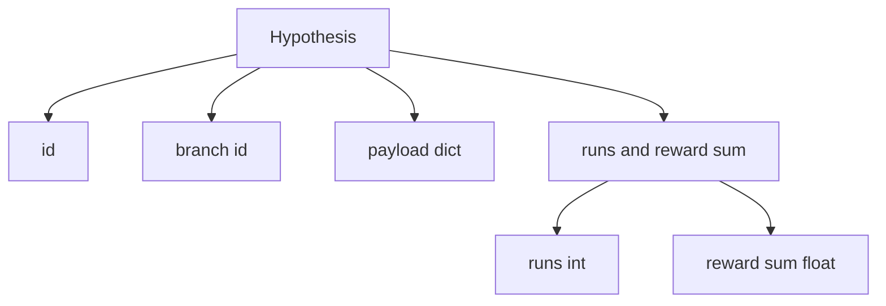
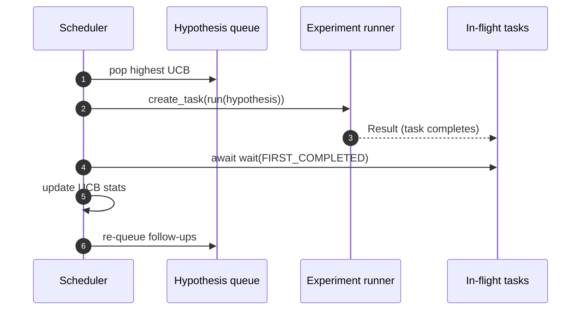

# 迭代调度器

> 没有调度器的研究循环只是一个自欺欺人的队列。调度器是循环决定停止探索什么的地方，而这个决定就是整场博弈的关键。

**Type:** Build
**Languages:** Python
**Prerequisites:** Phase 19 lessons 50-53
**Time:** ~90 minutes

## 学习目标

- 将研究工作流建模为一个假设队列，它向并行实验槽位供给任务，实验结果再汇聚（fan-in）回来。
- 使用 asyncio 并发运行多个实验，使调度器能让所有槽位保持忙碌。
- 用 UCB 为每个假设分支打分，使调度器能在不放弃探索的前提下剪除低收益分支。
- 将完成的结果分发（fan-out）到论文撰写阶段和重新入队阶段，使高收益分支能派生出后续假设。
- 输出每次迭代的追踪记录（trace），包含分支得分、槽位占用情况和剪枝决策。

## 为什么需要调度器，而不是工作清单

扁平的工作清单按提交顺序执行任务。当任务彼此独立时这没问题。但研究并不独立：实验三的发现会改变实验四和实验五的优先级。一个能读取结果汇聚信息并重排队列的调度器，能在单位算力下完成更多有用的工作。

有意思的设计选择在于打分规则。贪心打分器总是选择当前的领先者，从不探索。均匀打分器则从不利用已有优势。UCB（上置信界，upper confidence bound）是折中之道：利用领先者的同时，为尝试次数较少的分支保留一部分算力。

## 系统形态



队列存放假设。当某个槽位空出时，调度器选取 UCB 最高的假设。每个槽位异步运行一个实验。完成的实验把结果推送到总线上。总线更新来源分支的 UCB 统计量，并在某个分支的收益越过阈值时，将结果分发到论文撰写阶段。

## Hypothesis 的结构



`branch` 是 UCB 统计量的键。多个假设可以共享同一个分支（分支代表研究方向，假设则是该方向上的一次试验）。`runs` 是该分支已完成实验的计数，`reward_sum` 是累计奖励。UCB 同时读取两者。

## UCB 打分

本课使用的 UCB 公式是经典的 UCB1。

```text
ucb(branch) = mean_reward(branch) + c * sqrt( ln(total_runs) / runs(branch) )
```

`total_runs` 是所有分支上已完成实验的总数。`c` 是探索权重；本课默认取 `sqrt(2)`。运行次数为零的分支得分为 `+inf`，因此从未尝试过的分支总是最先被调度。平均奖励高的分支会维持高分，直到其他分支追上来；一个运行多次却收益寥寥的分支，会被运行次数更少的备选分支盖过。

剪枝门控与选取器是分开的。当某个分支在至少 `prune_after_runs` 次试验（默认 `3`）之后，平均奖励仍低于绝对下限（默认 `0.2`）时，剪枝会将该分支从后续调度中移除。这能保证队列规模有界。

## 用 asyncio 实现并行槽位

调度器通过 `asyncio.create_task` 驱动实验。每个任务运行实验执行器（一个 `async def` 可调用对象），返回一个 `Result`。主循环用 `asyncio.wait(..., return_when=asyncio.FIRST_COMPLETED)` 等待在途任务集合，并在每个任务完成时触发打分更新。



三个槽位并发运行。主循环从不阻塞在单个实验上。只要有槽位空出，调度器就立即启动新任务，直到队列为空且没有在途任务为止。

## 分发：论文触发

当某个分支的平均奖励越过 `paper_threshold`（默认 `0.7`）且该分支尚未产出过论文时，调度器会向输出列表分发一个 `paper.trigger` 事件。在下游，第五十四课的论文撰写器会接收这个事件。在本课中，触发事件被收集到一个列表里，方便测试断言。

## 分发：后续假设

当一个高收益结果落地时，调度器可以调用用户提供的 `expander`，在同一分支上生成一个或多个后续假设。expander 是一个从 `Result` 到 `list[Hypothesis]` 的纯函数。本课附带一个确定性的 expander：对任何奖励超过论文阈值的结果，生成两个后续假设。

## 预算

两个预算保护调度器免于失控循环。

```text
max_experiments    : total count of experiments run across all branches
max_seconds        : wall-clock cap (asyncio time)
```

任一预算触发时，调度器停止调度新任务，等待在途任务完成，然后返回最终的追踪记录。追踪记录中包含一个 `stop_reason`。

## 追踪记录与最终报告

每个调度决策（选取、派发、结果、剪枝、分发）都会发出一个事件。最终报告汇总各分支统计量、总运行次数、总耗时（wall-clock），以及已触发的论文事件。下一课的端到端演示会读取这份报告来驱动论文撰写器。

## 如何阅读代码

`code/main.py` 定义了 `Hypothesis`、`Result`、`BranchStats`、`IterationScheduler`，以及一个 `make_deterministic_runner` 工厂函数，它返回一个奖励可预测的 asyncio 实验执行器。执行器会休眠固定的 `delay_ms`（默认 `5ms`），从而让并发行为可观察。

`code/tests/test_scheduler.py` 覆盖：UCB 优先选取未尝试的分支、并行槽位占用、越过阈值时的论文触发、低收益试验后的分支剪枝、后续假设的分发，以及预算退出（实验计数与墙钟时间两种）。

## 更进一步

真实实现还需要三个扩展。第一，跨会话持久化 UCB 统计量：当前的统计量只存在于内存中；真实的调度器会对它们做检查点（checkpoint），使重启后已花费的探索预算得以保留。第二，多目标打分：每个结果不再发出标量奖励，而是发出一个向量，UCB 变成 Pareto 风格的选取器。第三，上下文老虎机（contextual bandits）：选取器以假设特征（长度、复杂度）为条件，使相似的假设共享探索。

调度器是研究超越工作清单的关键所在。一旦接入了 UCB 且槽位并行运转，其他一切改进都可以在此之上叠加组合。
