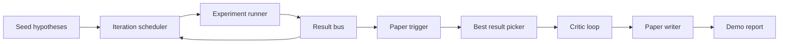
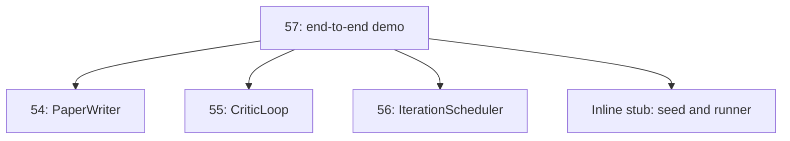
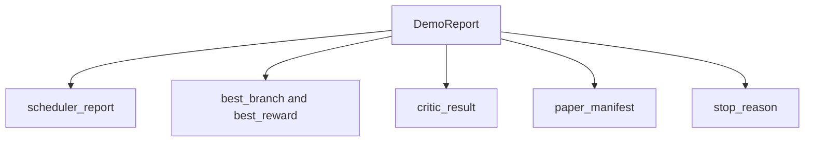

# 端到端研究演示

> 演示（demo）是你此前写下的每一个契约必须组合到一起的地方。只要其中任何一个出现泄漏，这节课就是抓住它的那一课。

**Type:** Build
**Languages:** Python
**Prerequisites:** Phase 19 lessons 50-53
**Time:** ~90 minutes

## 学习目标

- 端到端地接通自动研究循环：假设种子、实验运行器、调度器、评审循环（critic loop）、论文写作器。
- 通过普通的 Python import 组合 Track D 前四节课的基础组件，而不是依赖框架。
- 把循环运行到自行终止，并产出一份列出每个阶段输出的演示报告。
- 保持演示的确定性，使测试套件能够断言最终的输出形态。
- 当任一阶段的契约被破坏时，暴露清晰的失败模式，避免下一阶段在损坏的输入上继续运行。

## 这里组合了什么



共五个阶段。种子是一份包含三个假设的列表。调度器用三个并行槽位在这些假设上运行六次实验。结果总线报告一个或多个论文触发事件。挑选器选出唯一的最佳结果。评审循环对基于该结果构建的草稿进行迭代。论文写作器产出最终的 LaTeX、BibTeX 和清单（manifest）。

## 为什么用 import，而不是复制

前面每节课都附带一个包含公开 dataclass 和函数的 `main.py`。演示通过把各节课的父目录加入 `sys.path` 来导入它们。这不是框架式的接线；它与前面课程的测试文件已经在用的 import 完全相同。



内联桩（inline stub）代替了第五十到五十三课的内容：一个生成种子假设的小型生成器和一个同步的奖励函数。用户只需调整两处 import，就能把内联桩换成那些课程中的真实组件。

## 确定性保证

演示在构造上就是确定性的。实验运行器使用固定种子的 numpy。评审循环的修订器按固定顺序遍历固定的维度。论文写作器的正文生成器是第五十四课中那个 mock 版本。调度器的 UCB 挑选器按迭代顺序打破平局，而不是随机选择。

给定相同的种子，演示产出相同的报告。测试通过运行演示两次并比较清单来断言这一性质。

## 演示报告的形态



每个字段都原封不动地来自上游阶段。演示不转换任何输出；它只做组合。这正是演示所承担的那场测试。

## 失败模式处理

每个阶段要么成功，要么抛出带类型的错误。

```text
Scheduler ........ returns SchedulerReport with stop_reason
                   in {queue_empty, max_experiments, deadline}
Best-result pick . raises NoTriggerError if no paper trigger fired
Critic loop ...... returns LoopResult with status converged or stopped
Paper writer ..... raises PaperValidationError on contract break
```

任何阶段的失败都会以带类型的异常短路整个演示。测试钉死了这一契约：`test_no_triggers_raises_typed_error` 和 `test_best_picker_raises_when_no_triggers` 断言当没有分支触发论文事件时，挑选器抛出 `NoTriggerError` / `BestResultError`，且写作器从不会被调用。

## 最佳结果挑选器

调度器按分支产出论文触发事件。挑选器选出在所有触发事件中平均奖励最高的分支。平局按分支 id 的字母顺序打破，以保证演示的确定性。挑选器是一个小的纯函数；测试在一份固定的调度器报告上钉死它的行为。

## 接入评审循环

第五十五课的评审循环作用于 `MiniPaper`。演示从被选中的分支构建一个 `MiniPaper`：用分支 id 填充摘要，初始化两个章节（Introduction 和 Results），并根据分支的平均奖励设置 `originality_tag`（`>= 0.8` 为 high，`>= 0.6` 为 medium，否则为 low）。

随后修订器迭代草稿直至收敛。其输出进入论文写作器。

## 接入论文写作器

第五十四课的论文写作器作用于带图表和参考文献的完整 `Paper` 结构。演示通过 `mini_to_full_paper` 把收敛后的 `MiniPaper` 升级为完整论文：为选中的分支附加一张图表，并基于评审建议的引用键（cite key）的并集构建一份小型合成参考文献。演示添加的每一条引用也都会加入参考文献列表，从而保证校验通过。

## 如何阅读这份代码

`code/main.py` 定义了 `BestResultError`、`NoTriggerError`、`DemoReport`、`pick_best_branch`、`build_mini_paper`、`mini_to_full_paper` 和 `run_demo`。文件顶部的 import 一次性调整 `sys.path`，并从各自的课程中拉取 `PaperWriter`、`CriticLoop` 和 `IterationScheduler`。

`code/tests/test_e2e.py` 覆盖：演示端到端运行并产出五个字段全部填充的报告、两次运行间的确定性、没有分支越过阈值时抛出 NoTriggerError、写作器契约被破坏时抛出 PaperValidationError、论文清单包含被选中分支的图表，以及调度器的停止原因属于预期值之一。

## 更进一步

演示跑通之后，有三个值得接入的扩展。第一，持久化状态：每个阶段的结果写入一个小型 JSON 存储，使得重启后可以续跑，而无需重新运行那些廉价的阶段。第二，仪表盘：把调度器和评审循环的追踪事件渲染成一条统一的时间线。第三，真实模型调用：把 mock 的正文生成器和确定性的评审器换成由模型驱动的版本；接线方式不需要任何改变。

演示的职责是证明：组合本身就是架构。五节课，四个 import，一份报告。下次你再添加一个阶段时，接线代码恰好只增加一行。
