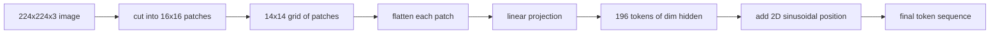

# 视觉编码器图像块

> 读取像素的视觉模型需要一个针对像素的分词器，图像块嵌入（patch embedding）就是这个分词器。把图像切成方格网格，将每个方块展平，通过一个线性层做投影，再加上 2D 位置信号，让 Transformer 知道每个方块在原图中的位置。

**Type:** Build
**Languages:** Python
**Prerequisites:** Phase 19 lessons 30-37 (Track B foundations)
**Time:** ~90 minutes

## 学习目标

- 将一张图像分词为固定长度的图像块嵌入序列。
- 实现基于 `Conv2d` 的图像块投影，使其在数学上与 unfold-再-线性变换完全一致。
- 构建确定性的 2D 正弦位置嵌入，让 token 顺序编码空间位置。
- 在合成测试数据上验证图像块数量、嵌入形状，以及 `Conv2d` 与 unfold 的等价性。

## 问题背景

Transformer 吃的是向量序列，而图像是一个 3 通道的网格。把每个像素当作一个 token 会让序列长度爆炸：一张 224x224 的 RGB 图像就是 150,528 个 token，12 层 Transformer 的注意力根本承受不起。而把整张图像当作一个巨大的扁平向量读入，则会丢掉局部性，注意力层也无法恢复这种信息。编码器前端的任务，就是把像素网格压缩成几百个 token，每个 token 概括一个方形区域。

图像块嵌入用一次线性投影解决了这个问题。一张 224x224 的图像按 16x16 切块，得到 14x14 的网格，共 196 个图像块。每个图像块从 `(3, 16, 16) = 768` 个像素值展平为一个向量，再由一个线性层映射到模型的隐藏维度。Transformer 看到的是 196 个维度为 `hidden`（通常为 768）的 token，外加一个 CLS token。这样的序列，网络的其余部分才嚼得动。

## 核心概念



### 为什么用图像块，而不是像素

注意力的计算量与序列长度成平方关系。196 个 token 的序列，每层每个头需要计算 `196 * 196 = 38,416` 个注意力分数；而 150,528 个 token 的序列则需要 `150,528 * 150,528 = 226 亿` 个。图像块换来了注意力计算量约 59 万倍的缩减，而一个 16x16 的区域已经携带了足够的信号来支撑高层视觉任务。代价是丢失了单个图像块内部的细粒度空间细节，这也是为什么下游多模态架构在需要精细定位时，常常会再加一条高分辨率分支。

### 为什么一个线性投影就够了

每个图像块被当作独立向量处理。投影学习的是一组基：边缘检测器、颜色滤波器、简单纹理。单个线性层很小（ViT-Base 是 `768 * 768 = 589,824` 个参数），训练也快。更深的卷积主干也存在（即「混合式」ViT），但扁平的线性投影才是标准做法，绝大多数现代开源权重编码器用的正是这个结构。

### `Conv2d` 技巧

一个 `Conv2d(in_channels=3, out_channels=hidden, kernel_size=patch_size, stride=patch_size)`、不加 padding，与 unfold-再-线性变换的数值结果完全相同，因为每个输出位置都是把图像块像素与一个滤波器做点积。这个卷积本身就是图像块投影，绝大多数生产代码库也是这样实现的，因为它在 GPU 上更快，还少一次 reshape。

### 位置嵌入

经过投影后的 token 不携带任何顺序信息。2D 正弦嵌入给每个 token 一个固定信号，编码其 `(row, col)` 位置。嵌入维度的一半用多个频率的 sin/cos 编码行位置，另一半编码列位置。这种编码是确定性的，因此切换分辨率无需重新训练，并且可以平滑地插值到模型训练时从未见过的网格尺寸。

| 组件 | 形状 | 参数量 |
|-----------|-------|------------|
| 图像块投影（`Conv2d`） | `(hidden, 3, patch, patch)` | `3 * P * P * hidden + hidden` |
| 位置嵌入（固定） | `(num_patches, hidden)` | 0（计算得到，非学习参数） |
| CLS token（可学习） | `(1, hidden)` | `hidden` |

对于 224 分辨率下的 ViT-Base/16：投影部分有 590,592 个参数，CLS token 有 768 个，正弦位置嵌入的参数量为零。下一课（第 59 课）将在这个前端之上堆叠一个 12 层 Transformer。

### 用等价性做完整性检查

图像块这一步有两种写法：`Conv2d` 投影，以及显式的 unfold-再-线性变换。在权重相同的情况下，它们必须产生相同的输出。如果不相同，说明 unfold 的数学有错，编码器的其余部分就是建在沙子上。本课的测试正是验证这个等价性。

## 从零实现

`code/main.py` 实现了：

- `PatchEmbed`，一个封装 `Conv2d` 做图像块投影的 `nn.Module`。
- `sinusoidal_2d(grid_h, grid_w, dim)`，一个无状态函数，用于构建 2D 位置表。
- `VisionFrontEnd`，把图像块嵌入、CLS 前置和位置加法组合成一次前向传播。
- 一个 `synthesize_image(seed)` 辅助函数，用 `numpy.random` 构建确定性的 224x224x3 测试图像。
- 一个演示程序，把一张测试图像送入前端，打印输出形状、CLS token 的范数，以及位置嵌入的一行。

运行：

```bash
python3 code/main.py
```

输出：224x224 的测试图像被分词为形状 `(1, 197, 768)` 的序列。第一个 token 是 CLS，接下来的 196 个是图像块 token。位置嵌入的范数在同一行内是均匀的，这正是正弦编码的特征。

## 生产实践

同样的图像块前端出现在每一个现代视觉-语言模型中：CLIP ViT-L/14、SigLIP、DINOv2、Qwen-VL 系列、InternVL 架构，全都从 `Conv2d` 图像块投影加位置信号起步。各家的差异在下游（CLS 池化 vs 无 CLS 池化、register token、不同的图像块尺寸 14 vs 16、通过位置插值实现的动态分辨率）。本课实现的前端，是所有这些模型共同站立的基座。

## 测试

`code/test_main.py` 覆盖：

- 图像块数量等于 `(image_size / patch_size) ** 2`
- 输出形状等于 `(batch, num_patches + 1, hidden)`
- 在小型测试数据上，`Conv2d` 投影与手动的 unfold-再-线性变换结果一致
- 正弦位置表在多次调用间是确定性的
- CLS token 在 batch 维度上广播且无数据泄漏

运行：

```bash
python3 -m unittest code/test_main.py
```

## 练习

1. 把正弦位置嵌入替换成可学习的 `nn.Parameter`，在一个小型合成分类任务上比较第一个 epoch 的损失。固定分辨率下可学习位置占优；训练后更换分辨率时正弦位置占优。

2. 把 `Conv2d` 换成显式的 `nn.Unfold` 加 `nn.Linear`，并断言两者输出在浮点容差范围内一致。同一套数学，两种写法。

3. 增加对非正方形图像块尺寸的支持（例如宽幅输入用 32x16），并验证位置表能处理非正方形网格。

4. 在 batch size 为 1、8、64 时对图像块步骤做性能剖析。图像块投影很少是瓶颈；下游的注意力层才是大头。

5. 将前端作为冻结的特征提取器，在一个 4 类合成形状数据集（圆形、方形、三角形、星形）上训练。CLS token 的输出应能线性可分。

## 关键术语

| 术语 | 含义 |
|------|---------------|
| 图像块（Patch） | 图像中的方形子区域，通常为 14x14 或 16x16 |
| 图像块嵌入（Patch embedding） | 将一个展平的图像块线性投影到隐藏维度 |
| 序列长度（Sequence length） | 图像块分词后的 token 数量，通常再加上 CLS |
| 正弦位置（Sinusoidal position） | 编码 2D 网格坐标的固定 sin/cos 信号 |
| CLS token | 前置到序列开头、作为池化头的可学习向量 |

## 延伸阅读

- An Image is Worth 16x16 Words（ViT，2021），图像块嵌入的原始提出。
- Attention Is All You Need（2017），本课改造到 2D 的正弦位置公式出处。
- DINOv2 论文，介绍 register token，可以作为练习 6 添加的扩展。
