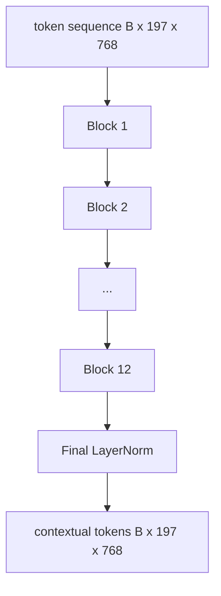
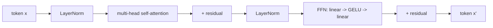

# Vision Transformer 编码器

> 仅有图像块（patch）还看不见图像。一个 12 层、带 12 个注意力头的 pre-LN Transformer 把图像块 token 序列转化为上下文 token 序列，并由 CLS token 在其最终隐藏状态中汇聚整张图像的特征。这一课是每一个现代视觉-语言模型的发动机舱。

**Type:** Build
**Languages:** Python
**Prerequisites:** Phase 19 lessons 30-37 (Track B foundations)
**Time:** ~90 minutes

## 学习目标

- 实现一个 pre-LN Transformer 块，包含多头自注意力和前馈子层。
- 堆叠 12 个块、配 12 个注意力头，构成一个 ViT-Base 编码器。
- 把第 58 课的图像块前端接入编码器，并跑通一次前向传播。
- 验证 CLS token 确实聚合了来自每个图像块的信息。

## 问题背景

图像块嵌入产生一个 197 个 token 的序列，每个 token 都是一个对其他图像块毫无感知的向量。一张猫的图片，需要每个图像块知道哪些块里有胡须、哪些是背景、哪些包含眼睛。Transformer 正是逐层注意力地构建这种感知的机制。没有它，图像块前端只是一个聪明的分词器，谈不上任何理解。

标准配方是：12 层深、12 头宽、pre-LayerNorm 放置、GELU 激活、前馈层 4 倍扩展。这套配方是 CLIP ViT-L、SigLIP、DINOv2、Qwen-VL 系列、InternVL 以及 2025-2026 年所有其他开源权重视觉编码器的骨架。这套配方足够稳定，以至于你读那些论文时，除非作者明确说明，否则都可以默认就是这种块结构。

## 核心概念





### Pre-LN 与 post-LN

最初的 Transformer 把 LayerNorm 放在残差之后。Pre-LN（在每个子层之前做 LayerNorm）是所有现代视觉-语言模型采用的版本，因为它不需要学习率预热（warm-up）技巧就能稳定训练。两者在前向传播中只差一行代码，但在 12 层以上的深度，梯度流动的差别是天壤之别。

### 多头自注意力

每个注意力头把 token 向量投影到自己的 `(query, key, value)` 三元组，维度为 `head_dim = hidden / num_heads`。在 `hidden = 768`、`heads = 12` 时，每个头的 `dim = 64`。12 个头并行计算注意力，输出再拼接回 768 维，经过一个输出投影。多头的意义在于：一个头可以学会「关注猫的眼睛」，另一个头同时学会「关注背景渐变」，彼此互不干扰。

### 为什么前馈层是 4 倍扩展

FFN 的结构是 `hidden -> 4 * hidden -> hidden`，中间用 GELU。系数 4 是经验值，自 2017 年以来在语言和视觉 Transformer 中一直成立。更小（2 倍）会欠拟合；更大（8 倍）在固定数据预算下会过拟合。MLP 是模型存储其大部分学到的知识的地方，而这些知识就放在更宽的中间层里。

| 组件 | ViT-Base 规模下的参数量 |
|-----------|------------------------------|
| 每个块的 qkv 投影 | `3 * 768 * 768 = 1.77M` |
| 每个块的输出投影 | `768 * 768 = 590K` |
| 每个块的 FFN（4 倍扩展） | `2 * 768 * 4 * 768 = 4.72M` |
| 每个块的 LayerNorm | `4 * 768 = 3K` |
| 每个块合计 | 约 7.1M |
| 12 个块 | 约 85M |
| 加上前端 | 总计约 86M |

ViT-Base 是一个 8600 万参数的编码器。按 2026 年的标准这算小的（SigLIP-So400M 是 4 亿，Qwen-VL 的 ViT 是 6.75 亿），但除了宽度和深度之外，架构完全相同。

### 要不要因果掩码？

Vision Transformer 是仅编码器（encoder-only）的双向结构：任意一对 token 中，token `i` 都可以关注 token `j`。不需要掩码。第 61 课解码器一侧的交叉注意力会使用因果掩码，但在视觉编码器内部，注意力是全连接的。

### CLS token 学到了什么

CLS token 一开始是一个可学习参数，本身不含任何图像块内容，靠每一个块中的注意力逐层累积信息。到最后一层时，CLS 那一行已经是整张图像的向量摘要；下游头部把这个单一向量投影成类别 logits、对比嵌入，或者文本解码器的交叉注意力键。

## 从零实现

`code/main.py` 实现了：

- `MultiHeadSelfAttention`，包含 `qkv` 投影和输出投影、缩放点积注意力的数学计算，以及形状断言。
- `FeedForward`，即 4 倍扩展的 GELU MLP。
- `Block`，一个 pre-LN 块，把注意力子层和前馈子层与残差组合在一起。
- `ViT`，由 12 个块堆叠并加一个最终 LayerNorm。
- `VisionEncoder`，把第 58 课的 `VisionFrontEnd` 接到 `ViT` 堆叠上，并暴露一个 `forward()`，返回上下文序列和池化后的 CLS 向量。
- 一个演示程序，把一张合成的 224x224 测试图像送进完整编码器，打印输入形状、输出形状、参数量，以及每隔一层的 CLS 范数。

运行：

```bash
python3 code/main.py
```

输出：测试图像被编码为一个 `(1, 197, 768)` 张量。CLS 范数随层数累加而逐渐上升，然后在最终 LayerNorm 处稳定下来。总参数量报告约为 86M。

## 生产实践

这里定义的编码器，除了宽度和深度之外，与 2025-2026 年每一个开源权重 VLM 内部搭载的块堆叠完全相同。差异体现在：

- **宽度与深度。** ViT-Large 是 `hidden=1024, depth=24, heads=16`；SigLIP So400M 是 `hidden=1152, depth=27, heads=16`。块结构相同。
- **池化头。** CLS 池化（本课）vs 平均池化（SigLIP）vs 注意力池化（后续的 VLM）。
- **位置处理。** 固定正弦编码（第 58 课）vs 可学习一维编码 vs ALiBi vs 二维 RoPE。块内的数学不变。
- **寄存器 token（register token）。** DINOv2 额外前置 4 个可学习 token。一行代码的事。

这套块堆叠就是底座。接下来的几课（60-63）都建在它之上。

## 测试

`code/test_main.py` 覆盖：

- 单个块保持形状不变，且对输入 batch size 不敏感
- 注意力分数沿 key 轴求和为 1（softmax 合理性检查）
- 残差路径已正确连接（全零输入经由 CLS token 仍产生非零输出）
- 4 层堆叠的前向传播产生正确的形状
- 梯度能从 CLS 输出流回图像块投影

运行：

```bash
python3 -m unittest code/test_main.py
```

## 练习

1. 添加寄存器 token（在 CLS 之后前置 4 个可学习向量）并重新运行。通过最后一层 softmax 分布的熵，比较注意力图的平滑程度。

2. 把 pre-LN 换成 post-LN，在一个合成形状分类器上训练一个 epoch。观察哪一种不需要学习率预热也能稳定训练。

3. 把因果掩码实现为一个 `attn_mask` 参数，使同一个块可以复用为解码器块。掩码形状为 `(seq, seq)`，下三角。

4. 用 `torch.profiler` 在 batch size 为 1、8、64 时分析一次前向传播。占据大部分耗时的是 MLP 层，而不是注意力。

5. 把某一个注意力头的 q-k-v 投影替换为低秩 LoRA 适配器，冻结其余部分，并验证梯度只在你预期的位置流动。

## 关键术语

| 术语 | 含义 |
|------|---------------|
| Pre-LN | LayerNorm 放在每个子层之前而不是之后 |
| 自注意力 | 同一序列中每个 token 关注所有其他 token |
| 多头 | 隐藏维度被切分到 `H` 个相互独立的注意力头上 |
| FFN 扩展 | 前馈层先扩宽到 `4 * hidden` 再收缩回来 |
| CLS 池化 | 用第一个 token 的最终隐藏状态作为图像摘要 |

## 延伸阅读

- An Image is Worth 16x16 Words（ViT，2021），编码器配方的出处。
- DINOv2（2023），寄存器 token 与自监督预训练目标。
- SigLIP（2023），平均池化变体以及第 62 课要用的 sigmoid 对比损失。
