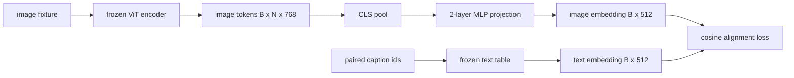

# 用于模态对齐的投影层

> 视觉编码器产出图像 token，文本解码器消费文本 token，两者位于不同的向量空间。一个小小的两层 MLP 把图像 token 投影到文本嵌入空间，再用与配对图注（caption）之间的余弦对齐损失把两个空间拉到一致。这个投影是视觉-语言模型中最小的组件，却是对迁移效果影响最大的那一个。

**Type:** Build
**Languages:** Python
**Prerequisites:** Phase 19 lessons 30-37 (Track B foundations)
**Time:** ~90 minutes

## 学习目标

- 构建一个两层 MLP 投影，把图像特征映射到文本嵌入空间。
- 构造一个模拟文本嵌入表（不用预训练分词器，也不用真实语料）。
- 计算投影后的图像 token 与配对图注嵌入之间的余弦对齐损失。
- 在视觉编码器和文本嵌入表都冻结的情况下，单独训练投影层。

## 问题背景

你手上有一个视觉编码器（第 58-59 课），产出维度为 `vision_hidden = 768` 的 token。你想在上面接一个文本解码器，其嵌入维度为 `text_hidden = 512`（换成其他数字也同样合理）。解码器期望的是文本形态的 token，而图像 token 并不是文本形态：它们位于编码器在纯视觉预训练期间学到的基（basis）里，与解码器的词向量没有任何对应关系。

两层 MLP 投影（线性层、GELU、线性层）填补了这道鸿沟。它足够小（约 `768 * 1024 + 1024 * 512 = 1.3M` 个参数），在单张 GPU 上几分钟就能训完，而且它是对齐阶段唯一需要学习的部件。视觉编码器保持冻结，文本嵌入表保持冻结，只有投影层在动。这正是 LLaVA 在 2023 年落地的配方，BLIP-2 把它重新表述为 Q-Former，此后每一个开放权重的 VLM 都以某种形式沿用了它。

## 核心概念



### 先池化再投影

视觉编码器输出 197 个 token，而文本侧只有一个图注级别的嵌入。要对齐两者，每个样本需要一个图像级别的向量。CLS 池化最简单：取编码器输出的第一个 token 直接投影。对全部 197 个 token 做平均池化是另一种选择，SigLIP 用的就是它。两种方式都是把 197 个向量压成一个。

### 为什么是两层而不是一层

单个线性投影可以做旋转和缩放，但如果两个空间存在曲率不匹配，它无法修正基的差异。在两个线性层之间放一个 GELU，给了投影一次非线性弯折的机会，经验上这已经足以把 CLIP 风格的特征对齐到语言模型的嵌入空间。更深的投影（LLaVA-NeXT 用了 GLU；Qwen-VL 用了一叠注意力层）属于扩展方案；两层 MLP 是公认的基线，也是 BLIP-2 的 Q-Former 投影头底层实际采用的形式。

| 层 | 形状 | 参数量 |
|-------|-------|------------|
| fc1 | `(vision_hidden, projection_hidden)` | `768 * 1024 + 1024` |
| activation | GELU | 0 |
| fc2 | `(projection_hidden, text_hidden)` | `1024 * 512 + 512` |

一个 `768 -> 1024 -> 512` 的投影头大约 1.3M 个参数。

### 余弦对齐损失

对齐并不意味着 `image_emb == text_emb`。对齐的含义是：在联合空间里，`image_emb` 与 `text_emb` 指向同一个方向。余弦损失为 `1 - cos_sim(image, text)`，取值从 0（完全对齐）到 2（方向相反）。训练把每一对样本的这个值往零推。第 62 课会推广到对比批次（InfoNCE）：每张图像与自己图注的距离必须比与批次中任何其他图注都更近；本课使用逐对版本，以便清楚地观察训练动态。

### 冻结编码器才是关键

视觉编码器有 86M 个参数，文本嵌入表又有几百万。用一个模拟语料把它们全部训一遍根本行不通。把两者都冻结后，投影层的 1.3M 个参数就是唯一在变化的部分，在合成样本对上跑几百步就足以把损失压下去。这正是所有基于适配器（adapter）的 VLM 的运行形态：重的部分保持冻结，轻量的桥接模块负责训练。

## 从零实现

`code/main.py` 实现了：

- `MLPProjector(in_dim, hidden_dim, out_dim)`：带 GELU 激活的两层线性 MLP。
- `MockTextEmbedding(vocab_size, dim)`：一个冻结的嵌入表，使用种子做确定性初始化。
- `make_pair(seed, vocab_size)`：合成一个（图像，图注）配对样本。图注是短的 id 序列；图注嵌入由各 token 嵌入做平均池化得到。
- `cosine_alignment_loss(image_emb, text_emb)`：逐对的 `1 - cos_sim` 目标函数。
- 一个训练循环：在 32 个合成样本对上（循环使用）训练投影层 200 步，视觉编码器和文本嵌入表均冻结，每 25 步打印一次损失。

运行：

```bash
python3 code/main.py
```

输出：训练报告显示损失从初始值约 1.07 在 200 步内降到约 0.80，说明仅靠投影层就能把图像 token 拉向文本空间。最后还会打印每对样本的余弦相似度。

## 生产实践

同样的模式出现在每一个开放权重的 VLM 中：

- **LLaVA 1.5。** 从 CLIP-ViT-L 的隐藏维度到 LLaMA 嵌入维度的两层 GELU MLP 投影。冻结视觉编码器，冻结 LLM，只训练投影层（第二阶段再解冻 LLM）。
- **BLIP-2。** Q-Former 让 32 个可学习的查询 token 与图像 token 做交叉注意力，再投影到 LLM 嵌入维度。Q-Former 最末端的投影头就是本课 MLP 的对应物。
- **MiniGPT-4。** 从 BLIP-2 Q-Former 的输出到 Vicuna 嵌入维度的单个线性投影。
- **Qwen-VL。** 多层交叉注意力适配器，但最后一环依然是投影到语言模型嵌入维度。

形态各异，角色完全相同：池化图像 token，投影到文本嵌入维度，单独训练。

## Tests

`code/test_main.py` 覆盖：

- 投影器的输出形状与配置的 `out_dim` 一致
- 冻结的文本嵌入表中 `requires_grad` 为真的参数数量为零
- 余弦损失在两个向量相同时为 0，在反向平行时为 2
- 一次反向传播后投影器有梯度流过
- 训练循环在第 0 步到第 200 步之间确实降低了损失

运行它们：

```bash
python3 -m unittest code/test_main.py
```

## 练习

1. 把 CLS 池化换成对 196 个 patch token 的平均池化，比较 200 步后的最终损失。在合成数据上平均池化通常训练更快；在自然图像上 CLS 的样本效率更高。

2. 给余弦损失加一个可学习的标量温度（`cos / tau`），观察 `tau` 过小（梯度噪声）和过大（损失停在高位）时分别会发生什么。

3. 把两层 MLP 换成单个线性层，量化损失差距。非线性在自然图像特征上更重要，在合成特征上影响较小。

4. 给投影器权重加一个小的 L2 惩罚，观察它与余弦对齐如何相互作用（余弦对缩放不敏感，所以惩罚主要在收缩未被使用的方向）。

5. 持久化投影器权重，然后重新加载并在不经过视觉编码器反向传播的情况下做推理，验证部署时只需要投影器。

## 关键术语

| 术语 | 含义 |
|------|---------------|
| 模态对齐（Modality alignment） | 让图像嵌入和文本嵌入在同一个共享空间中可以相互比较 |
| 投影头（Projection head） | 把一个空间映射到另一个空间的小模块，通常是两层 MLP |
| 余弦相似度（Cosine similarity） | 点积除以两个向量 L2 范数的乘积 |
| 冻结编码器（Frozen encoder） | 视觉（或文本）模型的所有参数都设为 `requires_grad=False` |
| 模拟语料（Mock corpus） | 使用合成样本对，使训练不依赖任何数据集下载 |

## 延伸阅读

- LLaVA 论文：两阶段训练（先训投影，再解冻语言模型）。
- BLIP-2 论文：Q-Former 作为可学习投影的替代方案。
- Qwen-VL 技术报告：交叉注意力适配器作为更深的投影头。
