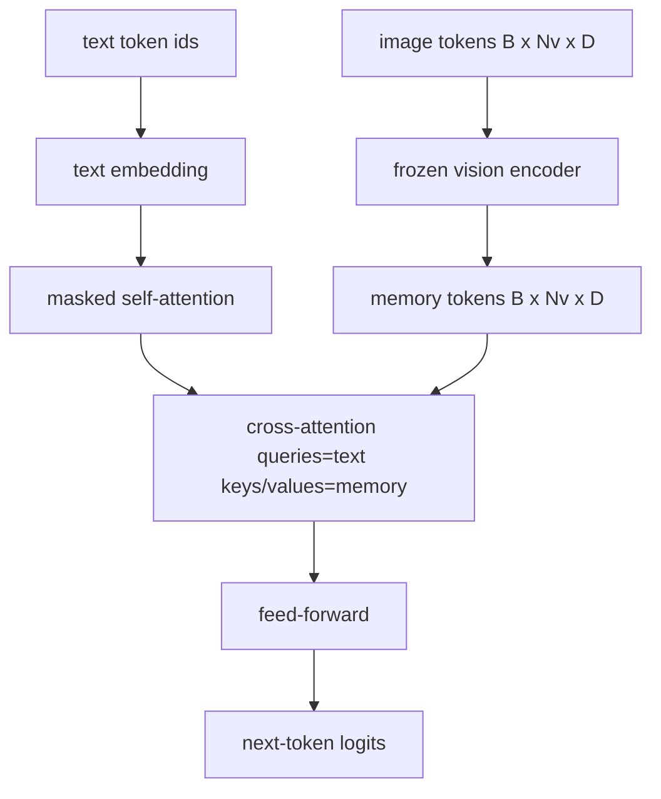
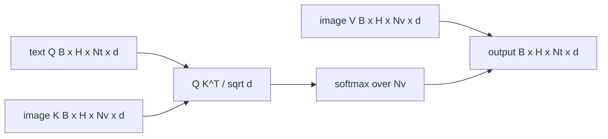

# 交叉注意力融合

> 投影层把一个图像向量和一个描述文本向量对齐。而一个真正的视觉-语言解码器需要让每个文本 token 都能关注每个图像块 token，模型才能把每个词落实到图像的某个区域上。交叉注意力（cross-attention）正是实现这种「落地」的机制：文本发出查询，视觉提供键和值来回应。本课将构建交叉注意力模块、因果文本自注意力，以及让两者都合法运作的掩码形状。

**Type:** Build
**Languages:** Python
**Prerequisites:** Phase 19 lessons 30-37 (Track B foundations)
**Time:** ~90 minutes

## 学习目标

- 实现多头交叉注意力，其中查询流来自文本，键/值流来自视觉。
- 组装一个解码器块：因果自注意力 + 交叉注意力 + 前馈网络。
- 把掩码形状写对：自注意力用因果掩码，交叉注意力不用掩码。
- 用一批文本 token 和一组固定的图像 token 运行一次前向传播。

## 问题背景

把图像 token 和文本 token 拼接成一个序列是一种融合方案（早期融合，Chameleon 和 Emu3 走的路线）。交叉注意力则是另一种（后期融合，由 Flamingo 开创，此后所有 Flamingo 形态的解码器都沿用了这一做法）。在后期融合中，文本解码器只在纯文本 token 上运行，并在每一层通过交叉注意力伸向图像流。

后期融合有两个优势。其一，文本流保持纯净，模型得以保留纯文本能力。其二，图像流对每张图只计算一次，之后每个解码步骤都可以复用，所以即使生成很长的描述，开销也很低。代价是每个块多出一个注意力子层。

## 核心概念





### 掩码形状

解码器块内的两种注意力需要不同的掩码：

| 注意力 | 查询长度 | 键长度 | 掩码 | 原因 |
|-----------|--------------|------------|------|-----|
| 自注意力 | `Nt`（文本） | `Nt`（文本） | 因果：下三角 `(Nt, Nt)` | 自回归过程中文本 token 不能偷看后面的内容 |
| 交叉注意力 | `Nt`（文本） | `Nv`（视觉） | 无掩码 | 整张图像对每个文本位置都可见 |

本课包含一个形状校验函数，把两者混用的错误以 `ValueError` 的形式暴露出来，而不是让损失曲线悄无声息地坏掉。

### 为什么交叉注意力不加掩码

在生成任何文本之前，图像已经被完整观测到了。描述文本的第 `t` 个 token 可以关注图像的任意一个图像块；图像块之间没有时间顺序。某些 Flamingo 变体在交错处理多张图像和多段文本时会加入逐样本的掩码模式，但对于「单张图像 + 一段描述」的场景，交叉注意力看到的是全部内容。

### 键/值缓存

图像的键和值在解码开始时计算一次，然后存入缓存。之后每个新的文本 token 直接使用缓存，无需重新计算。这正是图像描述任务在推理时能跑得快的原因：沉重的 ViT 只运行一次，交叉注意力在每一步都复用它的键和值。本课会把缓存暴露出来，并测试缓存命中路径。

### 块的组装

一个解码器块的执行顺序是：pre-LN -> 自注意力 -> 残差 -> pre-LN -> 交叉注意力 -> 残差 -> pre-LN -> 前馈网络 -> 残差。三个子层，各带一个独立的 LayerNorm。Flamingo 论文在交叉注意力上加了一个可学习的门控，让模型可以暂时绕开图像通路，以换取训练时的稳定性；本课采用的标准基线不带门控。

```python
class DecoderBlock:
  def forward(self, text_tokens, image_tokens, text_mask, cross_mask):
      text_tokens = text_tokens + self.self_attn(self.ln1(text_tokens),
                                                 mask=text_mask)
      text_tokens = text_tokens + self.cross_attn(self.ln2(text_tokens),
                                                  image_tokens,
                                                  mask=cross_mask)
      text_tokens = text_tokens + self.ffn(self.ln3(text_tokens))
      return text_tokens
```

## 从零实现

`code/main.py` 实现了：

- `CrossAttention(hidden, heads)`，多头交叉注意力，使用相互独立的 `q` 投影和 `kv` 投影。
- `CausalSelfAttention(hidden, heads)`，标准解码器中带掩码的自注意力。
- `DecoderBlock`，用 pre-LN 残差结构组装三个子层。
- `VisionLanguageDecoder`，四层解码器，输入由一个模拟视觉编码器的输出和一张小型文本嵌入表提供。
- `causal_mask(length)`，返回一个 `(length, length)` 的下三角布尔张量。
- 一个演示程序：输入一批两条长度为 10 的文本序列，搭配长度为 197 的图像记忆，打印输出形状、自注意力掩码形状，以及每个位置上交叉注意力输出的范数。

运行：

```bash
python3 code/main.py
```

输出：解码器产生一个 `(2, 10, text_vocab)` 的 logits 张量。掩码形状为 `(10, 10)`。KV 缓存复用检查确认缓存路径与非缓存路径产生的 logits 完全一致。

## 生产实践

交叉注意力出现在两大生产级模型家族中：

- **Flamingo 和 IDEFICS。** 每隔 K 个语言模型块插入一个交叉注意力子层，语言模型本身保持冻结。视觉-语言适配器就是交叉注意力块加上它的门控。
- **BLIP-2。** Q-Former 用一组固定的 32 个查询 token 对图像特征做交叉注意力，然后把这些查询投影到语言模型的嵌入空间。

本课中这个块的结构可以直接对应到这两者。掩码纪律（自注意力用因果掩码，交叉注意力不用掩码）也完全相同。

## 测试

`code/test_main.py` 覆盖：

- 因果掩码是下三角矩阵，且布尔形状符合预期
- 无论键的长度是多少，交叉注意力的输出形状都是 `(B, Nt, hidden)`
- KV 缓存路径与非缓存路径的结果在浮点容差内一致
- 文本流与图像流的形状不匹配时抛出清晰的 `ValueError`
- 完整的解码器前向传播产生正确的批次和序列形状

运行测试：

```bash
python3 -m unittest code/test_main.py
```

## 练习

1. 在交叉注意力的残差上加一个可学习的 tanh 门控（Flamingo 的技巧），并验证从接近零的初始门控值出发训练能够收敛。门控初始值为 0；模型先恢复纯文本行为，再逐步把图像流混入。

2. 实现交错注意力，让同一个解码器处理多张图像加多段文本。构建逐样本的交叉注意力掩码，防止第 2 段文本关注第 1 张图像。

3. 在 `Nt=64, Nv=576`（更高分辨率下的 24x24 网格）下对交叉注意力层和自注意力层做性能剖析。交叉注意力的开销是 `Nt * Nv`，在高图像分辨率下会成为主导。

4. 在交叉注意力图上加入查询侧 dropout，并在演示程序中测量描述文本的多样性（交叉注意力图中的 dropout 越大，描述样本的方差越大）。

5. 把交叉注意力层换成 Q-Former 风格的注意力块：每层用一组固定的 32 个查询 token 对图像特征做一次注意力。

## 关键术语

| 术语 | 含义 |
|------|---------------|
| 后期融合（Late fusion） | 文本流与视觉流保持分离；交叉注意力在每个块中架起两者的桥梁 |
| 交叉注意力（Cross-attention） | Q 来自一个流，K 和 V 来自另一个流 |
| 因果掩码（Causal mask） | 下三角布尔掩码，防止自回归过程中偷看后面的内容 |
| KV 缓存（KV cache） | 图像的键和值只存储一次，每个解码步骤都复用 |
| 记忆 token（Memory tokens） | 解码器伸手去取的那组冻结图像 token |

## 延伸阅读

- Flamingo (2022)：带门控交叉注意力的经典后期融合设计。
- BLIP-2 (2023)：Q-Former，本质上是一个披着可学习查询池外衣的交叉注意力块。
- IDEFICS (2023)：Flamingo 配方的开放权重复现。
