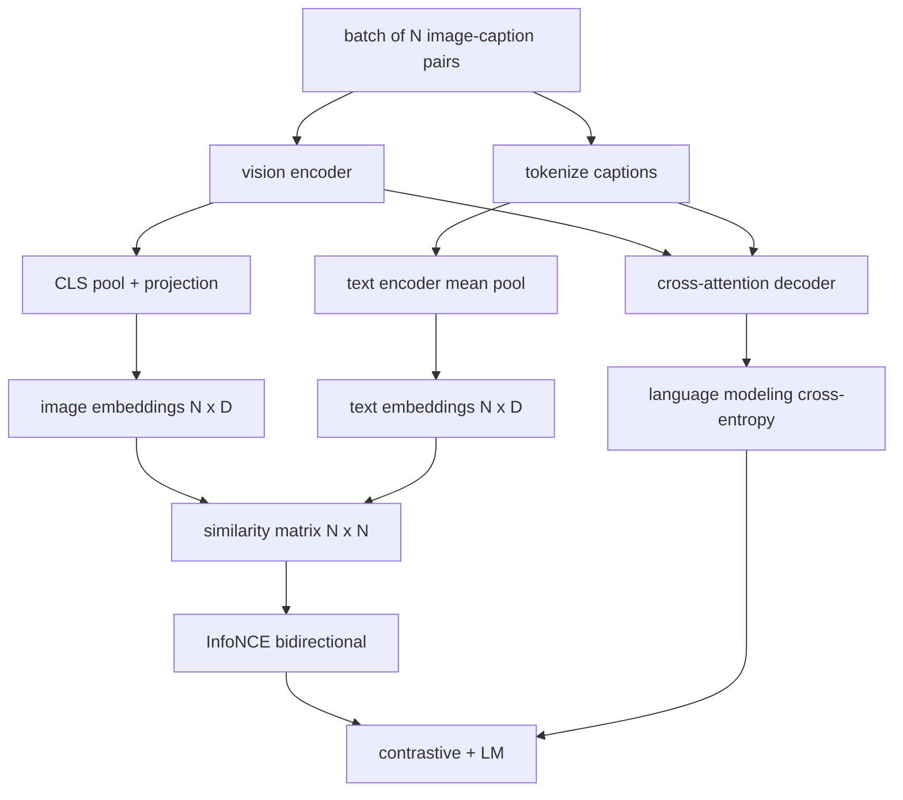

# 视觉-语言预训练

> 编码器、投影层和解码器已经接好了，现在要把它们放在一起训练。学习由两个目标驱动：一个是对比式图文损失（InfoNCE），把匹配的图文对在联合嵌入空间中拉近；另一个是语言建模损失，要求解码器为每张图像生成描述。两者结合，网络既学会为一句描述找到正确的图像，也学会为一张图像写出描述。

**Type:** Build
**Languages:** Python
**Prerequisites:** Phase 19 lessons 30-37 (Track B foundations)
**Time:** ~90 minutes

## 学习目标

- 在一个 batch 的图像-描述对上实现 InfoNCE 对比损失。
- 把对比损失与自回归语言建模损失组合在一起。
- 合成一个 200 对的模拟图文语料，无需下载任何真实数据集。
- 运行一个 50 步的演示训练循环，并观察两个损失同时下降。

## 问题背景

一个视觉-语言模型需要两种能力。它要会排序：给定一句描述，从众多图像中找出正确的那张。它也要会生成：给定一张图像，写出一句描述。只针对其中一种能力做预训练，得到的只是半个系统。CLIP 在排序上做到了极致，却无法生成描述。GPT-4V 能生成描述，但排序要靠一个独立的检索头。多目标预训练则一次性获得两种能力。

InfoNCE 负责排序这一半。对于 N 个图文对的 batch，模型把 N 个匹配对当作正样本，把 `N^2 - N` 个错配对当作负样本，然后在得到的 `(N, N)` 相似度矩阵上做交叉熵。语言建模损失负责生成这一半：以图像为条件的标准下一个 token 预测。两个损失都可微，并且可以共享编码器、投影层和解码器的权重。

## 核心概念



### 一段话讲清 InfoNCE

把 N 个图像嵌入按行堆叠，把 N 个文本嵌入也按行堆叠。对两者做 L2 归一化。计算 `N x N` 矩阵 `S = I T^T / tau`，其中 `tau` 是一个可学习的温度（temperature）。对角线上的元素是匹配对；非对角线元素是负样本。应用交叉熵，目标 `argmax` 沿对角线排布：第 `i` 行的最大值应当出现在第 `i` 列。再沿列方向对称地做一遍。总损失是二者的平均。这就是 CLIP 损失，八行代码即可写完。

### 温度很关键

温度 `tau` 控制 softmax 的尖锐程度。太小（比如 `tau = 0.01`）时，梯度只来自最难的那个负样本，训练会很嘈杂。太大时，softmax 变得平坦，梯度消失。CLIP 把 `tau` 作为参数来学习；本课的演示也采用同样的做法。

### 语言建模损失

解码器通过交叉注意力消费图像 memory token，并在每个位置预测下一个文本 token。损失就是以下一位置为目标的标准交叉熵。padding 位置会从损失中屏蔽掉。

### 组合两个损失

`total = contrastive + lm_weight * lm`，其中 `lm_weight` 是一个标量（通常为 1.0）。两个损失的梯度都会流入编码器和投影层；只有解码器接收语言建模损失的梯度。这正是 CoCa、BLIP 和 SigLIP 这类模型都在用的多任务配方，只是权重各有不同。

| 组件 | 损失作用面 | 影响范围 |
|-----------|--------------|---------|
| InfoNCE | 联合空间中的图文对排序 | 编码器 + 投影层 + 文本头 |
| LM | 以图像为条件的 token 预测 | 编码器 + 投影层 + 解码器 |
| 组合 | 多任务 | 整个网络栈 |

### 为什么 50 步对演示来说足够

模拟语料是一个合成的 200 对数据集，图像随机、描述 id 随机。用 batch size 16 跑 50 步 SGD 之后，即便绝对数值仍高于真实数据模型能达到的水平，两个损失也都会明显下降。这个演示的意义在于确认梯度管线端到端打通，以及加入语言建模损失不会破坏对比目标的稳定性。

## 从零实现

`code/main.py` 实现了：

- `MultimodalModel`，组合了一个小型 ViT 编码器、MLP 投影器、一个轻量的文本侧编码器（对嵌入后的 id 做均值池化），以及第 61 课的交叉注意力解码器。
- `info_nce_loss(image_emb, text_emb, temperature)`，双向的 CLIP 式对比损失。
- `lm_loss(logits, target_ids, padding_id)`，带掩码的下一个 token 交叉熵。
- `make_mock_corpus(seed, n_pairs)`，返回 200 个确定性的 (image, caption_ids) 对。
- 一个训练循环：50 步、batch size 16、Adam 优化器，以及一个可学习的对数温度参数。每 5 步打印一次两个损失。

运行它：

```bash
python3 code/main.py
```

输出：对比损失从约 `ln(16) = 2.77` 下降到 2.4 左右；语言建模损失从随机均匀分布基线 `ln(512) ≈ 6.24` 下降到约 4.7。两个损失的下降证明梯度接线正确。真实模型要训练数百万步；但动力学是一样的。

## 生产实践

同样的损失配方出现在以下模型中：

- **CLIP（2021）。** 只有图文对比损失，另配一个独立的冻结编码器描述探针。
- **CoCa（2022）。** 在一个模型里同时使用图文对比损失和图像描述语言建模损失。正是本课构建的模式。
- **BLIP（2022）与 BLIP-2。** 对比损失加语言建模损失，再加一个图文匹配头。三个损失组合。
- **SigLIP（2023）。** 用 sigmoid 成对损失替换 InfoNCE；对比角色相同，函数形式不同。
- **LLaVA 系列。** 两阶段训练：第一阶段是对齐（在冻结的 LM 上做余弦相似度），第二阶段解冻 LM 并加入语言建模损失。第 60 课对应第一阶段；本课对应第二阶段。

## 测试

`code/test_main.py` 覆盖：

- InfoNCE 损失在图像/文本两个方向上对称
- 当相似度矩阵是由大正数构成的完美对角阵时，InfoNCE 损失返回 0
- 语言建模损失正确屏蔽 padding 位置
- 模型前向传播无错误地产出两个损失
- 5 步训练循环能降低组合损失

运行它们：

```bash
python3 -m unittest code/test_main.py
```

## 练习

1. 用 SigLIP 式的 sigmoid 成对损失替换 InfoNCE，在模拟语料上比较收敛情况。

2. 加入难负样本（hard negative）挖掘步骤：每隔一个 batch，从上一个 batch 中挑出最难的非对角对并追加进来。训练后观察对比损失是否下降得更快。

3. 在联合嵌入之上加一个图文匹配二分类头（真/假：这一对匹配吗？）作为第三个损失，复现 BLIP 的三头结构。

4. 把模拟语料换成由 Markov 链生成的描述 id 序列，其转移矩阵以图像哈希为条件。描述损失应当降得更低，因为数据中存在真正可学习的信号。

5. 分别用 `lm_weight = 0` 和 `lm_weight = 1` 训练同一个模型。比较对比损失；语言建模损失不应让排序目标退化。

## 关键术语

| 术语 | 含义 |
|------|---------------|
| InfoNCE | 噪声对比估计：在相似度矩阵上做交叉熵 |
| 温度（Temperature） | 控制对比 softmax 尖锐程度的标量 |
| 难负样本（Hard negative） | 模型容易混淆的非对角图文对，可用于采样 |
| LM 损失 | 描述生成侧的标准下一个 token 交叉熵 |
| 联合嵌入空间 | 投影之后图像向量与文本向量共处的共享空间 |

## 延伸阅读

- CLIP 论文：最初的对比学习配方。
- CoCa 论文：在一个模型中结合对比与描述生成。
- SigLIP 论文：sigmoid 成对损失变体，以及它为什么更易扩展。
