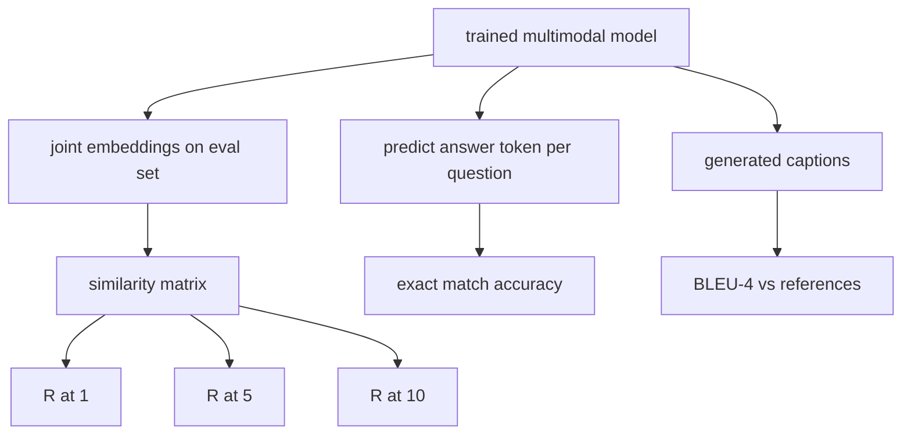

# 多模态评测

> 训练只是闭环的一半，另一半是度量。本课从底层原语出发构建三种评测面：以 R@1、R@5、R@10 报告的图文检索（image-caption retrieval）、以精确匹配准确率报告的视觉问答（visual question answering），以及以 BLEU-4 报告的图像描述（image captioning）。每个指标都是作用在模型输出上的一个函数，配合一套几秒钟就能跑完的合成评测集。

**Type:** Build
**Languages:** Python
**Prerequisites:** Phase 19 lessons 58-62 (Track E foundations: encoder, transformer, projection, cross-attention fusion, pretraining)
**Time:** ~90 minutes

## 学习目标

- 从图像与描述文本嵌入之间的相似度矩阵计算 Recall@K。
- 对一个将（图像, 问题）对映射到固定答案词表的模型，计算精确匹配的 VQA 准确率。
- 不依赖任何外部库，从生成的与参考的 token 序列计算 BLEU-4。
- 基于第 62 课训练好的模型构建合成评测集，运行全部三种评测。

## 问题背景

一个常见的诱惑是：训练损失一旦走平，就宣告多模态模型完工。训练损失衡量的是模型对训练分布的拟合程度；它无法衡量模型能否在留出批次中正确排序图文对、回答一个问题，或写出人类能接受的描述。业界标准的评测面有三个：

- **检索（R@1、R@5、R@10）。** 为查询描述构建联合嵌入；按余弦相似度对评测池中的每张图像排序；报告匹配图像是否落在前 1、前 5、前 10。对称方向（图像到文本）以同样的方式运行。
- **视觉问答（精确匹配）。** 给定（图像, 问题），模型输出一个答案 token。精确匹配是每个样本一比特的判定：预测答案是否等于参考答案？再对整个评测集取平均。
- **图像描述（BLEU-4）。** 生成一条描述。计算其相对于参考描述的 1-gram 到 4-gram 精度的几何平均，并乘以简短惩罚（brevity penalty）。多参考是标准形式（一张图像配多条参考描述）。

每个指标都是一个轻薄的函数。本课在代码中把它们全部实现一遍，让数学变得具体，评测面也始终在你的掌控之中。真实的基准测试套件（MS-COCO、VQA v2、GQA、OK-VQA）可以直接套进同样的函数形态。

## 核心概念



### 从相似度矩阵计算 Recall@K

构建图像与描述嵌入之间的 `(N, N)` 余弦相似度矩阵。对每一行，按相似度降序对各列排序。Recall@K 是对角线列索引落在前 K 个位置的行所占的比例。对称方向的 Recall@K（描述到图像）在转置矩阵上计算。两个数值都要报告。对于 N=100 的评测集，R@1 = 0.6 意味着 100 条描述中有 60 条把正确的图像检索为首位匹配。

### VQA 精确匹配

对每个（图像, 问题, 答案），编码图像、嵌入问题、经解码器融合，再读出下一个 token。将预测的 token id 与参考 id 比较，相等即正确，最后对评测集取平均。真实的 VQA 数据集为每个问题提供多个人工标注答案，并使用软准确率公式（10 名标注者中至少 3 人同意则记 1.0，不足则按比例折算）；本课为清晰起见使用单答案精确匹配。

### BLEU-4

```text
BLEU-4 = BP * exp(mean(log p1, log p2, log p3, log p4))
```

其中 `p_n` 是修正后的 n-gram 精度（生成的 n-gram 中出现在任一参考里的裁剪计数，除以生成的 n-gram 总数），`BP` 是简短惩罚：

```text
BP = 1                if generated length > reference length
   = exp(1 - r/g)     otherwise, where r is reference length and g is generated
```

小样本场景下某些 `p_n` 可能为零，因此需要平滑。实现采用 Chen 和 Cherry 的「方法 1」（对任何为零的计数，分子和分母各加 1），这是低计数场景下最稳妥的默认选择。

### 合成评测集

复用第 62 课的 mock 语料模式，在内存中以一个留出的随机种子构建一套 50 个样本的评测集。评测集由三个列表组成：

- `pairs`：50 个（image, caption_ids）对，用于检索。
- `vqa`：50 个（image, question_ids, answer_id）三元组。
- `caps`：50 条（image, [reference_caption_ids, ...]）记录，每张图像最多 3 条参考。

评测集由种子确定性生成，且与训练语料互不重叠，因此指标是在模型从未见过的数据上计算的。把评测集持久化到 JSON 留作练习（见下文）。

| 指标 | 取值范围 | 随机基线（N=50） |
|--------|-------|------------------------|
| R@1 | 0 到 1 | 0.02 (1 / N) |
| R@5 | 0 到 1 | 0.10 |
| R@10 | 0 到 1 | 0.20 |
| VQA EM | 0 到 1 | 1 / vocab |
| BLEU-4 | 0 到 1 | 很小但非零 |

对于在合成数据上跑 50 步的训练，并不指望指标很高；指望的是它们超过随机基线，这正是演示程序所检查的。

## 从零实现

`code/main.py` 实现了：

- `recall_at_k(sim_matrix, k)`，对两个方向各返回一个位于 `[0, 1]` 的浮点数。
- `vqa_exact_match(predictions, references)`，返回 `int` 相等判定的均值。
- `bleu4(generated, references, smoothing=True)`，支持多参考。
- `build_eval_suite(seed, n_samples, vocab_size, max_len)`，返回三个确定性生成的评测列表。
- `evaluate(model, suite)`，运行全部三种指标并返回一个数值 `dict`。
- 一个演示程序：加载第 62 课中刚初始化的多模态模型并先评测一次，再训练 50 步后评测一次，打印前后对比的指标。

运行：

```bash
python3 code/main.py
```

输出：前后对比的指标表显示，检索从接近随机水平提升到模型学到的信号水平，VQA 提升到随机基线以上，BLEU-4 也有提升（合成数据的结构足以带来 4-gram 精度的抬升）。

## 生产实践

每个指标都直接对应一个生产环境的基准测试：

- **检索。** MS-COCO 5K val、Flickr30K、ImageNet zero-shot 全都是基于同一个相似度矩阵的 R@K 问题。把合成评测集换成真实文件，函数签名不变。
- **VQA。** VQA v2、GQA、OK-VQA 使用同样的精确匹配形态（VQA v2 用软准确率替代单答案 EM）。
- **BLEU-4。** MS-COCO captioning、NoCaps、Flickr30K captioning 都使用 BLEU-4，外加 CIDEr 和 METEOR。增加 CIDEr 不过是再写一个函数。

对接真实基准时，把 `build_eval_suite` 换成真实数据加载器，函数体保持不变。这些数学与具体基准无关。

## 测试

`code/test_main.py` 覆盖：

- recall@k 在完美的单位相似度矩阵上返回 1.0，在翻转矩阵上当 k < N 时返回 0.0
- recall@k 遵守 `k <= N` 的上界
- bleu4 在生成结果与某条参考完全一致时返回 1.0
- bleu4 在词表完全不相交时返回 0.0
- vqa 精确匹配等于相等对所占的比例
- build_eval_suite 返回预期数量的 pairs、vqa 条目和 caption 条目

运行：

```bash
python3 -m unittest code/test_main.py
```

## 练习

1. 在图像描述指标中加入 CIDEr。CIDEr 对 n-gram 使用 TF-IDF 加权，奖励信息量大的 token。

2. 实现软准确率 VQA：每个问题有多个人工答案，若有任何匹配，准确率为 `min(human_count / 3, 1)`。复现 VQA v2 的做法。

3. 为 `bleu4` 添加一个 NaN 安全的变体，处理空的生成序列而不崩溃。

4. 在 R@K 之外计算平均倒数排名（mean reciprocal rank，MRR）。MRR 对正确项落在前 K 之外的具体位置敏感；R@K 只对是否落入前 K 敏感。

5. 在训练过程中的五个检查点（step 0、10、20、30、40、50）对模型运行评测，绘制学习曲线。确认指标的变化轨迹与损失轨迹一致。

## 关键术语

| 术语 | 含义 |
|------|---------------|
| R@K | 正确匹配落在前 K 个结果中的查询所占的比例 |
| 精确匹配 | 最简单的 VQA 打分方式：预测答案等于参考答案 |
| BLEU-4 | 1-gram 到 4-gram 精度的几何平均，乘以简短惩罚 |
| 多参考 | 图像描述指标接受每张图像的多条参考描述 |
| 留出（Held-out） | 评测集由与训练语料不相交的种子采样得到 |

## 延伸阅读

- VQA v2 论文：软准确率公式与数据集统计信息。
- CIDEr 论文：TF-IDF 加权的 n-gram 图像描述评测。
- BLEU 原始论文（Papineni et al., 2002）：各种平滑变体。
- MS-COCO captioning 评测脚本：权威的参考实现。
