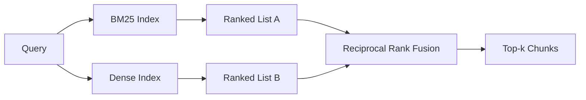

# 基于 BM25 与稠密嵌入的混合检索

> 词法检索和语义检索在彼此相反的查询分布上失效。采用倒数排名融合的混合检索不做插值，而是投票——而且这一票在每一类查询上都能赢。

**Type:** Build
**Languages:** Python
**Prerequisites:** Phase 11 lessons 04 (embeddings), 06 (RAG); Phase 19 Track B foundations (lessons 20-29); Phase 19 lesson 64 (chunking strategies)
**Time:** ~90 minutes

## 学习目标
- 按照 Robertson 与 Sparck Jones 的公式从零实现 BM25，支持字段加权、文档长度归一化，以及可调的 k1 和 b。
- 在确定性的 mock 嵌入之上构建一个稠密检索器，使整个流程可以离线运行。
- 严格按照 Cormack、Clarke 和 Buettcher 在 2009 年发表的形式实现倒数排名融合（Reciprocal Rank Fusion），并解释它为什么优于按分数加权的插值。
- 调节 RRF 的 k 常数和各模态权重，并在一个小型固定语料上读懂其中的权衡。

## 问题背景

当查询携带语料中逐字存在的字面标识符时，词法搜索胜出。查询 `AbortMultipartOnFail` 时，BM25 能在微秒级返回正确的 Go 函数。而同样的查询经过嵌入后，会落在三个相似度聚类的边界上，稠密检索器会把错误的文件排在第一位。

当查询的措辞偏离语料的字面词元时，稠密搜索胜出。用户问"我们如何处理被取消的上传"时，从未输入过 abort 或 multipart 这些词。BM25 会返回关于"上传大文件"的文档块，因为那个页面包含 uploads 这个词。而稠密检索能找到摘要中提到取消（cancellation）的那个 abort 函数。

二者之间的选择并不是静态的。查询分布才是变量。生产环境的 RAG 系统要在同一个端点上处理这两类查询，所以检索必须同时应对两者。这就是混合检索（hybrid retrieval）。合并这一步才是必须做对的部分。

## 核心概念



### 一段话讲清 BM25

BM25 给查询-文档对打分的方式是：对各查询词求和，每一项是逆文档频率因子乘以一个带长度归一化修正的饱和词频因子。两个旋钮。`k1` 控制词频饱和；默认值 1.5 是论文给出的推荐值，没有基准测试支撑就不要动它。`b` 控制文档长度的影响程度；默认值 0.75 的含义是较长的文档会被惩罚，但不是线性惩罚。

IDF 公式采用平滑后的 Robertson 与 Sparck Jones 定义，即 `log((N - df + 0.5) / (df + 0.5) + 1)`。对数内部的加一保证了当某个词出现在超过一半的语料中时，IDF 仍为正。这在小语料中很重要，因为停用词在小语料里技术上反而可能是稀有词。

字段加权（field weighting）让你告诉 BM25：符号名上的匹配比正文中的匹配更重要。实现方式是在建索引时对词频计数乘以一个系数，而不是在打分时处理。这样数学公式保持不变，也避免了为每个字段单独维护一个分数。

### 一段话讲清稠密检索

用嵌入模型把每个文档块嵌入为固定维度的向量。查询时，先嵌入查询，再按余弦相似度对所有文档块排序，返回 top-k。决定质量的变量是模型本身。检索算法本身只有两行：点积加排序。

本课使用基于哈希的确定性嵌入，让你不用发起网络调用就能读懂融合的数学。这个哈希把以词元为键的偏移量累加进一个 96 维向量并归一化。余弦排名在多次运行之间是确定性的，这正是测试套件所要求的。

### 倒数排名融合：论文中的公式

两份排名列表。对出现在任一列表中的每个候选项，累加它的倒数排名贡献。2009 年的论文使用 `1 / (k + rank)`，k 的默认值为 60。按总分排序。整个算法就这么多。

论文给出的常数 k = 60 并非随意选取。当 k = 60 时，排名第 1 的贡献是 1 / 61，排名第 10 的贡献是 1 / 70。贡献衰减得很慢，所以靠后的候选项仍能投票。更小的 k 会让头部结果占据主导。更大的 k 会让贡献曲线更平缓。

我们的实现有两个可调旋钮。一个是 `k` 常数。另一个是一对模态权重，当你有先验证据表明某个模态在你的语料上更好时，可以借此提升 BM25 或稠密检索的权重。把排名贡献乘以权重是最简单且有原则的实现方式；它保留了排名衰减的形状，并且与分数尺度无关。

### 为什么融合优于按分数加权的插值

BM25 的分数无上界，并且依赖于语料。余弦相似度的范围是 -1 到 1。线性组合 `alpha * bm25 + (1 - alpha) * cosine` 需要针对每个语料调节 alpha，而且每次重建索引都会失效。基于排名的融合则不会。两个排名在不同模态之间是可比的。自 2010 年以来，在每一个公开的 TREC 赛道上，论文中的 RRF 基线都击败了分数插值。

这与 Vespa 和 Weaviate 文档中关于 RankFusion 与 RRF 的论证是同一回事。他们得出了同样的结论：除非你有非常强的证据支持分数插值，否则坚持基于排名的方法。

## 从零实现

`code/main.py` 实现了：

- `tokenize(text)` - 一个快速的正则分词器。
- `BM25Index` - 支持字段加权，带 `add` 和 `search` 方法以及可调的 k1、b。
- `mock_embed`、`DenseIndex` - 与第 64 课相同的确定性嵌入，保证文档块可比。
- `rrf(rankings, k, weights)` - 论文中的融合算法，带多模态权重。
- `HybridRetriever` - 组合 BM25 与稠密检索。
- 一个演示用的 `main()`：加载一个小型固定语料，运行三条分别针对每个检索器强项与弱项的查询，并打印每个模态产生的排名以及融合后的列表。

运行：

```bash
python3 code/main.py
```

把演示输出并排着读。字面标识符查询的结果是 BM25 第 1 名、稠密第 4 名、RRF 第 1 名。改述查询的结果是 BM25 第 6 名、稠密第 1 名、RRF 第 1 名。模糊查询的结果是 BM25 第 3 名、稠密第 3 名、RRF 第 1 名。融合不是一个平局裁决器；它是在每一类查询上都获胜的系统。

## 调节旋钮

| 旋钮 | 默认值 | 何时调大 | 何时调小 |
|------|---------|----------------|------------------|
| BM25 k1 | 1.5 | 文档中词项重复出现，且你希望频率的影响更大 | 文档很短，词项重复属于噪声 |
| BM25 b | 0.75 | 长文档确实平均每个词承载的信息更少 | 文档长度与主题无关 |
| RRF k | 60 | 希望靠后的候选项继续参与投票 | 希望 top-1 占主导 |
| BM25 权重 | 1.0 | 语料包含字面标识符且查询能直接命中 | 查询是用户改述过的 |
| 稠密权重 | 1.0 | 查询是改述过的 | 查询是字面匹配的 |

调参时用第 68 课的评估框架在你的留出查询集上重跑，而不是凭直觉。

## 演示会掩盖的失效模式

**词表外（out-of-vocabulary）词元。** BM25 的 IDF 由语料计算得出，因此只出现在查询中的词项贡献为零。而稠密嵌入会为同一个词项"幻觉"出一个向量。面对语料外的标识符，稠密模态会返回看似合理实则错误的邻居。融合可以吸收这一问题，因为 BM25 不返回结果时它的排名贡献会直接消失——但前提是你按文档而不是按文档块去重。

**停用词主导。** 用 "the" 这个词去查 BM25，会得到对整个语料的均匀排名。要么在索引器中过滤停用词，要么接受高 IDF 词项自然占主导这个事实。

**跨模态内容完全相同。** 如果语料小到 BM25 的 top-1 同时也是稠密检索的 top-1，RRF 会给你相同的 top-1 和相同的邻居。这是正确行为而不是故障，但它会让融合看起来形同虚设。在你的评估中加入一对对抗性查询，以验证融合确实在起作用。

## 生产实践

生产模式：

- BM25 索引放在进程内；瓶颈是词频字典，而不是向量。
- 稠密向量放在单独的存储中建索引（本课用平铺列表；生产环境会用 HNSW）。
- 并行执行两路查询；融合是对并集做常数时间的合并。
- 持久化每个检索命中所属的模态，让下游重排器能看到是哪个模态为它投了票。

## 交付产物

第 66 课会拿本课融合后的 top-k，用交叉编码器（cross-encoder）进行重排。第 68 课用精确率、召回率、MRR 和 nDCG 评估整条流水线。本课的混合检索器是第 69 课端到端系统的第一阶段。

## 练习

1. 把 `mock_embed` 替换为你的服务商提供的真实模型。重新运行演示，报告改述查询上仅稠密检索的排名发生了哪些变化。
2. 增加第三个模态：把文档块摘要单独建索引，作为第三份排名列表参与融合。度量收益。
3. 在 10、30、60、100、200 这些值上扫描 RRF 的 k。用第 68 课的方法绘制 recall@k 曲线。报告曲线在你的语料上达到峰值时的 k 值。
4. 正确地实现 BM25F（按字段做长度归一化，而不是乘数技巧），并在一个符号匹配最重要的语料上做对比。

## 关键术语

| 术语 | 人们常说的 | 实际含义 |
|------|-----------------|------------------------|
| BM25 | "词法搜索" | 概率排序：idf x 饱和 tf x 长度归一化 |
| RRF | "排名融合" | 对各排名列表的 1 / (k + rank) 求和；k 默认 60 |
| k1 | "TF 饱和" | 控制重复词项多快停止贡献更多分数 |
| b | "长度惩罚" | 0 表示忽略文档长度，1 表示完全归一化 |
| 字段加权 | "符号加权" | 建索引时重复词元，以提升该字段中匹配的权重 |
| 基于排名 vs 基于分数的融合 | "为什么 RRF 优于线性组合" | 排名在不同模态之间可比；分数不可比 |

## 延伸阅读

- Cormack, Clarke, Buettcher, "Reciprocal Rank Fusion outperforms Condorcet and individual rank learning methods", SIGIR 2009
- Robertson, Walker, Beaulieu, Gatford, Payne, "Okapi at TREC-3"（BM25 的原始论文）
- [Vespa: Hybrid Retrieval with BM25 and Embeddings](https://docs.vespa.ai/en/tutorials/hybrid-search.html)
- [Weaviate: Hybrid Search](https://weaviate.io/developers/weaviate/search/hybrid)
- Phase 11 第 06 课 - RAG 基础
- Phase 19 第 64 课 - 其输出在本课中被索引的分块器
- Phase 19 第 66 课 - 消费融合后 top-k 的交叉编码器重排器
