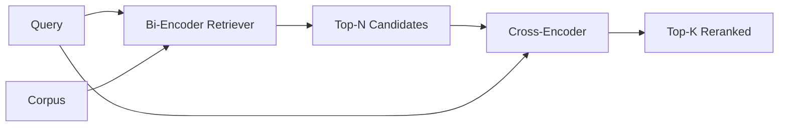

# Cross-Encoder 重排器

> 双编码器（bi-encoder）分别独立地为查询和文档生成嵌入。交叉编码器（cross-encoder）把两者拼接起来一次性读完。交叉编码器是最聪明的"读者"，也是最慢的。把它作为第二阶段用在双编码器的 top-k 结果上，这笔开销就值回票价。

**Type:** Build
**Languages:** Python
**Prerequisites:** Phase 11 lesson 06 (RAG), Phase 11 lesson 07 (advanced RAG); Phase 19 Track B foundations (lessons 20-29); Phase 19 lesson 65 (hybrid retrieval feeding this stage)
**Time:** ~90 minutes

## 学习目标
- 从输入形态、参数量和每次查询的开销三个维度，区分双编码器检索器与交叉编码器重排器。
- 从零实现一个小型交叉编码器：一个 Transformer 块，输入打包好的（查询，文档）序列，输出单个相关性标量。
- 搭建两阶段"先检索后重排"流水线：用廉价检索器取出 top-N，用交叉编码器把 N 重排为 top-K，返回 K。
- 在一个小型固定语料上测量延迟与质量的权衡，并为给定的延迟预算选出合适的 N。

## 问题背景

双编码器把查询和文档映射到同一个向量空间，按余弦相似度排序。两个编码过程互不相见。模型必须在看不到查询的情况下，把文档中所有有用的信息压缩进一个向量。这很快——索引时每个文档编码一次，查询时每个查询编码一次——而且这是在语料库规模下做排序的唯一办法。

代价是精度。两个总体主题相同的文档，嵌入可能几乎一模一样，哪怕其中一个能回答查询而另一个不能。双编码器分不出它们。

交叉编码器通过把查询和文档放在一起阅读来解决这个问题。模型接收 `[query] [SEP] [document]` 这一整条序列，在拼接处运行完整的注意力，输出一个相关性标量。文档的每个 token 都可以关注查询的每个 token。模型在完整上下文中决定分数。

代价是吞吐量。双编码器编码一次、永久复用，而交叉编码器每个（查询，文档）对都要跑一次。对一个 1000 万文档的语料库，每次查询就是 1000 万次前向传播。在请求预算内根本跑不动。

解决方案是分阶段。用双编码器检索出 top-N，再用交叉编码器把 N 重排为 top-K。N 很小（50 到 200），交叉编码器的质量提升集中在最关键的地方。总延迟保持在请求预算之内。总质量等于交叉编码器的质量，上限是双编码器在 N 处的召回率。

## 核心概念



### 交叉编码器的输入形态

标准的打包格式是 `[CLS] query_tokens [SEP] document_tokens [SEP]`。CLS 位置的输出送入一个线性头，输出相关性标量。有些实现用均值池化（mean-pooling）代替 CLS，差别不大。关键在于：模型对每个文本对只输出一个数。

一个 2200 万参数的交叉编码器（即已发布的 `ms-marco-MiniLM-L-6-v2` 这一权重级别）是典型的生产选型。更小的模型质量下降的速度快于延迟节省的速度。更大的模型（例如 5.68 亿参数的 `bge-reranker-v2-m3`）则留给离线重排，或 K 很小的首页重排场景。

### 为什么这节课只训练一个微型模型

真正的交叉编码器是一个经过微调的编码器 Transformer。生产环境中你加载一个检查点直接运行。这节课的目标是让你看清模型的形态和延迟-质量曲线的形态，而不是训练一个最先进的排序器。所以我们构建一个小型 `nn.Module`：一个 Transformer 块、多头注意力（默认 4 个头）、一个回归头。它从一个种子确定性地初始化，演示无需磁盘上的权重就能复现。

这个玩具模型从固定语料中学到了正确的形态：相关的查询-文档对的预测分数高于不相关的对。端到端流水线对双编码器的输出做重排，重排后的 top-k 与标注的黄金标签呈正相关。

### 延迟与质量

两阶段流水线只有一个可调参数：N。在留出的查询集上把 N 从 5 扫到 100，你就能得到这条曲线。

| N | 第二阶段的 Recall@1 | 每次查询的交叉编码器前向传播次数 | 延迟 |
|---|--------------------|---------------------------------------|---------|
| 5 | 0.62 | 5 | 低 |
| 20 | 0.81 | 20 | 中 |
| 50 | 0.86 | 50 | 高 |
| 100 | 0.86 | 100 | 极高 |

上面的数字只用于展示曲线的形态，并非在本课固定语料上的实测值。但形态是真实的。曲线在 20 到 50 个候选附近总会出现一个拐点，重排带来的提升在那里饱和。过了拐点，你付出的代价毫无回报。

根据评估曲线加上延迟预算来选 N。交叉编码器无法把召回率拉到双编码器在 N 处的召回率之上，所以 N 太低不仅限制延迟，更限制质量上限。

## 从零实现

`code/main.py` 实现了：

- `CrossEncoder` —— 一个小型 `torch.nn.Module`：token 嵌入、一个带多头注意力和前馈网络的 Transformer 块、均值池化头，输出一个标量。
- `tokenize_pair(query, document)` —— 把两个字符串打包成一条 id 序列，用 type id 标记边界，确定性实现且只用标准库。
- `train_tiny(pairs)` —— 在手工标注的（查询，文档，相关性）三元组列表上做一轮监督训练，让模型在固定语料上给出合理的分数。
- `rerank(query, candidates, top_k)` —— 生产接口。
- `pipeline(query, retriever, top_n, top_k)` —— 两阶段流程。
- 一个演示 `main()`：按第 65 课的模式加载语料，检索 top-N，重排为 top-K，并排打印两份列表，报告每个阶段的延迟。

运行它：

```bash
python3 code/main.py
```

输出会展示双编码器的 top-N、交叉编码器的 top-K 以及一份耗时汇总。交叉编码器单次调用更慢，但不会跑遍整个语料库。两阶段的总耗时保持在请求预算之内，同时还能把双编码器排在第二、第三位的正确答案挑出来。

## 演示会掩盖的失败模式

**交叉编码器不是对称的。** `rerank(q, d)` 和 `rerank(d, q)` 的分数不同。永远把查询放在前面。如果不小心调换了顺序，召回率会崩溃。

**N 太低，暴露不出 bug。** 如果你设 N = K，交叉编码器就无法重新排序，只能重新加权。提升看起来是零。N 至少要取 K 的三倍。

**训练数据泄漏到评估里。** 如果手工标注的训练对包含了评估查询，重排效果会好得离谱。即使在固定语料上，也要严格分离训练集和评估集。

**生产权重是稠密的。** 一个 2200 万参数的交叉编码器以 float32 存储是 88MB。在承诺 p95 低于 100ms 之前，先规划好模型服务器的内存。

**批处理很重要。** 真正的交叉编码器把 N 个候选放在一个批次里运行。本课在 `_batch_encode` 中就是这么做的：用 `torch.tensor(...)` 构建批量的 id 和 type-id 张量，然后跑一次前向传播。跳过批处理，延迟就会乘以 N。

## 生产实践

生产模式：

- 把双编码器、交叉编码器和 N 三者绑定在一起。改动其中任何一个，评估结果就失效了。
- 按（查询，文档 id）的哈希缓存重排器的输出。同一查询打到稳定的语料库上，重排顺序不变；缓存命中就是白赚的延迟削减。
- 记录排名第一的交叉编码器分数。若某个查询的 top-1 分数低于针对该语料设定的阈值，说明这是一次域外（out-of-domain）命中；把它以"我不确定"的形式上报给 LLM。

## 交付产物

第 68 课会对这条两阶段流水线做端到端评估。第 69 课会把这个重排器接在第 65 课的混合检索器之后、答案生成器之前。重排器是端到端系统的第二阶段。

## 练习

1. 把 N 从 5 扫到 50，绘制重排输出的 recall@1。在本课固定语料上找出拐点。
2. 把交叉编码器训练十个 epoch 而不是一个。测量每个 epoch 时正负样本对之间的分数差距。
3. 用 CLS token 头替换均值池化。在本课固定语料上比较收敛情况。
4. 给交叉编码器加第二个头，预测一个二元的"答案是否在文档中"标签。推理时同时使用两个头：一个用于排序，一个用于阈值判断。
5. 把确定性的模拟双编码器换成第 65 课的那个，把两个阶段串起来。测量 top-K 相对于只用双编码器时的变化。

## 关键术语

| 术语 | 大家怎么说 | 实际含义 |
|------|-----------------|------------------------|
| 双编码器（Bi-encoder） | "向量检索器" | 独立编码查询和文档，用余弦相似度排序 |
| 交叉编码器（Cross-encoder） | "重排器" | 联合编码（查询，文档），输出一个相关性标量 |
| 两阶段流水线 | "检索加重排" | 廉价检索器返回 N 个，昂贵的重排器保留 K 个 |
| N（候选预算） | "重排池" | 交叉编码器每次查询打分的候选数量 |
| 均值池化头 | "最后一层隐状态取平均" | 把编码器最后一层的输出平均成一个向量 |

## 延伸阅读

- Nogueira, Cho, "Passage Re-ranking with BERT", 2019 —— 交叉编码器排序的奠基论文
- Reimers, Gurevych, "Sentence-BERT: Sentence Embeddings using Siamese BERT-Networks", 2019 —— 关于双编码器与交叉编码器的对比
- [SentenceTransformers Cross-Encoders documentation](https://www.sbert.net/examples/applications/cross-encoder/README.html)
- [BGE Reranker v2 model card](https://huggingface.co/BAAI/bge-reranker-v2-m3)
- Phase 19 第 65 课 —— 为本重排阶段提供输入的混合检索器
- Phase 19 第 68 课 —— 测量本重排阶段带来的提升的评估
