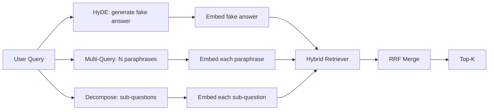

# 查询改写：HyDE、多查询扩展与查询分解

> 用户输入的查询，并不是检索器真正想要的查询。改写在检索之前弥合这道鸿沟，让索引看到的内容更接近答案本来的样子。

**Type:** Build
**Languages:** Python
**Prerequisites:** Phase 11 lessons 04 (embeddings), 06 (RAG); Phase 19 Track B foundations (lessons 20-29); Phase 19 lessons 64 and 65
**Time:** ~90 minutes

## 学习目标
- 实现假设文档嵌入（Hypothetical Document Embeddings，HyDE）：生成一个虚构的答案，将其嵌入，然后用这个向量代替查询向量去检索。
- 实现多查询扩展（multi-query expansion）：把一个查询改写成 N 个同义复述，分别检索，再用倒数排名融合（reciprocal rank fusion）合并结果的并集。
- 实现查询分解（query decomposition）：把一个复杂问题拆成若干子问题，逐个子问题检索，再合并结果。
- 在同一个测试数据集上正面对比这三种改写器，并解释每种策略各自在什么情况下胜出。
- 接入一个能产生确定性、贴合测试数据输出的 mock LLM，让改写器流程可以离线运行。

## 问题背景

用户输入了"上传失败而且预算用光时我们团队怎么处理？"。语料库里有一篇文档写着"AbortMultipartOnFail 会在上传失败时中止进行中的 S3 multipart 上传，并扣减该 bucket 的重试预算"。查询和文档之间没有任何共同的名词短语。BM25 完全找不到。双编码器（bi-encoder）把这篇文档排到第三或第四位，因为查询向量落在嵌入空间中一个更偏向"已取消任务"文档的区域，而不是"已中止上传"文档的区域。第 66 课的两阶段重排（rerank）可以在答案进入 top-N 时把它救回来，但如果它连 top-N 都进不了，重排器根本看不到它。

解决办法是在查询触达检索器之前先改写它。2023 年的论文 "Precise Zero-Shot Dense Retrieval without Relevance Labels"（Gao 等人）提出了 HyDE：让 LLM 写出一篇能回答该查询的文档，把这篇假设文档嵌入，并用它的嵌入作为检索向量。假设文档之所以落在嵌入空间的正确区域，是因为它是用语料库的"语言风格"写出来的。而查询向量做不到这一点。

有两种近亲技术常与 HyDE 配合使用。多查询扩展（Microsoft 的 GraphRAG 使用的术语）生成查询的 N 个同义复述并分别检索，然后合并结果。查询分解（在 2024 年 Stanford DSPy 的工作中以 "subquery decomposition" 之名流行起来）把"上传失败而且预算用光时我们团队怎么处理"拆成两个问题："上传失败时会发生什么"和"重试预算用光时会发生什么"。两次检索，一次合并，答案的两个部分都能被检索到。

本课会实现这三种技术，并在同一个测试语料库上运行它们。

## 核心概念



### HyDE 详解

HyDE 用一篇 LLM 写的假设文档的向量来替换用户的查询向量。提示词很短：

```
You are a domain expert. Write a one-paragraph passage that answers the question
below. Use the same vocabulary and phrasing the documentation in this domain would
use. Do not refuse. Do not say you do not know.

Question: {user_query}

Passage:
```

作为事实性答案，LLM 的回答是错的，因为 LLM 并不了解你的语料库。这没有关系。检索器不在乎事实是否正确，只在乎词元（token）分布。假设文档段落里会出现 "abort"、"multipart"、"bucket"、"budget" 这些词，因为一篇关于该主题的文档段落本来就会这样写。把这个段落嵌入后，向量就会落在真实段落附近。

在生产环境中，应把假设文档限制在两到三句话以内。更长的假设文档会引入更多噪声，更短的则会丢失 HyDE 所依赖的词法信号。

### 多查询扩展详解

生成用户查询的 N 个同义复述。最简单的提示词：

```
Rewrite the following question in {N} different ways. Each rewrite must preserve
the original intent. Number them 1 to {N}. Do not add explanations.
```

对每个复述检索 top-k，再用 RRF（与第 65 课相同的算法）合并 N 个排序列表。便宜、可并行、确定性。

当用户的措辞只是众多同样合理的提问方式之一，且任意一个改写都能问得更好时，多查询扩展会胜出。当所有改写都跟原始查询一样糟糕（败在同一个地方）时，它就会失败。

### 查询分解详解

单次检索无法满足一个多面向的问题。查询分解让 LLM 把问题拆成子问题，系统逐个子问题检索。提示词如下：

```
The following question may require information from multiple distinct topics.
Decompose it into a list of sub-questions. Each sub-question must be answerable
independently. If the question is already atomic, return it unchanged.

Question: {user_query}
```

逐个子问题检索，然后合并。对于包含并列连词、多子句比较或两个不相关主题的问题，分解是正确的工具。对于原子问题（atomic question）则不然——这时分解器的职责是原样返回单个问题，而不是凭空捏造假的子问题。

### 为什么三种方法并存

三者互补。HyDE 弥合查询与语料之间的词元鸿沟；多查询扩展覆盖措辞变化；查询分解覆盖多主题查询。生产系统会同时实现三者，并按查询逐一选择策略（第 69 课的端到端系统会展示这个选择器）。

## Mock LLM

本课完全离线运行。mock LLM 是一张以用户查询为键的小型查找表，外加一个针对未见过查询的回退逻辑。查找表包含：

- 对每个测试数据集中的查询：一段写好的假设文档、三个同义复述和一份分解结果。
- 对未知查询：一个确定性变换——提取查询中的实义词，通过同义词映射表扩展，然后返回结果。

重要的是 mock 的接口形状，而不是数据本身。在生产环境中，你把 mock 换成真实的模型调用即可，检索器不需要任何改动。

## 从零实现

`code/main.py` 实现了：

- `MockLLM` —— 上文描述的确定性替身。
- `HyDERewriter` —— 调用 LLM 写出假设文档，以 `RewriteResult` 的形式返回改写结果，其中包含假设文本以及检索器应该使用的查询。
- `MultiQueryRewriter` —— 调用 LLM 生成 N 个同义复述，返回一个查询列表。
- `DecomposeRewriter` —— 调用 LLM 做分解，返回子问题列表。
- `retrieve_with_rewriter` —— 接收一个改写器和一个检索器，执行改写并融合结果。
- 一个演示程序，在测试数据集上运行三种改写器，并打印哪种策略最先返回了标准答案文档。

检索器的结构复用自第 65 课（BM25 + 稠密检索的混合方案），融合方式同样是 RRF。唯一的新结构是改写器接口，而且它很小。

运行：

```bash
python3 code/main.py
```

输出包括逐策略的排名和最终汇总。HyDE 在措辞不匹配的查询上胜出；多查询扩展在措辞多变的查询上胜出；查询分解在多主题查询上胜出。回退方案（不做改写）至少会在三者之一上失败。

## 演示会掩盖的失败模式

**HyDE 会把语料库特有的标识符幻觉写错。** 模型凭空捏造一个函数名。由于这个虚构的名字成了索引中不存在的高权重词元，假设文档在正确文档上的 BM25 分数会崩塌。应限制假设文档的长度，并在融合中调低 BM25 的权重。

**多查询的改写全部趋同。** 能力弱的模型会产出三个几乎一模一样的复述。N 次检索返回相同的 top-k，RRF 合并的效果不会比单次检索更好。应在改写提示词中加入明确的多样性要求，并用 Jaccard 相似度检测重复。

**查询分解过度拆分。** 分解器把一个原子问题拆成了一个列表。各次检索都返回同一篇文档，但排名被稀释，合并结果反而比原始查询更差。应在扇出之前加一道"这些子问题是否足够不同"的检查。

**延迟成倍增长。** HyDE 花费一次 LLM 调用。多查询扩展花费一次 LLM 调用生成 N 个改写，再做 N 次检索。查询分解花费一次 LLM 调用做拆分，再做 M 次检索。检索可以并行执行；LLM 调用是延迟的下限。

## 生产实践

生产环境的常见模式：

- 按查询长度逐查询选择策略：原子的短查询用多查询扩展，复杂的多子句查询用查询分解，术语密集的查询用 HyDE。
- 以查询哈希为键缓存改写器的输出。很多查询是重复的。
- 三种策略并行运行，再用 RRF 把三个结果集融合为一个。代价是三次 LLM 调用加一次融合，换来的质量是三种策略覆盖范围的并集。

## 交付产物

第 69 课会把这个改写阶段接到第 65 课的检索器和第 66 课的重排器之前。第 68 课会评估改写器为检索召回率带来的提升。

## 练习

1. 实现 RAG-Fusion（2024 年的一个多查询变体）：让改写器刻意生成多样化的复述，再由重排步骤（第 66 课）挑选最终列表。
2. 增加第四种策略：step-back 提示（让 LLM 提出更宽泛的问题，先在宽泛问题上检索，再收窄）。在测试数据集上做对比。
3. 通过增加一个"问题是否原子"的判断头，训练分解器识别原子查询。测量加入前后的过度拆分率。
4. 把 mock LLM 替换为真实的模型调用。在你的技术栈上测量每种策略的延迟。
5. 为每个改写增加一个置信度分数，丢弃低于阈值的改写。测量其对召回率的影响。

## 关键术语

| 术语 | 人们怎么说 | 实际含义 |
|------|-----------------|------------------------|
| HyDE | "假文档检索" | 让 LLM 写出答案；对该答案做嵌入并检索，而不是用查询本身 |
| 多查询扩展 | "复述扩展" | 把查询改写 N 次；检索 N 次，用 RRF 合并 |
| 查询分解 | "子查询拆分" | 把多主题查询拆成子问题，分别检索 |
| 原子查询 | "单主题" | 不捏造假子问题就无法再分解的查询 |
| Step-back | "把查询抽象化" | 先问更宽泛的问题并检索，再收窄 |

## 延伸阅读

- Gao, Ma, Lin, Callan, "Precise Zero-Shot Dense Retrieval without Relevance Labels"（HyDE），2023
- Microsoft Research, "Multi-Query Expansion for Retrieval"
- Stanford DSPy, "Subquery Decomposition for Multi-Hop QA"
- [LlamaIndex query transformations documentation](https://docs.llamaindex.ai/en/stable/optimizing/advanced_retrieval/query_transformations/)
- Phase 11 第 07 课 —— 进阶 RAG 模式
- Phase 19 第 65 课 —— 本改写器对接的检索器
- Phase 19 第 68 课 —— 衡量改写器提升幅度的评估
