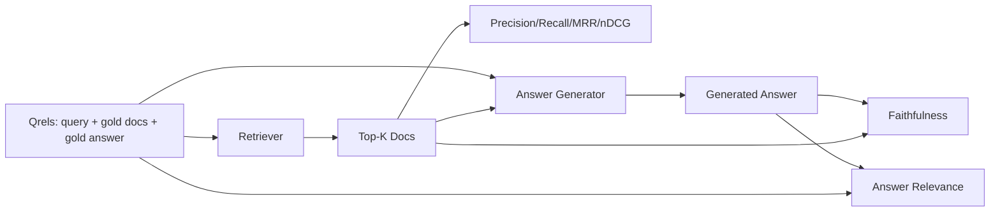

# RAG 评估：Precision、Recall、MRR、nDCG、忠实度、答案相关性

> 如果你不能同时给检索结果和最终答案打分，这个系统就没法上线。这两者不是同一个指标，同一个 prompt 会在不同的维度上失败。

**Type:** Build
**Languages:** Python
**Prerequisites:** Phase 11 lessons 06 (RAG), 10 (evaluation); Phase 19 Track B foundations (lessons 20-29); Phase 19 lessons 64, 65, 66, 67
**Time:** ~90 minutes

## 学习目标
- 基于黄金标注（gold qrels）计算四个检索指标：precision@k、recall@k、MRR（平均倒数排名）和 nDCG@k。
- 计算两个答案评分指标：忠实度（faithfulness，答案中每条论断都有检索上下文支撑）和答案相关性（answer relevance，答案确实回应了问题）。
- 构建一个 fixture qrels 文件（查询、黄金文档 id、黄金答案文本），让评估流程端到端地读取它。
- 解读各指标的数值，诊断流水线在哪个环节出了问题：检索、排序、生成，还是事实落地。

## 问题背景

一个 RAG 系统至少有四个活动部件：分块器（chunker）、检索器（retriever）、重排器（reranker）、生成器（generator）。其中任何一个都可能是错误答案的根源。没有分阶段的指标，你就是在盲飞。

用户报告了一个错误答案。是分块器把答案片段切断了吗？是检索器没把对应分块放进 top-k 吗？是重排器把正确分块挤出了第一位吗？还是生成器无视了分块、自己编了内容？光看答案本身你无从判断。你需要：

- 检索指标，给检索器的输出打分。
- 排序指标，给正确分块在排序中的位置打分。
- 忠实度，判断生成器是否始终停留在检索上下文之内。
- 答案相关性，判断答案到底有没有回应问题。

本课在一个 fixture qrels 文件之上构建全部六个指标。这套评估是离线且确定性的；在生产环境中，你把模拟的 LLM 评审（LLM-as-judge）换成真实模型即可。

## 核心概念



### Precision@k

检索器返回的前 k 个文档中，有多大比例属于黄金集合？如果黄金集合有三个文档，top-3 返回了其中两个加一个错误文档，那么 precision@3 就是 2 / 3。当检索到无关分块的代价很高时（生成器会在它上面浪费 token，或者这个分块会污染答案），使用 precision。

### Recall@k

黄金文档中，有多大比例出现在 top-k 里？如果黄金集合有三个文档，top-5 包含了全部三个，那么 recall@5 就是 1.0。当漏掉答案的代价很高时（你宁可多看到一个错误分块，也不愿完全错过答案分块），使用 recall。

在生产环境的 RAG 中，人们通常引用的指标是 recall@k。生成阶段可以轻松丢弃无关分块；但它没法从一个从未见过的分块中凭空生成答案。

### MRR（平均倒数排名）

对每个查询，找到排序列表中第一个相关文档的位置。倒数排名是 1 / 位置。再对整个查询集合取平均。MRR 用一个数字概括了检索器把最佳答案放到顶部的能力。

MRR 对第 1 位的权重极高。黄金文档排在第 1 位的查询贡献 1.0，第 2 位贡献 0.5，第 10 位贡献 0.1。这个指标由列表顶部主导。

### nDCG@k

归一化折损累积增益（Normalized Discounted Cumulative Gain）。完整公式给每个检索到的文档赋一个增益（通常相关为 1，不相关为 0），按位置的对数做折损，求和，再除以理想 DCG（如果排序完美你能得到的 DCG）。取值范围 0 到 1。

nDCG 支持分级相关性：黄金标注可以写成「doc A 是 3，doc B 是 2，doc C 是 1」。MRR 和 recall@k 把一切压平成二值。当语料库中每个查询有多个部分相关的文档时，使用 nDCG。

### 忠实度

对生成答案中的每条论断，检查它是否有检索上下文支撑。标准实现使用一个 LLM 评审 prompt，输入（论断, 上下文），返回 yes 或 no。指标就是通过检查的论断比例。

忠实度捕捉的是生成器编造内容这种失败模式。即便检索器返回了正确分块，一个会产生幻觉的生成器仍然是坏的。忠实度也被称作 groundedness、support、attribution。

本课用一个确定性的模拟评审来实现忠实度：检查每条论断的 token 与检索上下文的重叠是否超过阈值。在生产环境中换成真实模型调用即可。指标的形态是一样的。

### 答案相关性

答案是否真正回应了问题？忠实度问的是「答案是否落在上下文里」，答案相关性问的是「答案是否落在问题上」。一个忠实但跑题的答案，忠实度高、相关性低。一个简短、切题但无视上下文的答案，相关性高、忠实度低。

标准实现同样使用 LLM 评审：输入（问题, 答案），询问答案是否回应了问题。本课实现了一个「token 重叠加评审」的替代品。

## fixture qrels

```python
{
  "qid": "q1",
  "query": "what is the abort threshold for multipart uploads",
  "gold_doc_ids": ["d1", "d3"],
  "gold_answer_substring": "three failed parts",
  "graded_relevance": {"d1": 3, "d3": 2},
}
```

每个查询携带：
- 查询字符串，
- 一组黄金文档 id（用于 precision / recall / MRR），
- 一个分级相关性字典（用于 nDCG），
- 黄金答案子串（作为参考元数据保留在每条 qrel 上；本课的忠实度是通过将抽取的论断与检索上下文对照评判来计算的，而不是与这个子串对照）。

在生产环境中这些需要人工标注。本课附带一个手工构建的 fixture，让评估开箱即用。

## 从零实现

`code/main.py` 实现了：

- `precision_at_k(retrieved, gold, k)` - 按字面定义实现。
- `recall_at_k(retrieved, gold, k)` - 按字面定义实现。
- `mean_reciprocal_rank(retrieved_list_of_lists, gold_list)` - 在查询集上取平均。
- `ndcg_at_k(retrieved, graded_relevance, k)` - DCG / IDCG，支持二值或分级增益。
- `extract_claims(answer)` - 把答案切分成句子形态的论断。
- `faithfulness(claims, context_texts, judge)` - 被判定为有支撑的论断比例。
- `answer_relevance(question, answer, judge)` - 评审判断答案是否回应了问题。
- `MockJudge` - 确定性的 token 重叠评审，让评估可以离线运行。
- `evaluate_pipeline(pipeline_fn, qrels, ks)` - 运行所有指标的编排器。
- 一个演示程序，对三个流水线变体（分块器基线、混合检索、混合 + 重排）在 qrels 上运行，并打印指标表。

运行：

```bash
python3 code/main.py
```

输出在一张指标表中展示每个变体的 precision@k、recall@k、MRR、nDCG@k、忠实度和答案相关性。混合检索那一行在 recall 上超过分块器基线；重排那一行在 MRR 上超过混合检索。

## 解读指标以诊断故障

| 症状 | 可能原因 | 修复方向 |
|---------|-------------|-------------|
| recall@k 低、precision@k 低 | 分块器切断了答案，或检索器找不到它 | 分块边界（第 64 课）或检索模态（第 65 课） |
| recall@k 尚可、MRR 低 | 正确分块在 top-k 内但不在第 1 位 | 重排器（第 66 课） |
| MRR 高、忠实度低 | 上下文正确但生成器仍在编造内容 | 生成 prompt；强制「引用或拒答」 |
| 忠实度高、相关性低 | 答案有依据但跑题 | 查询改写器（第 67 课）或生成 prompt |
| 四项都高，用户仍在抱怨 | 评估集不具代表性 | 用真实用户查询扩充 qrels |

## 演示会掩盖的失败模式

**LLM 评审偏见。** 模型给自己的输出打的忠实度分会偏高。给评审用一个与生成器不同的模型家族，或人工抽样评分。

**qrels 腐化。** 黄金答案会随语料库变化而漂移。2024 年 1 月对 q1 是黄金文档的某篇文档，到 2024 年 10 月就不再是正确答案了，因为团队重命名了那个函数。安排每季度一次的 qrels 复查。

**忠实度的微观检查漏掉宏观论断。** 逐句的忠实度可以全部通过，但答案的整体结构仍有误导性。在自动化指标之上增加一层样本级的人工定性复查。

**recall@k 掩盖单查询失败。** 90% 的平均 recall 可能掩盖某一类查询总是失败的事实。按查询类别（字面匹配、改写、多主题）切分 qrels，按切片分别报告。

## 生产实践

生产环境模式：

- 每次检索器或生成器变更都跑一遍评估。把 recall@k 回退当作测试失败来对待。
- 持久化每个查询的指标轨迹。当用户投诉时，查找匹配的 qrels 条目，看这个问题本来是否会被捕捉到。
- 给 qrels 分层：20 条查询的冒烟集在 CI 中运行；200 条的回归集每晚运行；2000 条的深度集每周运行。

## 交付产物

第 69 课会把整条流水线（分块器、检索器、重排器、生成器）串起来，并用本课的评估对端到端系统进行打分。

## 练习

1. 增加第五个检索指标：hit-rate@k。将它与 recall@k 对比，解释二者何时会出现差异。
2. 实现分级忠实度：0（无支撑）、1（部分支撑）、2（完全支撑）。相应地更新指标。
3. 用真实模型调用替换模拟评审。在 fixture 上测量模拟评审与真实评审的分歧程度。
4. 增加查询类别切片（"literal"、"paraphrased"、"multi-topic"）。按切片报告指标。
5. 增加一个「答案长度」指标，并将它与忠实度做相关性分析。绘制曲线。

## 关键术语

| 术语 | 人们常说 | 实际含义 |
|------|-----------------|------------------------|
| Precision@k | 「检索结果中的命中率」 | top-k 中属于黄金集合的比例 |
| Recall@k | 「黄金集合的命中率」 | 黄金文档出现在 top-k 中的比例 |
| MRR | 「首个命中的位置」 | 1 / 第一个相关文档的排名，再取平均 |
| nDCG@k | 「分级排序质量」 | top-k 的 DCG 除以理想 DCG |
| 忠实度 | 「Groundedness」 | 答案论断中有检索上下文支撑的比例 |
| 答案相关性 | 「它回应问题了吗？」 | 答案是否匹配问题的意图 |
| Qrels | 「黄金标注」 | 查询及其黄金文档和黄金答案的标注集合 |

## 延伸阅读

- Buckley, Voorhees, "Evaluating Evaluation Measure Stability", SIGIR 2000 - 排序指标的经典论文
- Jarvelin, Kekalainen, "Cumulated Gain-based Evaluation of IR Techniques" - nDCG 论文
- [Ragas: Automated Evaluation of RAG Pipelines](https://docs.ragas.io)
- [Anthropic, Evaluating RAG](https://www.anthropic.com/news/evaluating-rag)
- Phase 11 第 10 课 - 评估框架基础
- Phase 19 第 64-67 课 - 本课所评估的各个组件
- Phase 19 第 69 课 - 本评估所打分的端到端流水线
