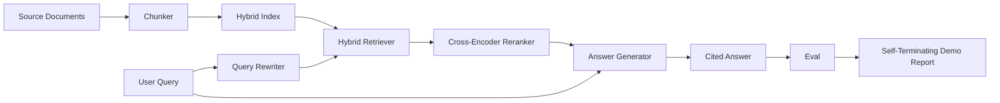

# 端到端 RAG 系统

> 六节课的组件。一条流水线。一个评测闭环。一个自终止的演示程序。这就是你要交付的系统。

**Type:** Build
**Languages:** Python
**Prerequisites:** Phase 11 lessons 06 (RAG), 10 (evaluation); Phase 19 Track B foundations (lessons 20-29); Phase 19 lessons 64, 65, 66, 67, 68
**Time:** ~90 minutes

## 学习目标
- 将分块器（chunker）、混合检索器、查询改写器、交叉编码器重排器和答案生成器组合成一条完整的端到端流水线。
- 实现一个按 chunk 锚点引用其论断的答案生成器，并带有低置信度拒答（refuse-on-low-confidence）的兜底机制。
- 用第 68 课的评测来检验组装好的流水线，证明分阶段构建的系统在每项指标上都优于各组件孤立运行的结果。
- 构建一个自终止的 CLI 演示程序：摄取固定语料（fixture corpus），运行固定查询集，并以退出码 0 结束，同时输出一份摘要报告。

## 问题背景

六个孤立的组件什么都证明不了。分块器可以在针对语料的 recall@5 上获胜，却在系统层面的 recall@5 上失利，因为检索器无法对分块器产出的内容正确排序。重排器可以在合成候选池上提升 MRR，却在真实的双编码器（bi-encoder）候选上失败，因为双编码器在重排预算内的召回率太低。查询改写器可以在某一个查询上把标准答案文档推到前面，却在下一个查询上崩掉，因为 LLM mock 返回了一个退化的假设性文档。

集成测试就是让整条流水线端到端地跑一遍，对着同一份固定 qrels、用同一个指标，由一个把所有东西串起来的编排器文件来执行。这就是本课要构建的内容。如果集成流水线的指标超过每个阶段孤立演示的指标，你就证明了这个系统。

## 核心概念



### 组装方式的选择

这条流水线是一个小型的图。每个阶段都是一个签名清晰的函数。

| 阶段 | 输入 | 输出 |
|-------|--------|--------|
| 分块器 | 文档文本 | Chunk 记录列表 |
| 检索器 | 查询字符串 | Top-N 条 Chunk 记录 |
| 改写器（可选） | 查询字符串 | 改写列表 + 假设性文档 |
| 重排器 | 查询、候选集 | 带交叉打分的 Top-K 条 Chunk 记录 |
| 生成器 | 查询、Top-K 条 Chunk 记录 | 带引用的答案字符串 |

当每个签名都稳定时，组合就很直接。本课的 `Pipeline` 类持有这五个阶段，外加一个按顺序运行它们的 `query` 方法。每个阶段都可替换：换一个不同的分块器、检索器、改写器、重排器或生成器，流水线照样能跑。

### 带引用的答案生成器

生成器是最后一个阶段，也是最容易出问题的环节。本课提供一个确定性的 mock 生成器，它会：

1. 接收重排后的 Top-K 个 chunk。
2. 选出至多两个文本与查询的内容词元（content-token）重叠度最高的 chunk。
3. 输出一个答案：从每个选中的 chunk 中各取一句话拼接而成，每句话后面跟一个 `[doc_id:chunk_index]` 锚点。
4. 如果没有任何 chunk 的重叠度超过拒答阈值，则输出"I do not know"且不带任何引用。

在生产环境中，你把这个 mock 换成真实的 LLM 调用，提示词模板如下：

```
You are answering a question using only the snippets below.
Cite every claim with the anchor in parentheses.
If the snippets do not answer the question, say "I do not know".

Question: {query}

Snippets:
{enumerated chunks with anchors}

Answer:
```

低置信度拒答路径正是要记录交叉编码器 rank-1 分数的全部理由。如果它低于语料阈值，生成器就拒答。这是防止幻觉答案的安全阀。

### 自终止演示程序

演示程序端到端地跑完所有环节。它打印一条查询的逐阶段拆解，对四条固定 qrels 运行评测，打印一张指标表格，并在所有第 68 课的指标都达到演示中设定的阈值时以状态码 0 退出。如果任何指标低于阈值，演示程序以非零状态码退出，并输出一条指明失败指标的消息。

这就是 CI 冒烟测试的形态。流水线离线运行，快速且确定。阈值在固定语料上被刻意设得很紧，使得这六节课中任何一处的回归都会让演示失败。

## 从零实现

`code/main.py` 实现了：

- `Chunk` —— 贯穿所有阶段的记录（在第 64 课的结构上扩展了 chunk_index 和来源 doc_id）。
- `Chunker` —— 从第 64 课中选择一种策略（默认是递归切分）。
- `HybridIndex` —— 打包了第 65 课的 BM25 + 稠密检索 + RRF。
- `Rewriter`（可选）—— 根据查询长度和是否含有连接词，从第 67 课的 HyDE、多查询、分解三种策略中选一种。
- `Reranker` —— 第 66 课训练的交叉编码器，使用更小的固定训练集，使其在数秒内收敛。
- `Generator` —— 带引用和低置信度拒答的确定性 mock 生成器。
- `Pipeline` —— 组合这五个阶段，提供 `query(question)` 方法，返回 `Result(answer, top_k, latency_ms_per_stage)`。
- `run_demo()` —— 摄取语料，运行三条固定查询，运行评测，打印结果，并按阈值设置退出码。

运行它：

```bash
python3 code/main.py
```

输出是一条打印出来的查询轨迹、完整的评测表格，以及最终的通过/失败状态。在固定语料上返回退出码 0。

## 演示程序会掩盖的失效模式

**分块器边界漂移。** 如果你在评测 qrels 标注阶段和演示阶段之间更换了分块策略，标准答案的文档 id 就对不上了。在 qrels 文件中锁定分块策略。演示程序包含一个标明所用分块器的头部信息。

**重排器训练集泄漏进评测。** 第 66 课的 14 个训练三元组里包含与评测查询相似的查询。在生产环境中要严格保留评测查询不参与训练。演示程序的评测查询与重排训练集刻意保持不相交。

**Mock 生成器掩盖了幻觉风险。** mock 不可能产生幻觉，因为它只输出检索到的 chunk 中的文本。本课指出了这一点，并指明了换用真实模型的生产替换路径。

**没有流式输出。** 流水线在每个阶段结束后返回完整答案。生产系统会对生成器的输出做流式传输。流式不在本课范围内；无论哪种方式，答案级别的指标都作用于最终字符串。

**延迟是离线测的。** mock LLM 调用是常数时间。真实的 LLM 调用才是大头。在请求层面规划延迟预算；本课的逐阶段计时只测量 CPU 工作量。

## 生产实践

生产模式：

- 把流水线文件收在一个编排器之下，配上明确的阶段接口。避免把组装逻辑散落在仓库各处。
- 每次涉及任一阶段的合并前都跑评测。评测下降，合并就不落地。
- 按 CI 运行持久化指标记录，这样可以把回归归因到某次阶段替换。
- 增加一个 20 条查询的冒烟集（回归集的子集），在 30 秒内跑完；完整回归集每晚运行。

## 交付产物

本课的流水线文件正是 Phase 19 的 Track F 后续课程所假定的形态。后续课程会在其上添加摄取自动化、增量重建索引、遥测以及服务层。检索、重排、改写和评测这几部分在这里已经完整。

## 练习

1. 在改写器内部添加一个按查询选择策略的选择器：用第 67 课的启发式规则（长度、连接词、术语比例）来选择 HyDE、多查询或分解。
2. 在环境变量开关后面为生成器添加真实的 LLM 调用。默认仍用 mock。测量延迟差异。
3. 扩展演示程序，使其接受一个 `--corpus path` 参数来加载真实语料。重新运行评测和阈值检查。
4. 给分块器添加一个 `--strategy` 参数。测量每种策略对端到端召回率的贡献。
5. 添加一个流式生成器接口并接入评测。确认忠实度（faithfulness）是基于最终字符串而非流式前缀计算的。

## 关键术语

| 术语 | 人们怎么说 | 实际含义 |
|------|-----------------|------------------------|
| 流水线（Pipeline） | "RAG 流水线" | 从摄取到带引用答案的全部组合阶段 |
| 引用锚点 | "来源链接" | 附在每条论断上的 (doc_id, chunk_index) 引用 |
| 低置信度拒答 | "I do not know" | 当重排器 top-1 分数低于阈值时，生成器不返回答案 |
| 冒烟集 | "CI 评测" | 在每次 PR 检查中运行的最小 qrels 子集 |
| 阶段接口 | "函数签名" | 流水线每个阶段稳定的输入输出类型 |

## 延伸阅读

- [Anthropic, Building search and retrieval](https://www.anthropic.com/news/contextual-retrieval)
- [Pinterest, MCP internal search](https://medium.com/pinterest-engineering) —— 可参考的生产架构
- [Ragas: Automated Evaluation of RAG Pipelines](https://docs.ragas.io)
- Phase 11 lesson 06 —— RAG 基础
- Phase 19 lessons 64-68 —— 本课组合的各个组件
