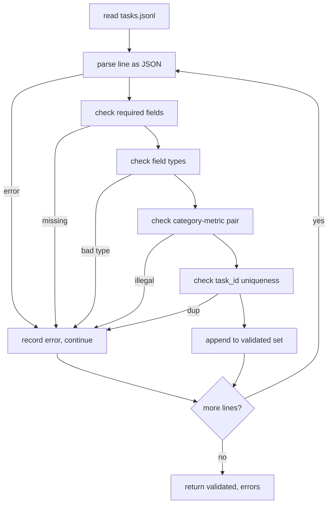

# 任务规范格式

> 评测框架的质量取决于其任务所遵守的契约。在写下第一个评分函数之前，先冻结 JSONL 的数据形状和指标命名词表。

**Type:** Build
**Languages:** Python
**Prerequisites:** Phase 19 Track B foundations
**Time:** ~90 min

## 学习目标

- 定义一种 JSONL 任务记录模式（schema），用同一种数据形状覆盖算术、多项选择、代码执行、分类和自由文本摘要五类任务。
- 锁定一个封闭的指标名称词表，让后续课程（71-73）只需根据单个字段进行分发。
- 把少样本示例（few-shot examples）和后处理规则定义在任务中而非运行器中，使同一个提示词在不同模型上产生相同的目标。
- 实现一个严格的校验器，在记录到达运行器之前拒绝所有格式错误的记录。
- 交付一套包含 10 个任务的测试夹具（fixture），覆盖规范的每个分支，让校验器有真实的输入可以检验。

## 为什么要冻结规范

研究代码库积累评测脚本的速度比积累测试的速度快得多。六个月后，每个 notebook 都有自己的 JSON 形状，每个指标都被重复实现了两遍，任何运行结果之间都无法比较。解决办法很朴素：选定一个模式，写一个校验器，拒绝其他一切。这正是本课要做的事。

这个数据形状借鉴了 BIG-bench、HELM 以及 lm-eval 风格评测框架的思路，但字段名是我们自己定义的。每个字段只有一个所有者：运行器读取任务，指标读取目标答案，后处理步骤规整模型生成的内容。任何字段在流水线中途都不可变更。

## 记录的形状

一个任务就是单行上的一个 JSON 对象。评测框架读取 `tasks.jsonl` 并独立校验每一行。某一行出错只会中止该条记录，而不会中止整个运行。

```json
{
  "task_id": "arith_001",
  "category": "arithmetic",
  "prompt": "Compute the result. Question: 17 + 24\nAnswer:",
  "targets": ["41"],
  "metric_name": "exact_match",
  "few_shot_examples": [
    {"prompt": "Question: 2 + 2\nAnswer:", "completion": "4"}
  ],
  "post_process": "strip_whitespace",
  "metadata": {"difficulty": "easy"}
}
```

必填字段为 `task_id`、`category`、`prompt`、`targets`、`metric_name`、`post_process`。`few_shot_examples` 和 `metadata` 是可选字段。出现未知的顶层字段会导致校验失败。

## 字段规则

`task_id` 是一个不含空白字符的字符串。校验器会在整个文件范围内强制其唯一性。

`category` 取值为 `arithmetic`、`mcq`、`code_exec`、`classification`、`summary` 之一。类别会约束哪些指标与后处理的组合是合法的：`code_exec` 任务必须使用 `metric_name = code_exec`，`mcq` 任务必须使用 `metric_name = exact_match` 并以单个字母作为目标答案。

`prompt` 是一个非空字符串。校验器禁止末尾出现空白字符，并拒绝在提示词正文中已经包含少样本示例块的记录。少样本的渲染由运行器完成，而不是由任务作者完成。

`targets` 是一个非空的字符串列表。对 `exact_match` 而言，匹配任意一个元素即算正确；对 `f1` 和 `rouge_l` 而言，取得分最高的目标；对 `mcq` 而言，列表必须恰好包含一个元素。

`metric_name` 取值为 `exact_match`、`f1`、`bleu_4`、`rouge_l`、`accuracy`、`code_exec` 之一。这个词表是封闭的。新增指标需要新开一课，并在这里新增一个条目。

`few_shot_examples` 是一个由 `{prompt, completion}` 键值对组成的列表。校验器将列表长度上限设为 8 条，以保证提示词长度有界。

`post_process` 取值为 `none`、`strip_whitespace`、`lower`、`extract_letter`、`extract_code_block`、`extract_first_line` 之一。每条规则都有唯一确定的行为。校验器禁止组合使用多条规则。

## 校验器行为



校验器返回两个列表：通过校验的记录，以及错误记录——后者包含出错的行、被违反的规则和出问题的字段。如果错误列表非空，运行器会拒绝启动，除非显式设置了 `--allow-bad-tasks` 标志。

## 少样本渲染

运行器把少样本示例拼接在提示词前面，以空行分隔。所有模型都走同一条代码路径，因此唯一的差异来源就是模型本身。作者只需编写一次示例，而不必为每个提供商各写一份。

```python
def render(task):
    parts = []
    for ex in task.get("few_shot_examples", []):
        parts.append(ex["prompt"] + " " + ex["completion"])
    parts.append(task["prompt"])
    return "\n\n".join(parts)
```

## 后处理规则

后处理步骤在模型生成之后、指标计算之前运行。它是确定性的、无状态的。

- `none` 原样返回字符串。
- `strip_whitespace` 去除首尾空白字符。
- `lower` 把字符串转为小写。
- `extract_letter` 返回第一个匹配 `[A-E]` 的字符，用于多项选择题。
- `extract_code_block` 返回第一个三反引号围栏代码块的内容，用于代码执行任务。
- `extract_first_line` 返回第一个非空行，用于摘要分类。

如果某个任务需要这个列表之外的规则，那它应该放进新的一课。

## 本课不做的事

本课不评分，不调用模型，也不运行代码。那些内容在第 71、72 和 75 课。本课只冻结它们都要遵守的契约。

包含 10 个任务的测试夹具涵盖：两个算术题、两个多项选择题、两个代码执行题、两个分类题和两个摘要题。校验器对全部 10 条记录都校验通过。另有一份单独的夹具（`tasks_bad.jsonl`）逐一触发每条规则，校验器恰好返回相应数量的错误。

## 如何阅读代码

`main.py` 定义了 `TaskSpec`、`validate_task`、`validate_file` 和一个 CLI 入口。夹具加载函数是 `load_fixtures`。渲染和后处理的辅助函数与校验逻辑放在一起，这样第 75 课的运行器只需导入一个模块。

从头到尾通读 `main.py`，然后阅读 `code/tests/test_spec.py`。这些测试固定了每条校验规则和每种后处理行为。`main.py` 底部的演示代码会校验内置的夹具并打印摘要。

## 更进一步

真实的评测套件增加类别，就像数据库模式增加列一样。稳妥的做法是：拒绝在不同时新增一个指标、一条后处理规则和至少一个夹具任务的情况下新增类别。把规范当作数据库迁移来对待：每次变更都要经过评审、版本化，并附带测试。本课的校验器就是这道关卡。
