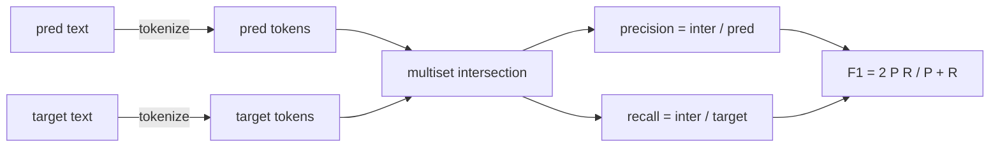
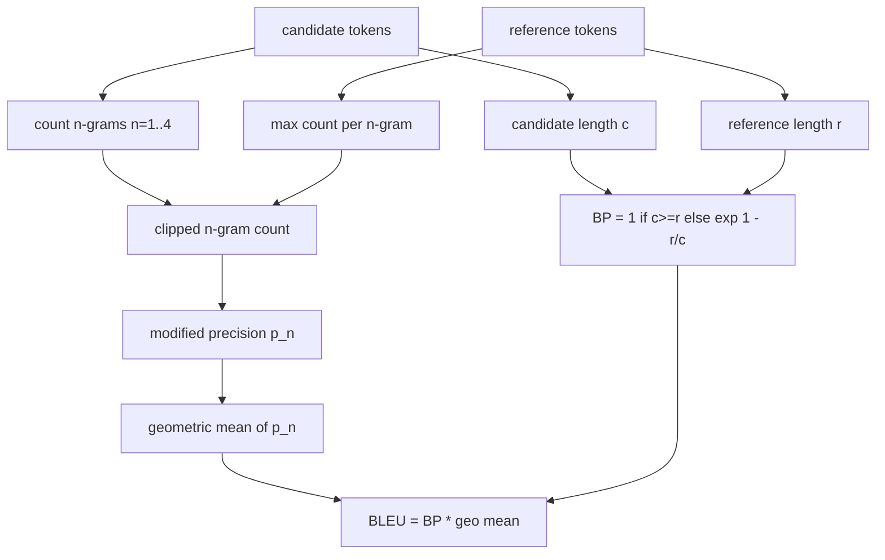

# 经典指标

> BLEU、ROUGE-L、F1、精确匹配、准确率。这五个指标至今仍贡献了已发表 LLM 评测数字中的绝大部分。从第一性原理出发逐一实现它们，你才能真正知道这些数字意味着什么。

**Type:** Build
**Languages:** Python
**Prerequisites:** Phase 19 Track B foundations, lesson 70
**Time:** ~90 min

## 学习目标

- 实现带有明确分词规则的 token 级精确匹配（exact-match）、F1 和准确率（accuracy）。
- 从零实现 BLEU-4：修正 n-gram 精确率、n 从 1 到 4 的几何平均、简短惩罚（brevity penalty）。
- 基于最长公共子序列（longest common subsequence）实现 ROUGE-L，并用 F-beta 综合精确率与召回率。
- 按第 70 课的 metric_name 字段做分发，让 runner 保持与具体指标无关。
- 用手工推演示例（而非第三方库）得到的参考向量来固定实现行为。

## 为什么要重新实现

你会读到一篇论文报告 BLEU 28.3，另一篇报告 BLEU 0.283。你会发现同一组数据的 ROUGE-L 分数在两个库之间相差十个点，因为一个库会先转小写而另一个不会。要想不再被这些数字搞糊涂，最快的办法就是自己把这些指标写一遍，然后直接指出决定分词器的那一行代码、应用平滑的那一行代码。在那之后，跨论文比较数字就变成了阅读指标设置的事，而不是争论用哪个库的事。

标准库加 numpy 就够了。BLEU 不过是计数加一个截断（clamp）。ROUGE-L 是动态规划。F1 是 token 上的集合交集。最难的部分是选定一个分词器，然后坚持用下去。

## 分词

分词器就是 `re.findall(r"\w+", text.lower())`。转小写、取连续的字母数字段、丢弃标点。本课中的每个指标都使用这一个分词器。runner 无权选择。一旦换了分词器，你跑的就是另一个基准了。

```python
TOKEN_RE = re.compile(r"\w+", re.UNICODE)
def tokenize(text):
    return TOKEN_RE.findall(text.lower())
```

这是有意为之的简化。生产环境的配置需要考虑 CJK、英文缩写形式和代码标识符。本课要传达的重点是：分词器是一份契约，而不是一个可调的旋钮。

## 精确匹配

```python
def exact_match(pred, targets):
    return float(any(pred.strip() == t.strip() for t in targets))
```

它对每个任务返回 1.0 或 0.0。在整个数据集上的聚合值就是均值。这是算术题、选择题（MCQ）和短文本分类任务的主力指标。

## Token 级 F1

为预测和目标分别构建 token 多重集（multiset）。精确率是多重集交集除以预测侧的多重集；召回率是同一个交集除以目标侧的多重集；F1 是两者的调和平均。实现中处理了空预测和空目标这两个边界情况。



对于多目标任务，我们取目标列表上的最优 F1。这与文献中广泛报告的 SQuAD 式做法一致。

## BLEU-4

BLEU 是机器翻译的经典指标，在摘要任务的研究中也仍然常见。我们采用的形式是语料级 BLEU-4，带标准简短惩罚，并对修正 n-gram 计数做加一平滑，避免缺了一个 4-gram 就把分数压到零。

对每个候选-参考对，我们统计 n 取 1、2、3、4 时的修正 n-gram 精确率。修正精确率会用该 n-gram 在任一参考中出现的最大次数来截断候选侧的计数，因此候选无法靠重复某个短语来刷高分数。四个精确率的几何平均再乘上简短惩罚。



这里的平滑规则就是 Lin 和 Och 所称的 method 1：在取对数之前，给每个 n-gram 精确率的分子和分母都加一。这样在参考中没有匹配的 4-gram 时可以避免 `log 0`，而对较长的候选又能保持与未平滑的值接近。

## ROUGE-L

ROUGE-L 比较候选与参考 token 序列的最长公共子序列。LCS 在不强制要求连续的前提下捕捉词序，这正是它成为摘要任务默认指标的原因。我们用标准的动态规划表计算 LCS 长度，然后由 `lcs / reference length` 得到召回率，由 `lcs / candidate length` 得到精确率，再用 F-beta 综合，beta 取 1 即对称的 F1 形式。

```python
def lcs_length(a, b):
    n, m = len(a), len(b)
    dp = numpy.zeros((n + 1, m + 1), dtype=int)
    for i in range(n):
        for j in range(m):
            if a[i] == b[j]:
                dp[i+1, j+1] = dp[i, j] + 1
            else:
                dp[i+1, j+1] = max(dp[i+1, j], dp[i, j+1])
    return int(dp[n, m])
```

numpy 表让实现一目了然；用纯 Python 列表同样可行。选用 ROUGE-L 的任务要为每个任务付出 O(n m) 的代价。对典型的摘要长度而言，耗时不到一毫秒。

## 准确率

对于多目标分类任务，准确率退化为与单个归一化目标做精确匹配。我们把它暴露为一个独立函数，这样分发器可以直接按 `metric_name` 分发，runner 内部就不需要做字符串比较。

## 分发契约

唯一入口是 `score(metric_name, prediction, targets)`，返回 `[0, 1]` 区间内的浮点数。runner 不对指标名做分支判断，它只是把调用转交出去并写入结果。这正是第 75 课将要与第 70 课任务规范对接的那个接口面。

```python
def score(metric_name, pred, targets):
    if metric_name == "exact_match":
        return exact_match(pred, targets)
    if metric_name == "f1":
        return max(f1_score(pred, t) for t in targets)
    if metric_name == "bleu_4":
        return max(bleu4(pred, t) for t in targets)
    if metric_name == "rouge_l":
        return max(rouge_l(pred, t) for t in targets)
    if metric_name == "accuracy":
        return accuracy(pred, targets)
    raise ValueError(f"unknown metric_name: {metric_name}")
```

`code_exec` 在第 72 课处理，届时再接入分发器。

## 本课不做什么

本课不调用模型；除了第 70 课的后处理规则已经做过的部分外，不对生成结果做额外归一化；不计算置信区间；不做 BLEURT 或 BERTScore（它们需要模型，属于另外的课程）。重点在于打好地基：五个指标、一个分词器、一张分发表。

## 如何阅读代码

`main.py` 把每个指标定义为一个自由函数，再加上分发器。参考向量放在文件底部的 `_reference_examples` 代码块中。演示程序对八个示例运行分发器并打印每个指标的分数。`code/tests/test_metrics.py` 中的测试固定了参考向量，并对每个边界情况做压力测试（空预测、空参考、无共享 token、完全匹配、重复短语截断）。

从头到尾通读 `main.py`。函数按复杂度排序：exact_match 和 accuracy 各一行，F1 六行，BLEU 和 ROUGE-L 是重头戏，并附有关于平滑规则和 LCS 递推式的详细注释。

## 更进一步

经典指标是必要的，但不充分。它们奖励表层重叠，却抓不住语义。解决办法是在你信任了经典指标这层地基之后，再叠加基于模型的指标（BLEURT、BERTScore、GEval）。那是后面课程的内容。眼下要做的是：把这五个指标做对，用测试固定下来，你就拥有了一套可审计、快速、可复现的指标栈。
