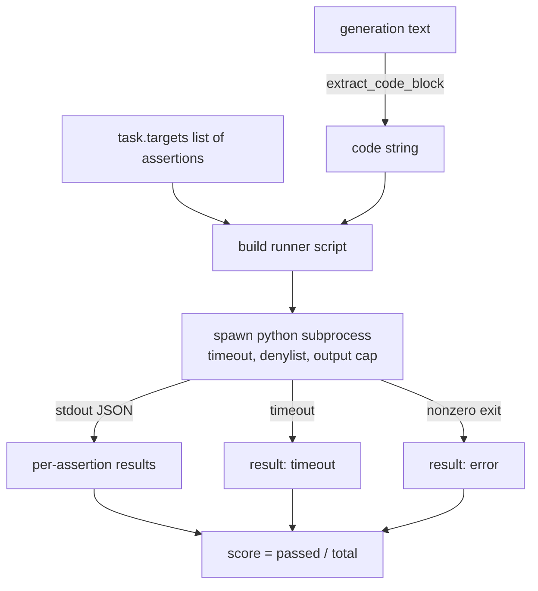
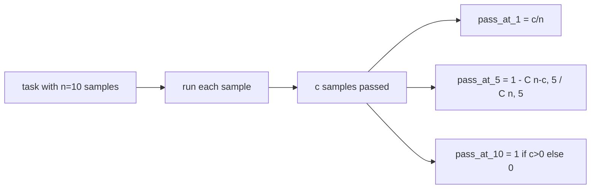

# 代码执行指标

> 生成的代码是否正确，要看它能否通过测试。评测框架（eval harness）必须能提取代码、在不搞垮宿主进程的前提下执行它，并诚实地统计通过率。本节课就构建这一层能力。

**Type:** Build
**Languages:** Python
**Prerequisites:** Phase 19 Track B foundations, lessons 70 and 71
**Time:** ~90 min

## 学习目标

- 以与第 70 课后处理规则一致的方式，从自由格式的生成文本中提取代码块。
- 在隔离的子进程中执行候选代码，并施加墙钟超时、输出上限和 import 拒绝清单（denylist）。
- 将任务得分计算为给定断言字符串中通过部分所占的比例。
- 为从同一模型采样多个生成结果的任务计算 pass-at-k。
- 把沙箱崩溃、语法错误和超时当作一等公民的失败模式处理，赋予各自独立的退出码供运行器记录。

## 为什么要用隔离的子进程

内联 `exec` 是安全与稳定性的双重隐患。模型生成一句 `while True: pass` 就能让评测永远卡住；生成 `import shutil; shutil.rmtree('/')` 的灾难性后果则不言自明。解决办法是为每个候选代码启动一个全新的 Python 解释器，通过 stdin 传入代码，把断言结果写到 stdout，超时就杀掉进程。宿主评测进程始终保持运行。

HumanEval、MBPP、BigCodeBench、LiveCodeBench 这些真实的评测都使用子进程沙箱，有的还在上面叠加 Docker。我们止步于子进程是有理由的：它可移植、只依赖标准库，并且能捕获教学评测中真正重要的失败模式。生产部署还会加上 seccomp、网络隔离和只读文件系统，那属于本系列之外的加固课题。

## code-exec 任务的形态

一个 `code_exec` 任务在 `targets` 中携带断言字符串。运行器从生成文本中提取围栏代码块，围绕它构建测试脚手架，然后运行整个结果。



得分是 `[0, 1]` 区间内的一个比例。一个有三条断言、两条通过的任务得 0.667。无论什么环节失败，运行器都返回同样的结构：子进程崩溃会被映射为规范化的错误码，而不是让 Python 回溯信息直接冒泡到评测框架。

## 拒绝清单

拒绝清单基于 import 实现。在运行候选代码之前，运行器脚本会把危险模块的导入重写为一个抛出 `ImportError("denied")` 的桩。清单刻意保守：`os.system`、`subprocess`、`socket`、`requests`、`urllib`、`urllib.request`、`urllib.error`、`urllib.parse`、`ctypes`、`shutil`、`http.client`、`asyncio.subprocess`。

我们不假装它无懈可击。在 Python 中，蓄意的对抗代码可以逃逸任何进程内沙箱。拒绝清单只是兜底，真正承重的控制手段是墙钟超时和输出上限。

```python
DENIED = {
    "os.system": True,
    "subprocess": True,
    "socket": True,
    "shutil": True,
    "requests": True,
    "urllib": True,
    "ctypes": True,
}
```

我们在候选代码前面拼接 `import sys` 和一段把 `os.system` 猴子补丁成直接抛异常的守卫代码。完整模板见 `main.py`。

## 墙钟超时

每个子进程默认获得三秒的墙钟时间预算。运行器使用 `subprocess.run(..., timeout=t)`。超时触发时，运行器捕获 `TimeoutExpired`，杀掉进程，并为该任务记录 `timeout` 退出原因。该任务得分为零，运行器继续处理下一个任务。

超时可以通过 `task.metadata.timeout_s` 按任务配置。运行时间长的单元测试可以申请更多时间；第 70 课的校验器把该值上限封顶在三十秒，以保证整个测试集的运行时间有界。

## 输出上限

子进程可能向 stdout 倾泻数据，耗尽宿主内存。运行器把 stdout 流式写入缓冲区，一旦累计总量超过 256 KB 就立即杀掉子进程。结果记录为 `exit_code = error`，详情字符串为 `"output overflow"`。这种情况在实践中常见于模型不小心生成了一个带打印的无限循环。

## Pass-at-k

Pass-at-k 是 HumanEval 及同类评测使用的无偏估计量。给定每个任务 `n` 个独立采样，其中 `c` 个通过，则从这 `n` 个中取出大小为 `k` 的样本至少包含一个通过解的概率为：

```
pass_at_k(n, c, k) = 1 - C(n - c, k) / C(n, k)
```

当 `n - c < k` 时分子无定义，此时取值为 `1`。实现中直接处理了这个边界情况。我们对外暴露 `pass_at_k(n, c, k)`，供第 74 课的排行榜层调用。



## 退出码

运行器为每个任务返回五种结果之一：

- `pass`：所有断言全部通过。
- `assertion_fail`：代码运行了，但至少一条断言失败。
- `syntax_error`：代码无法导入或存在 SyntaxError。
- `timeout`：墙钟时间耗尽。
- `error`：其余所有崩溃，包括命中拒绝清单和输出溢出（溢出会附带详情 `"output overflow"`）。

得分仍然是一个比例，退出码只是元数据。后续课程可以自行决定把超时计为零分还是计为缺失数据。

## 本节课不做什么

它不提供真正的沙箱，不运行来自公开互联网的不可信代码，也不处理文件 I/O 或网络调用这类有状态任务——那些需要容器或 microVM。本节课的重点是这份契约：一个隔离的子进程、一份拒绝清单、一个超时、一个输出上限、一套干净的退出码词汇表，以及 pass-at-k 的数学。

## 如何阅读代码

`main.py` 定义了 `extract_code`、`run_candidate`、`score_code_exec` 和 `pass_at_k`。子进程运行器脚本以字符串形式构建，通过 `-c` 传给一个全新的 Python 解释器。`code/tests/test_exec.py` 中的测试覆盖了四种退出码，并用 HumanEval 风格的实例验证 pass-at-k。

从头到尾通读 `main.py`。运行器模板是承重的核心部分。盯着断言循环看，直到你能预测它写回父进程的 JSON 信封长什么样。

## 更进一步

子进程方案跑通之后，下一个关注点是可移植性。不同 Python 版本在 Windows 上对 SIGKILL 的处理并不一致，最干净的解法是把运行器装进 Docker 镜像。再往后则是用真正的单元测试文件取代断言字符串，让评测与生产 CI 的做法一致。到了那一步就别再把断言字符串叫作测试了——它们只是玩具测试，有着玩具级的失败模式。
