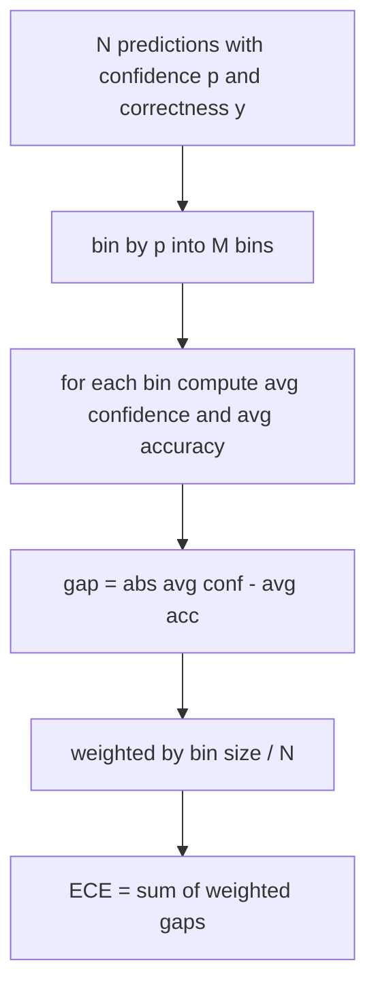
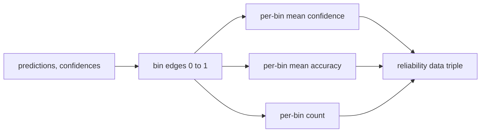

# 困惑度与校准

> 如果你的模型在一千道题上都声称有 90% 的把握，结果只答对了六百道，那它的校准就不合格。校准（calibration）是评测可信度的一半，另一半是困惑度（perplexity）——它告诉你模型是否认为留出文本根本是合理的。

**Type:** Build
**Languages:** Python
**Prerequisites:** Phase 19 Track B foundations, lessons 70 and 71
**Time:** ~90 min

## 学习目标

- 基于模型适配器提供的 token 负对数概率，在留出语料上计算 token 级困惑度。
- 基于分箱后的预测概率，计算分类器或多选题评测的期望校准误差（ECE）。
- 计算 Brier 分数（相对于正确性指示变量的均方误差），并解释它在哪些方面能做到 ECE 做不到的事。
- 构建绘制「置信度—准确率」曲线所需的可靠性图（reliability diagram）数据。
- 把这三项指标全部接入评测框架，让 runner 能在模型报告中附上 `perplexity`、`ece` 和 `brier` 数值。

## 困惑度告诉你什么

困惑度是每 token 平均负对数似然取指数后的结果。数值越低越好。困惑度为 1 意味着模型对每个实际出现的 token 都赋予概率 1。困惑度等于词表大小则意味着模型是均匀分布，什么都没学到。真实数字落在两者之间：一个强大的 2026 年基座模型在 WikiText-103 上大约在 8 到 12 之间，一个糟糕的模型在同样的文本上会到 50 以上。

评测框架本身并不计算对数概率，对数概率来自模型适配器。框架只负责聚合：它接收一个每 token 负对数概率的列表和一个每序列 token 数的列表，返回语料级困惑度。

```python
def perplexity(neg_log_probs, token_counts):
    total_nll = sum(neg_log_probs)
    total_tokens = sum(token_counts)
    return math.exp(total_nll / total_tokens)
```

实现需要处理零 token 的边界情况，并断言负对数概率是非负的。一个常见错误是忘记取负号：如果适配器返回的是 `log p` 而不是 `-log p`，会算出小于 1 的困惑度，而这是不可能的。函数会把这种情况当作契约违规捕获。

## ECE 衡量什么

期望校准误差把预测按置信度划分到固定数量的分箱中，然后计算各分箱内置信度与准确率之间的平均差距，并按分箱大小加权。



标准做法是在 `[0, 1]` 上使用十个等宽分箱。实现支持任意正整数的分箱数。我们暴露一个 `bins` 参数，让 runner 可以在发表惯例（10）和比较惯例（15）之间选择。

ECE 会受分箱数量和样本规模的偏差影响。十个分箱、一百条预测的情况下，你无法把 0.02 的 ECE 和随机噪声区分开。实现会把有数据的分箱数量与 ECE 一起返回，这样 runner 就能在样本太少时拒绝只报告一个孤立的数字。

## Brier 分数能做而 ECE 做不到的事

ECE 只关心平均差距。一个模型如果在一半分箱里过度自信、在另一半分箱里信心不足，ECE 可能很低，但局部校准依然很差。Brier 分数对每条预测计算相对于真实结果的平方误差，因此直接惩罚这种分散。

对于二元结果，Brier 是 `mean((p_i - y_i)^2)`。它可以分解为可靠性（reliability）、分辨率（resolution）和不确定性（uncertainty）三项。我们既计算分数也计算分解。runner 报告标量值，但把分解结果记入日志供仪表盘使用。

```python
def brier(p, y):
    return float(np.mean((p - y) ** 2))
```

## 可靠性图数据

可靠性图把每个分箱内的预测置信度与经验准确率画在一起，对角线代表完美校准。函数返回三个数组：每箱平均置信度、每箱平均准确率、每箱样本数。绘图代码在下游；本课只到数据形态为止。



返回的三元组正是调用方绘图或计算自定义 ECE 变体（自适应 ECE、扫描 ECE 等）所需要的东西。我们返回 numpy 数组，这样下游代码无需再做转换。

## 置信度来源

评测框架不假设置信度来自 softmax，它接受每条预测对应的任意 `[0, 1]` 内的数字。对于多选题任务，自然的置信度是 `softmax over option log-likelihoods`。对于自由文本，自然的置信度是模型自报的概率，或者平均对数似然的指数。评测只消费这个数字，至于它从哪里来，是适配器的职责。

## 边界情况

- 所有预测全错：ECE 等于平均置信度，Brier 很高，困惑度则反映模型对文本本身的看法。
- 所有预测全对且置信度很高：ECE 接近零，Brier 接近零。
- 完全不确定的预测器，p=0.5：ECE 等于 0.5 减去准确率，Brier 等于 0.25 减去一个修正项。
- 空输入：ECE、Brier 和可靠性图返回 `0.0`（或全零数组）。困惑度在零 token 的情况下返回 `NaN`。这些路径都不发出警告；由 runner 检查数值并决定报告还是跳过。

这些情况都固化在测试里。真实模型跑真实基准测试不会触发它们，但有 bug 的适配器或极小的样本会，而 runner 不应该因此崩溃。

## 调度

校准不像 F1 那样是按任务计算的指标，而是一份按模型出具的报告。runner 在整个评测过程中累积 `(confidence, correct)` 对，最后一次性计算 ECE、Brier 和可靠性图数据。困惑度则在留出文本语料上计算，与逐任务打分相互独立。

接口如下：

```python
report = CalibrationReport.from_predictions(confidences, correct)
report.ece          # float
report.brier        # float
report.reliability  # tuple of three numpy arrays
report.populated_bins  # int
```

`PerplexityResult.from_token_nll(neg_log_probs, token_counts)` 返回困惑度以及每 token 平均负对数似然。

## 本课不做什么

本课不调用模型，不实现 softmax，也不从输出 token 估计置信度——那是适配器的工作。它不做温度缩放（temperature scaling）或 Platt 缩放，那些是事后修正手段，属于另一节课。本课的目标是让这三个数字（困惑度、ECE、Brier）可信且可复现。

## 如何阅读代码

`main.py` 定义了 `perplexity`、`expected_calibration_error`、`brier_score`、`reliability_diagram`，以及 `CalibrationReport` / `PerplexityResult` 两个数据类。演示运行在真值已知的合成预测上：一个校准良好的模型、一个过度自信的模型和一个信心不足的模型。`code/tests/test_calibration.py` 中的测试固定了所有边界情况，外加这几个合成预测器的参考值。

从头到尾阅读 `main.py`。函数排列顺序是从标量到向量再到报告。每个函数都有一段简短的 docstring，写明数学定义和契约。

## 延伸思考

校准是公开评测中最被忽视的维度。大多数排行榜只报告一个准确率数字就收工。一个准确率领先但 Brier 落后的模型，在生产部署中比一个准确率低几个点但能可靠报告自身不确定性的模型更糟糕。一旦你把校准的管线搭好，就可以在留出验证集切片上做温度缩放，重新计算 ECE，看着差距缩小。那是另一节课的内容，但地基就在这里。
