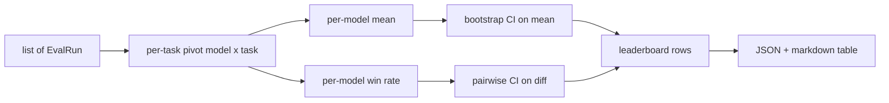
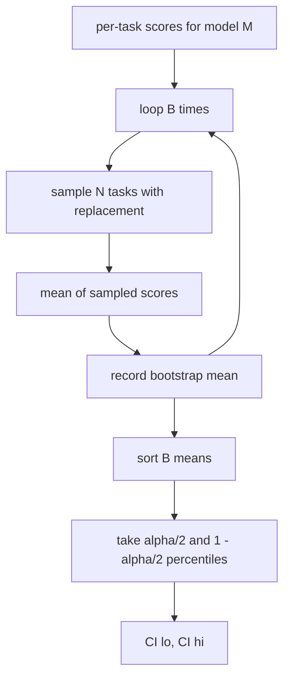

# 排行榜聚合

> 算出每个任务的分数很容易。在异构任务上给出每个模型的排名则要难一些。而在一个上千条预测的排行榜上计算统计显著性，是人人都会跳过的那一步。这节课不会跳过它。

**Type:** Build
**Languages:** Python
**Prerequisites:** Phase 19 Track B foundations, lessons 70, 71, 73
**Time:** ~90 min

## 学习目标

- 把多个模型、多个任务的逐任务分数聚合成整齐的每模型一行。
- 对异构分数做归一化，避免通过率和 BLEU 值对聚合结果产生过大的影响。
- 分别按均值和胜率（win-rate）对模型排名，并解释各自适用的场景。
- 用自助法（bootstrap）计算每个模型平均分的置信区间，以及两两差值的置信区间。
- 把排行榜输出为 JSON 报告和 markdown 表格，供第 75 课的运行器粘贴到 CI 评论中。

## 输入的形态

聚合器消费一个 `EvalRun` 记录列表：

```python
@dataclass
class EvalRun:
    model_id: str
    task_id: str
    metric_name: str
    score: float          # in [0, 1]
    category: str
```

第 75 课的运行器为每个 `(model, task)` 组合产出一条记录。聚合器不关心分数是怎么算出来的。它假定归一化已经完成：每个分数都落在 `[0, 1]` 之内。

## 输出

最终产出三张表：



排行榜的每一行包含：`model_id`、`mean_score`、`mean_ci_lo`、`mean_ci_hi`、`win_rate`、`tasks_completed`，以及一个可选的 `categories` 映射，用于存放各类别的均值。

## 归一化

如果一个任务的分数在 `[0, 1]` 区间，另一个在 `[0, 100]` 区间，后者会悄悄地主导均值。聚合器会校验每个输入分数都落在 `[0, 1]` 内，否则直接拒绝这次运行。修复应该发生在上游：指标本身就应当返回一个比例值。第 71 到 73 课强制执行了这个约定。

## 均值与胜率

这两种排名方案服务于不同的目标。

平均分是单个模型在各任务上分数的平均值。它是排行榜对外报告的头条数字。它对离群值和任务不均衡都很敏感。

胜率统计的是一个模型在同一任务上击败所有其他模型的频率。对每个任务，分数最高的模型获胜（平局时均分）。胜率等于获胜次数除以该模型有分数的任务总数。它对离群值和量纲差异不那么敏感，但会丢失信息。

```python
def win_rate(model_id, runs_by_task, all_models):
    wins, total = 0, 0
    for task_id, runs in runs_by_task.items():
        scores = {r.model_id: r.score for r in runs if r.model_id in all_models}
        if model_id not in scores:
            continue
        total += 1
        best = max(scores.values())
        if scores[model_id] >= best:
            wins += 1
    return wins / total if total else 0.0
```

评测框架两者都会报告。第 75 课的运行器默认按均值排名；如果用户更偏好胜率，markdown 表格里的胜率列就在那里。

## 自助法置信区间

每个模型的均值都附带一个置信区间，通过在任务维度上做自助重采样（bootstrap resampling）估计得出。我们对任务 id 进行有放回抽样，在重采样集合上计算均值，重复 `B` 次，然后取置信水平 `alpha` 下的百分位区间。



做两两比较时，我们对逐任务差值 `score_A - score_B` 做自助法，取百分位区间并报告出来。用户只需查看区间是否不包含零。如果不包含，差异在 alpha 水平上显著；如果包含，排行榜就把这两个模型视为平手。

底层辅助函数（`bootstrap_mean_ci`、`bootstrap_pairwise_diff`）默认 `B=1000`；公开的聚合函数（`aggregate`、`pairwise_diffs`）默认 `b=500`，以保证演示和测试跑得快。alpha 默认值为 0.05。这节课的自助法只用纯 numpy 实现，不依赖 scipy。

## 类别

如果设置了 `EvalRun.category`，聚合器还会报告各类别的均值。这就是每个排行榜上写着 `math`、`reasoning`、`code`、`safety` 的那一列。它让运行器能发现某个模型整体不错但代码能力偏弱——这正是头条均值会掩盖的信息。

## Markdown 渲染

排行榜被渲染成一张 markdown 表格：

```text
| Rank | Model | Mean | 95% CI | Win rate | Tasks |
|------|-------|------|--------|----------|-------|
| 1    | gpt   | 0.78 | 0.74-0.82 | 0.62 | 50 |
| 2    | claude| 0.75 | 0.71-0.79 | 0.34 | 50 |
| 3    | random| 0.10 | 0.07-0.13 | 0.04 | 50 |
```

表格按平均分排序。置信区间渲染为两位小数。过长的模型 id 截断到二十个字符。

## 这节课不做什么

它不运行模型。它不调用指标层。它不实现自适应 ECE 或其他校准变体；那些属于第 73 课。它不实现任务加权。在这里，每个任务的权重都一样。生产环境的排行榜会给任务加权；我们通过 `weight` 字段保留了这个扩展点，但聚合器忽略它。如果你需要加权，在后续课程中自行添加。

## 如何阅读代码

`main.py` 定义了 `EvalRun`、`LeaderboardRow`、`aggregate`、`bootstrap_mean_ci`、`bootstrap_pairwise_diff` 和 `render_markdown`。演示程序构建一个由三个模型、十二个任务组成的合成套件，执行聚合，然后打印排行榜和两两差值表。`code/tests/test_leaderboard.py` 中的测试固定了自助法、markdown 渲染、胜率的边界情况以及空输入的行为。

从头到尾通读 `main.py`。数据结构（EvalRun、LeaderboardRow）在最前面，聚合器其次，自助法第三，渲染在最后。每个函数都有一个聚焦的职责约定。

## 更进一步

自然的下一步是用配对任务显著性检验取代非配对自助法。如果模型 A 和 B 跑的是同样的一百个任务，恰当的检验是对逐任务差值做配对自助法，而这正是我们实现的方案。再往后，你会需要一种尊重任务族结构的分层自助法（数学题之间并不相互独立；一种算术错误模式会同时影响其中十道题）。那是后续课程的内容。这节课的重点是把地基打牢，让评测报告出一个你能站得住脚的数字。
