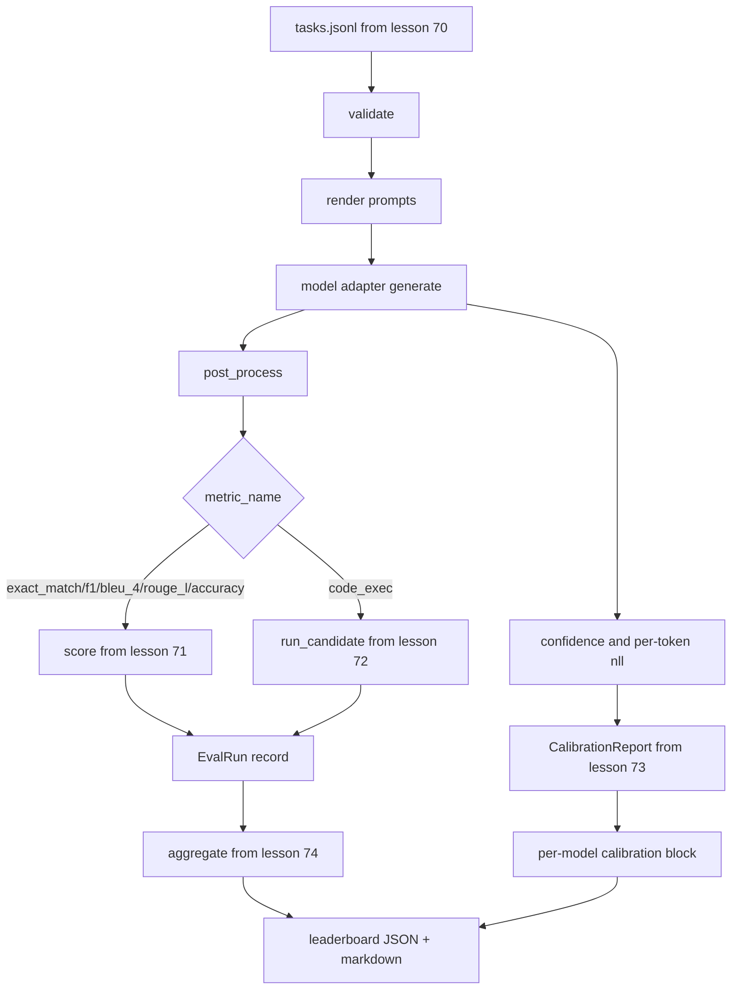

# 端到端评测运行器

> 前五节课搭好了管线，这一节课把它们粘合起来。运行器读取第 70 课的任务规格，通过适配器调用模型，用第 71、72 课的逻辑打分，附上第 73 课的校准报告，最后输出第 74 课的排行榜。演示程序自动终止。

**Type:** Build
**Languages:** Python
**Prerequisites:** Phase 19 Track B foundations, lessons 70 through 74
**Time:** ~90 min

## 学习目标

- 定义一个 `ModelAdapter` 接口，让任何模型（mock、本地、API）都能以极小的方法集实现它。
- 在一个 fixture JSONL 文件上运行评测，通过工作线程池并行执行任务。
- 在一趟遍历中组合指标层（exact_match、F1、BLEU-4、ROUGE-L、code_exec）与校准层。
- 输出每个模型的 `EvalRun` 记录，并直接送入排行榜聚合器。
- 同时输出 JSON 报告和 markdown 表格；运行干净时以退出码零自动终止，校验或运行时失败则返回非零。

## 流水线



运行器就是集成点。第 70 到 74 课各自负责一个模块，运行器负责组合它们。运行器不会复制那些模块中的任何逻辑：它直接导入它们。

## 适配器接口

适配器是运行器与任意模型之间的接缝。这个接口刻意保持小巧。

```python
class ModelAdapter:
    model_id: str

    def generate(self, prompt: str, task: TaskSpec) -> Generation: ...
```

`Generation` 是一个 dataclass，包含：

- `text`：模型的自由格式输出
- `confidence`：`[0, 1]` 区间内的浮点数，表示模型自报的答案概率
- `token_nll`：可选，生成 token 的负对数似然之和
- `token_count`：可选，生成的 token 数量

运行器中的 mock 适配器提供三种风格：`RuleBasedAdapter`（确定性、近乎完美）、`NoisyAdapter`（过度自信、经常出错）、`BiasedAdapter`（擅长一类任务、在另一类上一塌糊涂）。演示程序用这三个适配器跑完第 70 课的 fixture。

## 并行执行

运行器使用 `concurrent.futures.ThreadPoolExecutor` 按模型并行执行任务。工作线程数默认取 8 和任务数中的较小者。线程足够用，因为真实模型调用的瓶颈在于网络 I/O。code-exec 路径会在任务内部派生自己的子进程，执行器只负责调度等待。

为了让测试可确定，运行器暴露了 `run_eval(adapters, tasks, parallel=False)`，测试可以借此固定执行顺序。

## 单趟打分循环

对每个任务：

1. 渲染提示词（few-shot 前缀加上提示词正文）。
2. 调用适配器并计时。
3. 按任务规则对生成结果做后处理。
4. 分发到指标层。
5. 用分数和指标元数据构建一条 `EvalRun` 记录。
6. 把 `(confidence, correct)` 对追加到校准缓冲区。

`correct` 信号的判定：exact_match 风格的指标（`exact_match`、`accuracy`、`code_exec`）取 `score >= 1.0`，分级指标取 `score >= 0.5`。这个阈值定义在 `_correct_from_score` 里，运行器不提供公开的覆盖入口。

## 聚合

所有任务都有结果之后，运行器调用第 74 课的 `aggregate` 和 `pairwise_diffs`，以及第 73 课的 `CalibrationReport.from_predictions`。输出是单个 JSON 信封：

```json
{
  "leaderboard": [...],
  "pairwise": [...],
  "calibration": {
    "model_id_a": {"ece": 0.04, "brier": 0.10, "populated_bins": 8, ...},
    ...
  },
  "summary": {
    "tasks": 10,
    "models": 3,
    "wall_seconds": 1.2
  }
}
```

运行器还会向 stdout 写一个 markdown 表格，方便用户把结果直接粘进 PR review。

## 自动终止的演示

演示程序用三个 mock 适配器跑第 70 课的十个 fixture 任务。墙钟时间应在十秒以内。运行干净时退出码为零。

干净运行的判定标准是：

- 每个任务都通过了第 70 课的校验。
- 每个任务都经第 71、72 课打了分。
- 校准报告按第 73 课聚合且无错误。
- 排行榜上基于规则的适配器严格排在随机适配器之上。

任何一条不满足，运行器就以非零退出码结束，并在 JSON 信封中附上结构化的错误信息。

## 这节课不做什么

它不调用真实模型。它不实现 API key 流程或限流处理。它不实现流式输出或部分生成；适配器每次调用只返回一个生成结果。它不做重试或缓存。这些关注点属于适配器层；运行器对指标无感知、对供应商也无感知。

## 如何阅读代码

`main.py` 是集成代码。它通过一个小的 `_load_sibling` 辅助函数按相对路径解析并导入其他五节课的模块。dataclass `Generation`、`EvalReport` 和 `ModelAdapter` 在本地定义。mock 适配器位于文件底部。

从头到尾通读 `main.py`。先浏览导入，然后看 `run_eval`，再看 `_score_one`，最后看适配器。文件末尾的演示程序是入口点。

`code/tests/test_runner.py` 中的测试固定了适配器接口、单趟循环、并行与串行的等价性、校准缓冲区，以及 JSON 信封的形状。

## 更进一步

这个运行器只是底线。生产级评测系统还会加上：以 `(task_id, model_id, model_version)` 为键的结果缓存、按运行追踪金额和 token 的成本台账、遇到限流时退避的重试层、面向 pass-at-k 任务的采样策略，以及面向长测试套件的流式输出格式。每一项都是单一关注点，可以包裹在运行器外层，而无需改动指标层或聚合层。这种分离正是契约的意义所在。

等 mock 跑通之后，再为真实供应商写一个适配器。挑一家有免费额度的，写三十行胶水代码，看着排行榜亮起来。然后接入第二家供应商，让评测框架替你干活。
