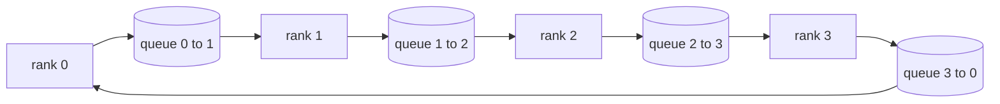

# 从零实现集合通信原语

> 支撑分布式训练的四个集合通信操作（collective operations）是 allreduce、broadcast、allgather 和 reduce_scatter。训练框架提供的其他所有原语都是对这四个操作的封装。基于 `multiprocessing.Queue` 网格把它们实现一遍，再用参考实现验证正确性，这条赛道剩下的内容就只是管道拼接了。

**Type:** Build
**Languages:** Python
**Prerequisites:** Phase 19 Track C lessons 42-49
**Time:** ~90 min

## 学习目标

- 用两遍流程（先 reduce-scatter 再 allgather）实现环形 allreduce（ring allreduce），并证明每个 rank 的通信量为每元素 2(N-1)/N 字节。
- 基于 `multiprocessing.Queue` 上的点对点发送，实现 broadcast、allgather 和 reduce_scatter。
- 对相同输入，用 `torch.distributed` 的 gloo 参考实现验证每一个原语。
- 能够从集群形态、延迟下限和带宽上限的角度，论证环形与树形拓扑的取舍。

## 问题背景

在 N 个 rank 上做朴素 allreduce，需要把张量发送 N 次到根节点，再广播 N 次回来。每个 rank 的带宽开销随 O(N) 增长，根节点成为瓶颈，墙钟时间的下限是最慢链路乘以 N。环形 allreduce 把这一过程摊平成 2(N-1) 个大小为 T/N 的分块，每个 rank 的传输字节数降为 2T(N-1)/N，与集群规模无关。树形 allreduce 在 N 较小、链路延迟较高时占优，因为树的深度是 log2(N) 跳，而不是 2(N-1)。如果拓扑选择与集群形态不匹配，最慢的那块 GPU 就会决定整个训练步的耗时。

这条赛道后续要读的每一个分布式训练框架都依赖这四个原语。PyTorch DDP 对每个参数桶（bucket）做一次 allreduce 来同步梯度。ZeRO 用 reduce_scatter 切分优化器状态，再用 allgather 广播更新后的参数。FSDP 把完整的前向过程变成 allgather 加 reduce_scatter。流水线并行需要 broadcast 在各 stage 组之间传递激活值。如果你写不出这四个集合通信操作，就无法推断训练为什么卡住、梯度不一致为什么出现在 rank 3、换一种拓扑后流水线气泡为什么翻倍。

## 核心概念



### 两遍流程的环形 allreduce

把张量切成 N 个等大的分块，编号 0..N-1。每个 rank 拥有与自己 rank 号相同的分块。第一遍是 reduce-scatter，共 N-1 步。在第 s 步，rank r 把分块 (r - s) mod N 发给 rank (r + 1) mod N，同时从 rank (r - 1) mod N 接收分块 (r - s - 1) mod N，并把收到的分块累加进本地副本。N-1 步之后，rank r 持有分块 r 的完整求和结果。第二遍是 allgather，再走 N-1 步，把已完成的分块沿环旋转，直到每个 rank 都持有所有分块的完整求和结果。

| 原语 | 每 rank 字节数 | 步数 | 适用场景 |
|-----------|---------------|-------|-------------|
| 环形 allreduce | 2T(N-1)/N | 2(N-1) | 大张量 T、链路带宽充足的同构集群 |
| 树形 allreduce | T log2(N) | 2 log2(N) | 小张量 T 或高延迟链路 |
| Broadcast | T | log2(N) 树深 | 参数初始化、标量配置 |
| Allgather | T(N-1)/N | N-1 | 分片前向、ZeRO 反分片 |
| Reduce_scatter | T(N-1)/N | N-1 | ZeRO 梯度分片 |

### 用队列网格替代 NCCL

NCCL 运行在 PCIe 和 NVLink 之上，归约（reduction）由硬件卸载完成。在 CPU 上没有这些条件。给环的每条边配一个 `multiprocessing.Queue`，就得到了单生产者、单消费者的有序点对点传输。归约在用户态完成，所以要付出 Python 的开销，但通信模式（wire pattern）与 NCCL 的环形 allreduce 完全一致。在队列版本上把正确性推理清楚，集群上的行为自然随之成立。

### 用 gloo 做验证

每个原语落地时都附带一个单元测试，把它的输出与用 gloo 后端初始化的 `torch.distributed` 在相同张量、相同 world size 下的结果进行比对。如果你的环形 allreduce 与 gloo 的偏差超过 float32 的 epsilon，测试就失败。对照参考实现做验证没有商量余地；没有它，原语看起来一切正常，直到真实训练跑到第 10000 步才暴露问题。

## 从零实现

`code/main.py` 实现了：

- `Mesh` 类，把 N 个 `multiprocessing.Queue` 实例接成一个环，并为每个 rank 暴露 `send(dst, tensor)` 和 `recv(src)`。
- `ring_allreduce(mesh, rank, world_size, tensor)`，运行两遍流程的算法。
- `broadcast(mesh, rank, world_size, tensor, src)`，基于对数级的树形结构。
- `allgather(mesh, rank, world_size, tensor)`，使用 N-1 次旋转。
- `reduce_scatter(mesh, rank, world_size, tensor)`，即 allreduce 的前半段。
- `_gloo_reference(op, world_size, tensor)`，把相同输入跑一遍带 gloo 的 `torch.distributed`，用于逐字节比对。

运行：

```bash
python3 code/main.py
```

输出：逐原语的验证表，对比队列网格与 gloo 的输出，随后是每 rank 的字节计数器，验证 2T(N-1)/N 的扩展规律。

## 业界生产模式

三个模式能把这些原语加固到可以上线的程度。

**在 allreduce 之前对梯度分桶。** 一个 10 亿参数的模型有数万个梯度张量。每个张量做一次 allreduce 意味着把延迟下限支付 N 次。DDP 把梯度归并成约 25 MB 的桶，每个桶只发一次 allreduce；小张量搭大张量的便车。不分桶的话，延迟开销会主导整个训练步。

**通信与计算重叠。** 反向传播按层逆序计算梯度。最后一层的梯度一就绪，立刻发起它的 allreduce，同时下一层继续计算。PyTorch DDP 用桶就绪钩子（bucket-ready hook）实现这一点。在网络有余量时，这种重叠能把可见的通信时间减半。

**按消息大小选环形或树形，而不是凭信仰。** NCCL 自带拓扑探测器，消息大于约 1 MB 时选环形，小于则选树形。分界点在于带宽与延迟之争：超过 1 MB 时，带宽项 2T(N-1)/N 占主导，环形胜出；低于 1 MB 时，log2(N) 的跳数占优。把拓扑写死，会在不匹配的消息大小上损失吞吐量。

## 生产实践

生产中的模式：

- **PyTorch DDP。** 反向传播后对分桶的梯度调用 `dist.all_reduce`。桶大小可调；默认 25 MB 对 100Gbit 以太网来说是合理的。
- **DeepSpeed ZeRO。** 用 reduce_scatter 切分梯度，在前向之前用 allgather 重建完整参数。本课的原语正是 ZeRO 发出的那些调用。
- **FSDP。** 前向先用 allgather 把该层反分片，完成计算后用 reduce_scatter 归约，并丢弃反分片副本。同样的原语，不同的调度。

## 交付产物

第 77-81 课会用到这些队列网格原语。第 77 课把 allreduce 接入 DDP。第 78 课把 reduce_scatter 接入 ZeRO。第 79 课把 broadcast 接入流水线激活值传递。第 81 课把四个原语组合成端到端的演示。

## 练习

1. 增加一个树形 allreduce 变体，并按消息大小在环形与树形之间切换。测量分界点。
2. 增加一个 `recv_timeout_ms`，让卡住的 rank 抛出超时错误，而不是永远挂起。
3. 把 `multiprocessing.Queue` 换成 TCP socket 来实现这四个原语。测试不变，链路换成真实网络。
4. 增加一个带宽埋点钩子，把每 rank 的字节计数器记录到 JSONL。
5. 在 4 个 rank 上对比环形与树形在 1KB、1MB、16MB 张量下的墙钟时间。用实验数据论证分界点。

## 关键术语

| 术语 | 大家怎么说 | 实际含义 |
|------|----------------|------------------------|
| Allreduce | “跨 rank 求和” | 调用结束后，每个 rank 都持有相同的归约后张量 |
| Ring | “那个快的拓扑” | N-1 个大小为 T/N 的分块沿环流动两圈 |
| Tree | “对数拓扑” | 归约沿二叉树进行；深度是 log2(N) 跳 |
| Allgather | “拼接分片” | 每个 rank 最终持有所有其他 rank 的分片 |
| Reduce_scatter | “切分求和结果” | 每个 rank 最终只持有一个分块的求和结果 |
| Bucket | “融合小张量” | 把 N 次小 allreduce 合并成一次大的 |

## 延伸阅读

- [PyTorch Distributed: NCCL collectives](https://pytorch.org/docs/stable/distributed.html#collective-functions)
- [Horovod ring allreduce paper](https://arxiv.org/abs/1802.05799)
- [NCCL topology and algorithm selection](https://docs.nvidia.com/deeplearning/nccl/user-guide/docs/index.html)
- [Patarasuk and Yuan, Bandwidth optimal allreduce algorithms](https://www.cs.fsu.edu/~xyuan/paper/09jpdc.pdf)
- Phase 10 Lesson 05 - 分布式训练概览
- Phase 19 Lesson 77 - 基于这些原语搭建的 DDP
