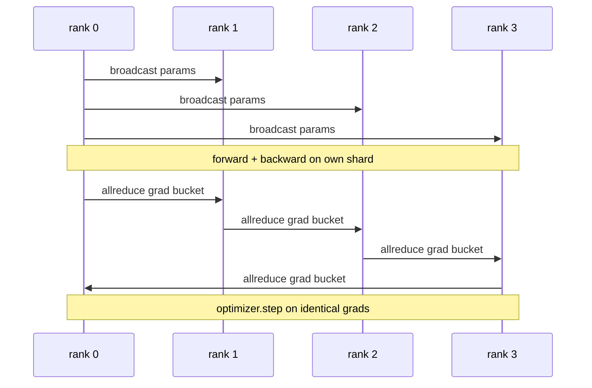

# 从零实现数据并行 DDP

> DistributedDataParallel 本质上就是架在 allreduce 之上的一个钩子（hook）。包装一个模型，从 rank 0 广播初始参数让每个 rank 起点完全一致，在每个参数上安装一个反向传播钩子来发起梯度的 allreduce，剩下的就是梯度下降。整个模式只需 200 行代码。

**Type:** Build
**Languages:** Python
**Prerequisites:** Phase 19 Track C lessons 42-49
**Time:** ~90 min

## 学习目标

- 编写一个 `DistributedDataParallel` 风格的包装器：广播初始参数，并在反向传播后对梯度做 allreduce。
- 用 `torch.multiprocessing.spawn` 在 gloo 后端上启动 N 个 CPU rank，使用基于文件的 rendezvous。
- 通过在单进程中用同样的数据顺序训练同一个模型，证明每一步的参数完全等价，从而验证梯度同步的正确性。
- 论证分桶（梯度融合）与重叠（在反向传播期间进行通信）是让一个"能跑的 DDP"变成"生产级 DDP"的两项关键改动。

## 问题背景

一个拥有 10 亿参数、激活值占 12 GB 的模型放不进一块消费级 GPU。即便放得下，训练也要花上数周。数据并行把 batch 切分到 N 个 rank 上，每个 rank 在自己的分片上计算前向和反向，每一步都把所有 rank 的梯度求和，使 N 份模型副本始终保持一致。优化器执行 step 所用的正是这个求和后的梯度。

没有梯度同步，N 个副本在第 2 步就会发散。模型不再是"一个用更多数据训练的模型"，而是 N 个恰好共享初始权重的独立模型。如果梯度同步做得很糟（每个参数一次 allreduce、没有重叠、没有分桶），网络就会成为瓶颈，GPU 只能空转等待网线。DDP 的功夫在于让梯度同步的开销相对于计算几乎可以忽略。PyTorch 的标准 DDP 通过梯度分桶、把 allreduce 与下一层的反向计算重叠、以及在 NVLink 上使用 NCCL 来做到这一点。我们可以在 CPU 上用 gloo 实现这三点，学到同样的经验。

## 核心概念



### DDP 需要的三种操作

| 阶段 | 集合通信操作 | 原因 |
|-------|-----------|-----|
| 初始化 | 从 rank 0 广播 | 让每个 rank 以相同的参数起步 |
| 反向传播后 | 对每个梯度做 allreduce | 优化器执行 step 所用的是平均梯度 |
| 某些情况下 | 广播 buffer | 保持 batchnorm 的滑动统计量同步 |

### 为什么取均值而不是求和

Allreduce-SUM 除以 world_size 得到平均梯度。均值对 world_size 是不变的：在单 rank 上调好的学习率在四个 rank 上同样适用，因为每步的梯度幅值不会变化。如果只做 Allreduce-SUM 而不除，每次改变集群规模都得重新调学习率。DDP 在 SUM 之后做了除法；本课中也照此实现。

### 为什么要对梯度分桶

一个 Transformer 有数千个参数张量。每个张量做一次 allreduce，就要付出数千次 gloo 的延迟下限。DDP 把梯度分组到约 25 MB 的桶（bucket）里，每个桶只发起一次 allreduce。在网线上传输的总字节数不变，但延迟被整个桶摊薄了。对于本课的小模型，我们把所有梯度归入一个桶；真正能迁移到实际场景的是这个结构本身。

### 为什么要固定随机种子

每个 rank 在做数据打乱时必须调用 `torch.manual_seed(seed + rank)`，而在参数初始化时必须调用 `torch.manual_seed(seed)`。如果所有 rank 共用一个种子，每个 rank 看到的 batch 顺序完全相同（数据并行就失去意义）；如果参数初始化用了与 rank 相关的种子，初始参数会在浮点 epsilon 量级上不一致，梯度同步就再也无法让副本保持一致。种子模式必须用对，否则参数等价性测试在第 1 步就会失败。

## 从零实现

`code/main.py` 实现了：

- `MiniMLP`：一个 3 层 MLP，小到几秒内收敛，又大到足以暴露整套接线逻辑。
- `DistributedDataParallel(model, world_size)`：在构造时广播参数，返回一个包装器，其 `sync_grads` 把 allreduce 求和后累积的梯度除以 world_size。
- `worker(rank, world_size, ...)`：完整训练循环，包括基于 gloo 的 `torch.distributed` 初始化、前向、反向、同步、step。
- `_reference_single_process_loop(...)`：在单个 rank 上用相同数据顺序训练同一个模型，测试用它验证每步之后参数逐字节相等。

运行：

```bash
python3 code/main.py
```

输出：一张逐步训练表，将单进程的损失和参数校验和与 4 个 rank 上的 DDP 运行结果进行比较。两条路径产生的损失曲线在浮点 epsilon 精度内完全一致，证明梯度同步是正确的。

## 实际生产中的模式

有三种模式能把 DDP 加固到可以上线的程度。

**查找未使用的参数。** 某些前向路径会按条件跳过部分参数（提前退出、混合专家（mixture-of-experts）的路由器）。被跳过的参数没有梯度，但 DDP 的桶就绪钩子仍会等待它们，allreduce 因此死锁。`find_unused_parameters=True` 告诉 DDP 在归约前先检查哪些参数实际得到了梯度。代价是每一步都要遍历一次计算图，所以除非前向有分支，否则不要打开它。

**静态图优化。** 当前向计算在各步之间保持稳定时，`static_graph=True` 让 DDP 预先计算分桶调度。这一优化在大规模下才显得重要：预计算每步省下几毫秒，在 10000 步上累积起来相当可观。

**梯度累积需要小心处理。** 在 K 个 microbatch 上累积梯度而不对每个 microbatch 做同步，能带来 10 倍的吞吐量提升。DDP 提供了 `no_sync()` 上下文管理器来暂停反向传播后的 allreduce。忘了用这个管理器，你就会白白做 K 次 allreduce，吞吐量直接跌到谷底。

## 生产实践

生产中的常见模式：

- **PyTorch DDP。** 标准实现。`torch.nn.parallel.DistributedDataParallel(model)` 内置了分桶、重叠和 no_sync 上下文。
- **HuggingFace Accelerate。** 增加了一个启动器来处理 `torchrun` 的环境变量和模型包装。底层仍是同样的 DDP。
- **Megatron-LM 数据并行。** 为大模型把 DDP 与张量并行结合起来；其中数据并行部分仍是同样的"反向传播后 allreduce"模式。

## 交付产物

第 78 课（ZeRO 分片）用 reduce_scatter 取代逐参数的 allreduce，使每个 rank 只存储自己那一份优化器状态分片。第 81 课把 DDP 与 ZeRO 组合成端到端演示。

## 练习

1. 实现可配置大小的梯度分桶，并在更深的模型上测量它相对于"每个参数一次 allreduce"的加速比。
2. 把 `no_sync()` 实现为上下文管理器，并验证在 K 个 microbatch 上的梯度累积与单进程基线一致。
3. 添加一个 `find_unused_parameters` 模式，让前向有时跳过 MLP 的某一层；不开该标志时运行应当死锁。
4. 用仅 `torch.distributed.barrier()` 的同步方式替换 gloo，体会基于 allreduce 的同步与基于 barrier 的同步之间的差别。
5. 测量 batch size 为 1、16、256 时梯度同步开销占单步时间的比例，并解释这种缩放规律。

## 关键术语

| 术语 | 大家怎么说 | 实际含义 |
|------|----------------|------------------------|
| DDP | "数据并行" | 广播参数并在每步对梯度做 allreduce 的包装器 |
| Bucket | "融合梯度" | 把 N 次小的 allreduce 合并为一次大的 allreduce |
| Overlap | "隐藏通信" | 在后面的层还在计算反向传播时就发起 allreduce |
| no_sync | "累积" | 为梯度累积跳过反向传播后的 allreduce |
| find_unused | "带分支的前向" | 在归约前检测没有梯度的参数 |

## 延伸阅读

- [PyTorch DistributedDataParallel docs](https://pytorch.org/docs/stable/generated/torch.nn.parallel.DistributedDataParallel.html)
- [PyTorch DDP internals tutorial](https://pytorch.org/tutorials/intermediate/ddp_tutorial.html)
- [Li et al, PyTorch Distributed: Experiences on Accelerating Data Parallel Training](https://arxiv.org/abs/2006.15704)
- Phase 19 第 76 课 - DDP 赖以构建的集合通信原语
- Phase 19 第 78 课 - ZeRO 分片用 reduce_scatter 取代逐参数 allreduce
