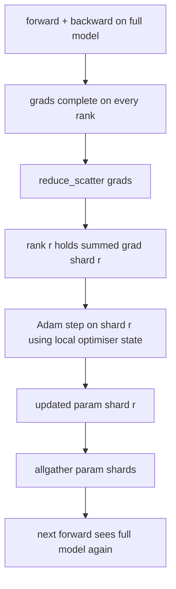

# ZeRO 优化器状态分片

> Adam 为每个参数存储两个矩估计（moment estimate），且都是 float32。一个 7B 参数的模型要背负 56 GB 的优化器状态。ZeRO stage 1 把这部分状态分片到 N 个 rank 上，每个 rank 只持有 1/N 的优化器状态。本地 step 完成后，更新过的参数分片广播回去，每个 rank 重建完整模型，然后开始下一步。收益在于：训练栈中最大的一块内存分配实现了线性下降。

**Type:** Build
**Languages:** Python
**Prerequisites:** Phase 19 Track C lessons 42-49
**Time:** ~90 min

## 学习目标

- 把优化器状态（一阶矩、二阶矩、fp32 主副本）分片到 N 个 rank 上，使每个 rank 只持有 1/N。
- 使用 reduce_scatter 只把各 rank 所属分片的梯度和送达该 rank，再用 allgather 把更新后的参数分片广播回去。
- 计算 stage 1、stage 2、stage 3 相对于原始 DDP 的内存节省表。
- 能根据模型规模和带宽预算，论证 stage 1、stage 2、stage 3 的选型依据。

## 问题背景

原始 DDP 复制一切：参数、梯度、优化器状态在每个 rank 上都是完整的。对一个 fp16 的 7B 参数模型，这意味着每个 rank 上有 14 GB 参数、14 GB 梯度和 28 GB 优化器状态。优化器状态是最大的一项，也是最容易分片的一项，因为它只在 step 阶段被访问，前向和反向都不碰它。

ZeRO stage 1 对优化器状态做分片。每个 rank 持有 1/N 的 Adam 矩。反向传播之后，ZeRO 不再对完整梯度做 allreduce 然后本地 step，而是执行 reduce_scatter，让每个 rank 只收到自己分片的梯度求和结果。该 rank 对自己持有的那份主参数分片执行优化器 step。随后更新过的参数分片通过 allgather 传回，使每个 rank 都拥有完整模型以进行下一次前向。优化器内存下降为原来的 1/N。每步的网络流量与 DDP 相同：按带宽计算，一次 reduce_scatter 加一次 allgather 等于一次 allreduce。内存省了，吞吐不变。

## 核心概念



### ZeRO 的各个阶段

| 阶段 | 分片对象 | 每 rank 内存 | 每步通信 |
|-------|----------------|------------------|---------------|
| DDP | 无 | params + grads + optim | 1x allreduce |
| ZeRO-1 | 优化器状态 | params + grads + optim/N | 1x reduce_scatter + 1x allgather |
| ZeRO-2 | 优化器状态 + 梯度 | params + grads/N + optim/N | 1x reduce_scatter + 1x allgather |
| ZeRO-3 | 优化器状态 + 梯度 + 参数 | params/N + grads/N + optim/N | 每层 1x allgather + 每层 1x reduce_scatter |

Stage 1 是性价比最高的收益，因为优化器状态在内存预算中占大头。Stage 2 需要梯度分片累积的逻辑，但带宽不变。Stage 3（FSDP）在每次前向和反向中都要付出逐层通信的代价，换来参数分片带来的内存下降。本课完整实现 stage 1。

### 内存计算，用真实数字

对一个有 P 个参数、用 Adam 做混合精度训练的模型：

| 项 | 原始方案 | ZeRO-1 | 原因 |
|------|---------|--------|-----|
| fp16 参数 | 2P 字节 | 2P 字节 | 前向需要 |
| fp16 梯度 | 2P 字节 | 2P 字节 | 反向需要 |
| fp32 主副本 | 4P 字节 | 4P/N 字节 | 只有优化器使用 |
| fp32 一阶矩 | 4P 字节 | 4P/N 字节 | 只有优化器使用 |
| fp32 二阶矩 | 4P 字节 | 4P/N 字节 | 只有优化器使用 |
| 总计 | 16P 字节 | 4P + 12P/N 字节 |   |

当 N=8 时：原始方案 16P，ZeRO-1 5.5P，下降 65%。当 N=64 时：原始方案 16P，ZeRO-1 4.19P，下降 74%。

### 为什么 reduce_scatter 优于先 allreduce 再分片

Allreduce 让每个 rank 都拿到完整的梯度求和结果。如果你只需要分片 r，那么在 rank r 上，规约出来的梯度有 (N-1)/N 是浪费的。Reduce_scatter 精确地把每个 rank 所属的分片送达；每个 rank 的传输字节数与 allreduce 相同（因为 allreduce 就是 reduce_scatter + allgather），只是后半段被换成了稍后的参数分片 allgather。网络总流量与 DDP 完全一致，而内存被均分了。

## 从零实现

`code/main.py` 实现了：

- `flatten_params(module)` 和 `unflatten_into(module, flat)`，把模型参数打包进一个连续张量并能解包还原。扁平布局让按 rank 分片变成一次简单的切片操作。
- `ZeroOptimizer(model, world_size, rank, lr)`，持有该 rank 所属的主副本分片和 Adam 矩分片。
- `step()`，对扁平梯度执行 reduce_scatter，在本 rank 的分片上应用 Adam，再通过 allgather 把更新后的参数传回。
- 一个演示程序：训练一个 3 层 MLP 共 20 步，并打印每步的内存预算，与原始 DDP 基线并列对比。

运行：

```bash
python3 code/main.py
```

输出：每步的损失，以及一张内存表，展示 ZeRO-1 在每个 rank 上只持有 1/N 的优化器状态，而 DDP 持有完整副本。

## 业界生产模式

三个模式让 ZeRO 足够稳健，可以上线。

**分片检查点至关重要。** ZeRO-1 的优化器状态分散在各个 rank 上；检查点必须记录哪个 rank 拥有哪部分。第 80 课构建了分片检查点清单（manifest），使 ZeRO 训练能在相同的 world size 上恢复。没有它，保存下来的状态在重启时根本无法读取。

**混合精度才是重点。** ZeRO 本质上是一种混合精度技术；被分片的正是 fp32 主副本。不开混合精度跑 ZeRO，相当于为 fp32 主副本付了内存税，却没有拿到相应的 fp16 前向收益。生产环境的训练总是把 ZeRO 与 autocast 或 bf16 权重搭配使用。

**Stage 1 是近乎免费的收益。** 按带宽计算，通信量与 DDP 完全相同。内存节省随 N 线性增长。唯一的成本是优化器分片的簿记工作。生产技术栈默认使用 stage 1，除非参数分片的内存也成了问题；那时再用 stage 2 或 3 以通信换内存。

## 生产实践

生产模式：

- **DeepSpeed ZeRO。** 参考实现。`deepspeed_config.json` 用于选择 stage 1/2/3 和分区大小。
- **PyTorch FSDP。** PyTorch 原生的等价物。`ShardingStrategy.SHARD_GRAD_OP` 对应 ZeRO-2；`FULL_SHARD` 对应 ZeRO-3。
- **HuggingFace Accelerate。** 用统一的配置同时封装 DeepSpeed 和 FSDP。

## 交付产物

第 79 课（流水线并行）是与之正交的分片维度：不是在同一个模型上分片优化器状态，而是把模型的各层分片到不同 rank 上。第 81 课在端到端演示中组合 DDP + ZeRO。

## 练习

1. 扩展到 ZeRO-2，对梯度做分片：每个 rank 只存储自己分片的梯度，做法是在反向之后把非本分片的部分清零。
2. 添加一个内存分析器，打印 rank 0 上实际的 fp32 字节用量，并与公式预测值对比。
3. 测量原始 DDP 与 ZeRO-1 每步的墙钟时间，并分解为前向、反向、通信三部分。
4. 在 ZeRO-1 下实现梯度裁剪：L2 范数必须跨所有分片计算，通过对本地范数平方做 allreduce 实现。
5. 实现一个用 allreduce 代替 reduce_scatter 的"朴素 ZeRO"，测量网络传输时间的差异。用数字论证 reduce_scatter 这一选择。

## 关键术语

| 术语 | 大家怎么说 | 实际含义 |
|------|----------------|------------------------|
| ZeRO-1 | "分片优化器" | 每个 rank 持有 1/N 的 fp32 主副本 + Adam 矩 |
| ZeRO-2 | "梯度也分片" | 每个 rank 在 reduce_scatter 之后还会丢弃非本分片的梯度 |
| ZeRO-3 | "分片参数" | 每个 rank 持有 1/N 的 fp16 参数；前向时逐层 allgather |
| 主副本（master copy） | "fp32 权重" | 优化器实际更新的高精度参数副本 |
| Reduce_scatter | "切开求和结果" | 只把各 rank 所属分片的梯度和送达该 rank |

## 延伸阅读

- [Rajbhandari et al, ZeRO: Memory Optimizations Toward Training Trillion Parameter Models](https://arxiv.org/abs/1910.02054)
- [DeepSpeed ZeRO documentation](https://www.deepspeed.ai/tutorials/zero/)
- [PyTorch FSDP documentation](https://pytorch.org/docs/stable/fsdp.html)
- Phase 19 第 76 课 —— 本课所依赖的 reduce_scatter 和 allgather
- Phase 19 第 80 课 —— ZeRO 状态必须使用的分片检查点
