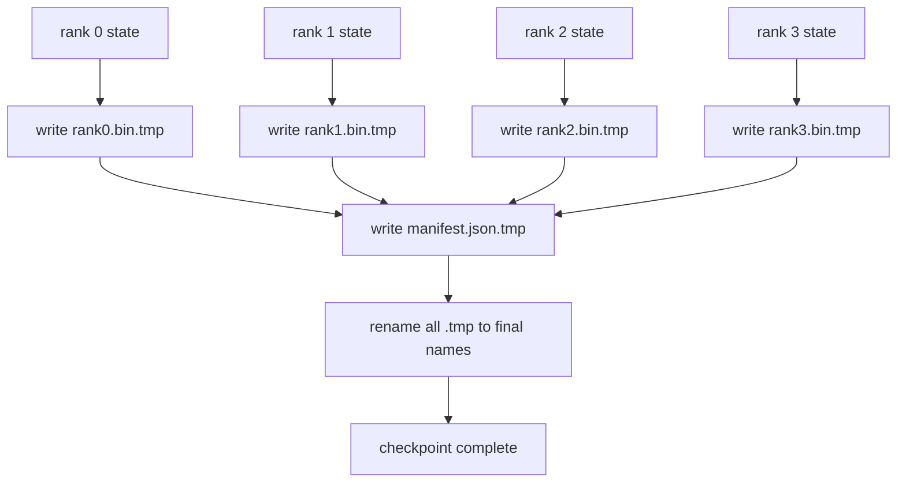

# 分片检查点与原子化恢复

> 一个 70B 参数的训练任务每隔几小时就会因节点故障而中断。检查点格式决定了你损失的是 30 分钟还是 30 小时。分片检查点（sharded checkpoint）让每个 rank 并行写出自己的分片，并在清单（manifest）中记录归属关系。恢复时，每个 rank 从自己的文件中加载分片，在相同的 world size 上重建状态，优化器就像什么都没发生过一样继续迭代。原子写入（atomic write）则保证写到一半的检查点不会污染下一次恢复。

**Type:** Build
**Languages:** Python
**Prerequisites:** Phase 19 Track C lessons 42-49
**Time:** ~90 min

## 学习目标

- 将多 rank 检查点保存为每 rank 一个分片文件，外加一份记录各 rank 拥有哪些数据的清单。
- 使用原子写入模式（先写临时路径再重命名），确保写入中途崩溃永远不会留下半成品检查点。
- 从清单恢复，并在每个 rank 上验证 fp16 参数和 ZeRO 优化器状态字节级一致。
- 让清单 schema 能够防御三种失败模式：world size 变更、分片数量不匹配、部分写入。

## 问题背景

朴素的检查点做法是把所有参数和优化器状态收集到 rank 0，gather 之后写成一个文件。对于 70B 模型，这意味着 1.1 TB 的状态要挤过单个 rank 的网络端口。写入期间所有其他 rank 都被阻塞，只能空转等待 gather 完成。IO 带宽受限于最慢的那块 GPU 的网络链路，而不是集群的聚合带宽。在真实集群上，gather 再写入这一步可能比前一个训练小时还要久，也就是说这个任务每个训练日产出的检查点不到一个。

分片检查点反转了这一模式：每个 rank 把自己的分片并行写入自己的文件。清单记录哪个 rank 拥有哪个分片，恢复时就能把每个分片放回原处。聚合写入带宽随集群规模扩展。一个通过单 rank 写入需要 4 小时的 1 TB 检查点，通过 64 个 rank 只需 4 分钟。此外，清单还为不兼容的恢复提供了一份契约：world size 变更可以被检测到，部分写入可以被检测到，加载路径可以大声报错失败，而不是悄悄使用陈旧数据。

## 核心概念



### 清单 schema

```json
{
  "world_size": 4,
  "step": 1234,
  "wall_clock_seconds": 4521,
  "shards": [
    {"rank": 0, "path": "rank0.bin", "sha256": "...", "param_shard_offset": 0, "param_shard_numel": 65536},
    {"rank": 1, "path": "rank1.bin", "sha256": "...", "param_shard_offset": 65536, "param_shard_numel": 65536}
  ],
  "schema_version": 1
}
```

其中三个字段是承重的。`world_size` 让规模不同的恢复大声失败，而不是悄悄损坏数据。每个分片的 `sha256` 能捕获部分写入或损坏的写入。每个分片的 `param_shard_offset` 和 `param_shard_numel` 让加载器能在正确的位置重建扁平参数张量。

### 原子写入

标准模式：把每个分片写到 `<name>.tmp`，把清单写到 `manifest.json.tmp`，逐个 fsync，然后重命名。同一文件系统内的 POSIX rename 是原子的；要么新文件完整存在，要么旧文件保持原样。在最终重命名之前崩溃，留下的仍是上一个检查点作为有效检查点。如果没有原子写入，崩溃可能留下一个不完整的分片，而清单却已存在并指向它，恢复加载时就会损坏优化器状态。

### schema 必须防御的三种失败模式

| 失败 | 症状 | 防御 |
|---------|---------|---------|
| world size 变更 | 用 N=4 的清单在 N=8 上恢复 | 清单中的 world_size 不匹配，大声失败 |
| 分片数量不匹配 | 恢复时看到的 rank*.bin 文件少于清单中的分片数 | 枚举所有分片，验证每一个都存在 |
| 部分写入 | 分片文件在 flush 中途被截断 | 加载时进行 sha256 校验 |

每种防御都在早期拒绝坏的加载；否则就是静默损坏，直到 100 步之后损失变成 NaN 才暴露出来。

### 为什么用每 rank 一个文件，而不是一个大文件

通过 `O_APPEND` 并发写入同一个文件在 POSIX 上对字节对齐的写入是可行的，但实践中单个分片内的偏移跨越 MB 级区域，锁开销会占据主导。每 rank 一个文件没有竞争，而且当底层文件系统是并行文件系统（Lustre、GPFS）时还能受益于条带化。生产级技术栈（DeepSpeed、FSDP、NeMo）正是出于这个原因全部采用每 rank 一个文件。

## 从零实现

`code/main.py` 实现了：

- `ShardManifest` dataclass，包含上述 schema 以及 `to_json`/`from_json`。
- `save_sharded(state_dict_per_rank, dir, step)`，使用先写临时文件再重命名的原子模式把每个 rank 的二进制状态写入各自的文件，然后写入清单。
- `load_sharded(dir, expected_world_size)`，读取清单，验证每个分片的 sha256，并返回每 rank 的 state dict。
- 一个往返测试：构建每 rank 的状态，保存，加载，断言字节级一致。

运行：

```bash
python3 code/main.py
```

输出：写出 4 个分片文件外加清单，然后重新加载并验证字节级一致。

## 生产环境中的实践模式

三个模式能把检查点加固到可以上线的程度。

**异步写入。** 生产级技术栈在单独的线程或进程上发起检查点写入，训练得以继续。屏障设在下一次检查点：在上一次保存完成之前不开始下一次保存。DeepSpeed 的 `async_io` 标志做的正是这件事。本课为了让步骤清晰可见，保持写入为同步。

**先写本地快盘，再异步上传。** 先写入本地 NVMe（快），再异步上传到 S3 或 GCS。这种两级模式让集群内的检查点保持快速以便恢复，同时把一份持久副本运到集群外归档。清单携带本地路径；上传清单携带远端路径。

**轮换很重要。** 生产运行会保留最近 K 个检查点（通常 3-5 个）并轮换掉最旧的。没有轮换，磁盘会在训练中途写满，下一次检查点随之失败。有了轮换，下一次保存会先删除最旧的，腾出预算。

## 生产实践

生产模式：

- **DeepSpeed 检查点。** `deepspeed.save_checkpoint(tag=step)` 写出每 rank 的文件，外加一个指向当前活动 tag 的 `latest` 文件。
- **PyTorch FSDP 检查点。** `torch.distributed.checkpoint` 通过一个决定每 rank 布局的 `Planner` 保存分片状态。
- **NeMo。** 封装了 DeepSpeed 和 FSDP，提供统一的 `save_to_checkpoint` API 并附加元数据。

## 交付产物

第 81 课将对端到端 DDP+ZeRO 运行保存一个分片检查点，并在相同的 world size 上重新加载，以证明恢复契约成立。

## 练习

1. 添加异步写入：在线程中发起保存，让训练继续。在上一次保存完成之前阻塞下一次保存。
2. 添加 `last_5_steps` 轮换：保留最近 5 个检查点，在保存新检查点之前删除最旧的。
3. 为内循环重载添加一条仅 CRC 的快速校验路径（轮换会把某个检查点滚动为新的活动检查点，无需完整 sha256）。
4. 添加跨 world size 加载：通过读取清单、拼接再重新分片，把分片从 N=4 重平衡到 N=8。
5. 添加上传到一个假 S3（第二个目录）并写出上传清单。论证这种两级存储策略的合理性。

## 关键术语

| 术语 | 人们常说的 | 实际含义 |
|------|----------------|------------------------|
| 分片检查点（Sharded checkpoint） | "每 rank 各自保存" | 每个 rank 并行写出自己的分片文件 |
| 清单（Manifest） | "索引" | 记录分片路径、偏移和 sha256 的 JSON 文件 |
| 原子写入（Atomic write） | "先 tmp 再 rename" | 写到 .tmp 再做 POSIX rename，崩溃时上一个文件仍然有效 |
| 部分写入（Partial write） | "被截断的分片" | 写入期间崩溃产生损坏的分片；sha256 能捕获它 |
| 轮换（Rotation） | "保留最近 K 个" | 写新检查点之前删除最旧的，以限制磁盘占用 |

## 延伸阅读

- [DeepSpeed checkpointing](https://www.deepspeed.ai/tutorials/checkpointing/)
- [PyTorch torch.distributed.checkpoint](https://pytorch.org/docs/stable/distributed.checkpoint.html)
- [POSIX rename atomicity](https://pubs.opengroup.org/onlinepubs/9699919799/functions/rename.html)
- Phase 19 第 78 课——本检查点所要保存的 ZeRO 状态正是按它设计的
- Phase 19 第 81 课——端到端演示对保存的状态做完整往返验证
