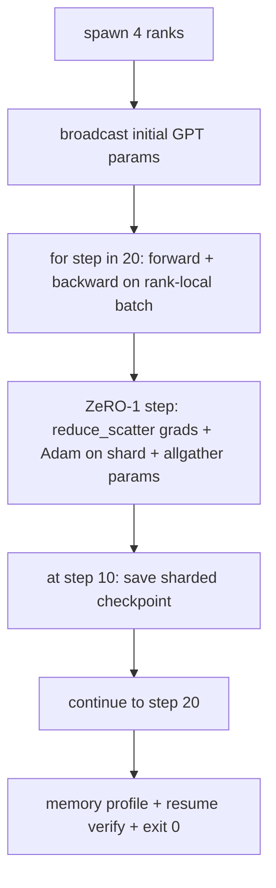

# 端到端分布式训练

> 第 76 到 80 课各自构建了一个组件。本课是总装配：在 4 个模拟 rank 上训练一个微型 GPT，用 DDP 做梯度同步，用 ZeRO-1 做优化器状态分片，并在中途保存一个分片检查点。演示运行 20 步后自行终止，打印损失曲线和内存画像，并写出一个可恢复的检查点。

**Type:** Build
**Languages:** Python
**Prerequisites:** Phase 19 Track C lessons 42-49
**Time:** ~90 min

## 学习目标

- 把 DDP（第 77 课）、ZeRO-1（第 78 课）和分片检查点（第 80 课）组合进同一个训练循环。
- 在 4 个模拟 rank 上，用一个小型合成语料训练一个 2 层 Transformer 语言模型，共 20 步。
- 打印逐步损失表、每个 rank 的内存画像，以及一份检查点清单，并验证在相同 world size 下恢复后字节级一致。
- 为这种组合方式辩护：每个组件在前面的课程中都可以独立测试，而本课证明它们可以正确地组合在一起。

## 问题背景

毕业项目（capstone）是「这些组件能拼到一起」的证明。第 76 课实现了集合通信。第 77 课把它们封装成 DDP。第 78 课用 reduce_scatter 对优化器状态做了分片。第 79 课分析了流水线。第 80 课保存了分片检查点。每节课都有自己的测试、各自独立成立。但真实的训练运行会同时用到所有这些原语；如果组合方式出错，损失会发散、检查点无法恢复，或者本应缩小的单 rank 内存反而增长。

本课运行端到端演示，并验证四条不变量：(a) 在浮点噪声范围内，损失在 20 步中单调下降；(b) 每一步所有 rank 持有相同的参数范数；(c) 每个 rank 的优化器内存等于 ZeRO-1 公式 12P/N 字节；(d) 第 10 步保存的检查点在重启后字节级一致地重新加载。演示自行终止：20 步、单条命令、退出码 0。

## 核心概念



### 微型 GPT

模型刻意做得很小：2 个 Transformer 块、嵌入维度 32、4 个注意力头、词表 64、序列长度 16、批大小 4。总共几千个参数。它大到足以覆盖每一个接线决策（多头注意力走标准的带掩码路径；LayerNorm 有需要同步的权重；LM 头是一个独立的线性投影，映射回词表），又小到 4 个 CPU rank 上跑 20 步只需几秒钟。

### 组合规则

| 课程组件 | 它负责什么 | 它留给训练循环什么 |
|--------------|--------------|----------------------------|
| DDP broadcast | 初始参数同步 | 构造时调用一次 |
| ZeRO-1 step | 梯度同步、master 副本更新、参数广播 | 每步调用一次，替代 optimiser.step |
| 分片检查点 | 持久化各 rank 状态，带 sha256 的清单 | 在 rank 0 上调用，状态通过 allgather 收集 |
| 训练循环 | 前向、反向、损失记录 | 按顺序调用上面三者 |

训练循环对 reduce_scatter 和会合（rendezvous）文件一无所知。ZeRO 和检查点模块暴露的是窄接口，由循环来组合。

### 为什么用微型 GPT 而不是一个 MLP

第 77 课的 MLP 足以验证梯度同步。微型 GPT 额外带来三样东西：一个映射到词表的独立 LM 头（本课为清晰起见不做权重绑定；完整的 GPT 通常把 LM 头与 token 嵌入绑定）、softmax+交叉熵损失（比 MSE 有更多数值边界情况），以及一个不对称的前向过程（先嵌入，再逐层注意力、逐层 MLP）。如果毕业项目仍然用 MLP，就无法暴露组合方式是否正确处理了 LayerNorm 或嵌入层的梯度形状。

### 自行终止意味着退出码 0

循环固定运行 20 步然后退出。没有 `while True`，没有人工干预，没有从外部状态恢复。一个可以无人值守地运行、结束后留下完整日志的毕业项目，才是证明系统接线正确的毕业项目。如果任何组件死锁，演示永远不会返回，测试装置就能捕获它。

## 从零实现

`code/main.py` 实现了：

- `MiniGPT`：带掩码自注意力和独立 LM 头的 2 层 Transformer。
- `make_corpus(seed, total_tokens)`：确定性的下一 token 预测数据。
- `_train_worker`：每个 rank 各自 spawn 的工作进程；广播初始参数，运行训练循环，调用 ZeRO step，在第 10 步写分片检查点。
- `verify_resume`：主运行结束后，在进程内重新加载第 10 步的检查点，并断言保存的 master 分片与内存快照逐字节一致。
- `main`：编排整个演示，打印损失表、内存画像和验证结果。

运行：

```bash
python3 code/main.py
```

输出：一张 20 行的损失表、一张 4 行的各 rank 内存画像、一份检查点清单，以及成功时的一行「RESUME VERIFIED」。

## 真实世界中的生产模式

三个模式补全了真实运行所需的组合。

**按每 K 分钟而不是每 K 步保存检查点。**单步耗时随序列长度和 microbatch 数量变化。每 10 分钟保存一次的节奏，无论模型多大，覆盖的计算量都相同。本课为简单起见用基于步数的方式；生产中用基于墙钟时间的方式。

**尽早检测发散。**生产运行会在反向传播后加 NaN 守卫和损失尖峰检测器；如果损失在一步内跳涨超过 2 倍，就回滚到上一个检查点，而不是让优化器继续走向退化状态。本课的损失曲线很平滑，守卫不会被触发，但钩子保留在那里。

**跨 rank 聚合内存画像。**真实运行中各 rank 的内存并不相同（持有最大流水线阶段的 rank 会保留更多激活值）。生产中记录跨 rank 的最大值和均值；本课逐 rank 打印，以展示数值与公式吻合。

## 生产实践

生产模式：

- **DeepSpeed。**把 DDP + ZeRO + 流水线 + 激活检查点整合到一份配置里。本课的组合方式就是 DeepSpeed 形态的微缩版。
- **PyTorch FSDP。**原生等价物。带 `ShardingStrategy.SHARD_GRAD_OP` 的 `FullyShardedDataParallel` 就是 ZeRO-2。
- **NeMo 和 Megatron-LM。**为最大规模的模型加入张量并行；除此之外，组合的形态是一样的。

## 交付产物

整条 track 到这里结束。这 6 节课合在一起，就是一个真实团队在采用 DeepSpeed 之前会自行构建的分布式训练子系统；抽象已经在 gloo 上得到验证，失败模式也都演练过了。Phase 17（基础设施与生产）才是把它搬上真实集群的地方。

## 练习

1. 给注意力头加一个张量并行切分，验证损失与单 rank 基线一致。两个 rank：每个 rank 持有一半的头，对注意力输出做 allreduce。
2. 加上跨 4 个 microbatch 的梯度累积，并证明该梯度等于一个大 batch 的梯度。
3. 加一条从第 10 步恢复的路径，真正继续训练到第 20 步，并产生与原始运行相同的最终损失。
4. 加一个指标导出（损失、梯度范数、步耗时）到 JSONL，让这次运行可以事后可视化。
5. 加一个 NaN 守卫，在损失尖峰时回滚到上一个检查点，并用一个单步学习率乘数强行制造尖峰来演练回滚。

## 关键术语

| 术语 | 人们怎么说 | 实际含义 |
|------|----------------|------------------------|
| 端到端 | 「全部接起来」 | 一次运行组合所有组件，而不是每个组件各自一个单元测试 |
| 内存画像 | 「每个 rank 多少 GB」 | 每个 rank 上为参数、梯度、优化器状态持有的字节数 |
| 恢复契约 | 「保存再加载」 | 检查点往返后各 rank 状态字节级一致 |
| 自行终止 | 「有界运行」 | 固定步数，完成后退出码 0，无需人工介入 |

## 延伸阅读

- [DeepSpeed end-to-end training tutorial](https://www.deepspeed.ai/getting-started/)
- [PyTorch FSDP advanced tutorial](https://pytorch.org/tutorials/intermediate/FSDP_advanced_tutorial.html)
- [Megatron-LM training script reference](https://github.com/NVIDIA/Megatron-LM)
- Phase 19 第 76-80 课——本课所组合的各个组件
- Phase 17——把这套组合搬上真实集群
