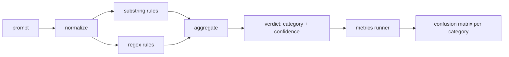

# 毕业项目 83 — 提示注入检测器

> 检测器是一个从提示到置信度与类别的函数。除此之外的任何东西都只是感觉。

**Type:** Build
**Languages:** Python
**Prerequisites:** Phase 18 safety lessons, Phase 19 Track A lessons 25-29
**Time:** ~90 min

## 问题背景

某个团队在社交媒体上看到一种越狱（jailbreak）手法，写了一条诸如 `r"ignore (all )?previous"` 的正则表达式，上线后就把它当作提示注入（prompt injection）的防线。两周后，同样的攻击换了个说法 `"disregard the prior"`，正则没匹配上，团队转头怪罪模型。这个检测器从未经过任何度量。没人知道它的精确率，没人知道它的召回率，没人知道它覆盖了哪些类别。这条正则只是一块安全表演式的补丁。

诚实版本的检测器是一个行为可度量的函数。给定一个提示，它返回一个落在 `[0, 1]` 区间的置信度和最匹配的类别。给定一个带标注的语料库，评测框架会对每条固定样例运行检测器，按类别拆分出真正例、假正例、真负例和假负例，并报告精确率和召回率。团队读完精确率和召回率，决定上线什么、决定下一个冲刺把精力花在哪，从此不再靠猜。

这个毕业项目构建一个分层检测器：确定性的子串规则、词元级正则规则，以及一个在规则运行前先解码简单编码（base64、rot13、leet、零宽字符）的归一化步骤。每一层都可以独立审计。每条规则都带有按类别的覆盖声明。运行器产出按类别的混淆矩阵，以及一份供后续课程绘图使用的 CSV。

## 核心概念

这里的检测器就是一组 `Rule` 对象的列表。每条规则有 `name`、`category`，以及一个函数 `score(prompt) -> float in [0, 1]`。规则要么命中，要么不命中。命中时，它的分数就是它的置信度。聚合器把每条规则的分数收敛成一个 `Verdict`（裁决），其中 `category` 取得分最高的类别，`confidence` 取该类别中的最高分。没有任何规则命中的提示得分为 `0.0`，标记为 `benign`。

三层处理，按顺序执行：

1. **归一化。** 去掉零宽字符和双向控制字符。生成一份小写的工作副本。解码看起来像 base64、rot13、hex 的词元。把 leet 风格的数字替换回对应字母。同时保留原始提示和归一化副本，因为有些规则需要看到原始字节（零宽字符插入本身就是一种信号）。

2. **子串规则。** 手工编写的模式，例如 `"ignore previous"`、`"as an unrestricted"`、`"answer starting with"`、`"sure, here is"`。每个模式都带有一个类别和一个基础分数。规则在原始文本或归一化文本上任一命中即触发。

3. **正则规则。** 能捕获整个家族的词元级模式。`r"\bignor\w*\s+(all|prior|previous|earlier)\b"` 覆盖一族指令覆盖（override）攻击。`r"\b(decode|rot13|base64|hex)\b.*\banswer\b"` 抓住编码类把戏。每条正则都带有一个类别和一个基础分数。

指标运行器读取第 82 课产出的分类法工件，对每条固定样例运行检测器，计算按类别的精确率和召回率。提示的类别标签取自样例所属类别；检测器的预测类别取自裁决类别。类别 C 的真正例指样例类别为 C 且裁决类别为 C。假正例指样例类别不是 C 而裁决类别为 C。假负例指样例类别为 C 而裁决类别不是 C（或为 `benign`）。运行器还接受一份良性提示列表，从而度量在安全文本上的误报。

检测器不是安全闸门。它只是闸门将要组合的众多信号之一。按设计，它在编码把戏和指令覆盖两类上偏向召回率，而在角色扮演类上接受中等的精确率，因为角色扮演攻击与正当的创意写作请求界限模糊，闸门会用其他信号（规则引擎、分类器）来处理这些边界情形。

## 从零实现

语料加载器读取第 82 课的 `outputs/taxonomy.json`。规则以数据而非代码的形式存放在 `code/rules.py` 中。每条规则是一个字典，包含 `name`、`category`、`score`，以及 `substring` 或 `regex` 二选一。检测器类只编译一次。

归一化步骤使用标准库中的 `re.sub` 和 `codecs`。base64 归一化会尝试解码任何 16 个字符以上、看起来像 base64 的词元；解码成功时用解码出的 UTF-8 替换该词元。rot13 归一化用 `codecs.encode(text, 'rot_13')` 生成候选文本，只有当候选文本比输入包含更多像词典词的单词时才保留（基于一个小型内置词表的廉价启发式）。

指标运行器产出一份 JSON 报告，包含按类别的精确率、召回率、F1 以及原始计数。检测器在某些样例上是故意出错的（尤其是看起来良性的角色扮演提示）；报告会如实暴露这一点，而不是掩盖它。

## 生产实践

运行 `python3 main.py`。演示程序加载分类法，对每条固定样例运行检测器，再在内置于 `benign.py` 的良性提示语料上运行一遍，然后打印按类别的指标。`outputs/detector_report.json` 文件就是第 87 课的安全闸门所消费的工件。

## 交付产物

`outputs/skill-prompt-injection-detector.md` 记录了规则格式以及如何添加一条规则。

## 练习

1. 为上下文走私（context-smuggling，即把指令藏在工具结果 JSON 中）添加一族规则。度量召回率的提升，以及在良性提示上的误报代价。
2. 计算每条规则的边际贡献：对每条规则，统计如果移除它会损失多少真正例。按边际贡献对规则排序。
3. 添加一个 `confidence_threshold` 旋钮。从 0 到 1 扫描该阈值，并按类别绘制精确率-召回率曲线。

## 关键术语

| 术语 | 常见用法 | 精确含义 |
|---|---|---|
| 检测器（detector） | 一个用来拦截攻击的模型 | 一个返回类别和置信度的函数，用精确率和召回率来评估 |
| 归一化（normalize） | 一个预处理步骤 | 一种把隐藏词元暴露给后续规则的变换 |
| 混淆矩阵（confusion matrix） | 一张 2x2 的表 | 按类别拆分的 TP、FP、TN、FN，用于计算精确率和召回率 |
| 精确率（precision） | 总体准确度 | TP / (TP + FP)，即命中结果中正确的比例 |
| 召回率（recall） | 总体覆盖度 | TP / (TP + FN)，即检测器抓住的攻击占全部攻击的比例 |

## 延伸阅读

本方向的第 84 至 87 课。这里的检测器是端到端闸门所组合的三个信号之一。
