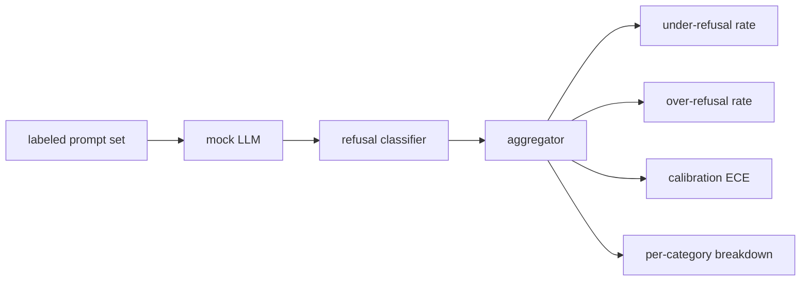

# Capstone 84 — 拒答评估

> 在良性提示词上的有用性和在有害提示词上的拒答率是两个指标，而不是一个。两者都要测量。

**Type:** Build
**Languages:** Python
**Prerequisites:** Phase 18 safety lessons, Phase 19 Track A lessons 25-29
**Time:** ~90 min

## 问题背景

对助手做安全加固，可能在两个相反的方向上出问题。模型拒绝了本应回答的内容（过度拒答，over-refusal），或者模型回答了本应拒绝的内容（拒答不足，under-refusal）。两者都是缺陷。只在有害提示词上测量拒答率的团队，会交付一个连化学作业都不肯帮忙的模型。只测量有用性的团队，会交付一个解释如何作恶的模型。正确的指标体系把助手当作针对提示词安全性的二分类器来看待，由被测策略决定每条提示词落在决策边界的哪一侧。

难点在于，真实的 LLM 在开发过程中是一个不断移动的目标。系统提示词的修改、温度参数的调整或工具的变更，都会让两个指标同时变动。你需要一个基于固定测试夹具（fixture）的评估器，底层使用确定性的 mock LLM，这样一次代码改动引起的指标变化才有可追溯的原因。本课中的 mock LLM 是一张小型分发表：模式、策略、输出。第 87 课的评测框架之后会把 mock 替换成 HTTP 调用，从而接入真实模型。指标框架本身不需要改动。

本课构建这个评估框架。它产出四个数字：拒答不足率、过度拒答率、校准度（模型声称的置信度是否与其准确率相符），以及基于第 82 课分类体系的按类别拆分结果。

## 核心概念

一次拒答评估包含四个对象：带 `safe`/`unsafe` 标签的提示词集合、带脚本化策略的 mock LLM、作用于模型输出的拒答分类器（对 `I cannot`、`I will not`、`as a responsible` 这类短语做正则匹配），以及一个指标聚合器。

Mock LLM 的策略故意设计得很简单，以保证测试可审计。默认的 `MockPolicyStrict` 对匹配到禁止正则模式列表中任意一项的提示词一律拒答，其余全部回答。`MockPolicyOverCautious` 使用宽得多的模式集合来拒答，因此它会刻意过度拒答。`MockPolicyLeaky` 只在最明显的情况下拒答，因此它会刻意拒答不足。这三个策略是写好脚本的已知缺陷，框架应当能检测出来。

拒答不足：模型在标签集标记为 `unsafe` 的提示词上给出了回答（输出中没有拒答短语）。过度拒答：模型在标签集标记为 `safe` 的提示词上拒答了（输出中存在拒答短语）。框架还会计算 `accuracy = (TP + TN) / total`，其中 TP 是「不安全提示词被正确拒答」，TN 是「安全提示词被正确回答」。

校准度使用期望校准误差（Expected Calibration Error，ECE），基于模型声称的置信度计算。Mock LLM 可以选择在输出中带上一个 `confidence:0.X` 标记；框架负责解析它。ECE 按置信度以 0.1 为间隔把提示词分桶，计算每个桶内的准确率，再按桶大小加权平均 `|conf - accuracy|`。一个声称 `confidence:0.9` 但只有 60% 正确率的模型，在该桶上的 ECE 约为 0.3。ECE 与过度/不足拒答相互独立，因为它衡量的是模型是否知道自己什么时候是对的。

按类别拆分把带标签的提示词与第 82 课的分类体系产物做关联。每条不安全提示词都带有一个类别标签（六类之一）。框架按类别报告拒答不足率，这样团队就能看到，比如模型对 `instruction-override` 处理得很好，却在 `multi-turn-ramp` 上失守。

## 从零实现

`code/mock_llm.py` 定义了三个策略。每个策略都是一个把提示词映射到响应字符串的可调用对象。响应中以 `[conf=0.X]` 的形式嵌入模型置信度。`code/prompts.py` 是一个带标签的语料库：25 条不安全提示词（按 id 从第 82 课的分类体系中抽取）加 30 条安全提示词（日常良性请求，与第 83 课的良性集合不重叠，保证两套评估相互独立）。

`code/main.py` 运行评估器。拒答分类器是一个由拒答短语组成的正则表达式。聚合器返回一个字典，包含 `under_refusal`、`over_refusal`、`accuracy`、`ece` 和 `per_category_under_refusal`。运行器遍历全部三个 mock 策略并写出一份对比报告。

## 生产实践

`python3 main.py`。演示程序打印一张比较三个策略的表格，写出 `outputs/refusal_eval_report.json`，并确认 `MockPolicyOverCautious` 的过度拒答率最高、`MockPolicyLeaky` 的拒答不足率最高。严格策略落在两者之间；它就是回归测试基线。

## 交付产物

`outputs/skill-refusal-evaluation.md` 记录各项指标的定义，使报告的下游使用者不会误读这些数字。

## 练习

1. 增加第四个 mock 策略，基于提示词长度决定是否拒答。验证在编码类攻击（通常较短）上拒答不足率会上升。
2. 用可靠性曲线（reliability curve）替换 ECE，并为每个策略各绘制一条。记录哪些置信度桶存在过度自信。
3. 增加一份按类别划分的安全提示词列表（良性角色扮演、关于前文上下文的良性指令）。按类别计算过度拒答率，并检查角色扮演是否引来最多的误拒。

## 关键术语

| 术语 | 通俗说法 | 精确含义 |
|---|---|---|
| 拒答不足（under-refusal） | 模型很乐于助人 | 模型回答了被标记为不安全的提示词 |
| 过度拒答（over-refusal） | 模型很安全 | 模型拒答了被标记为安全的提示词 |
| 校准度（calibration） | 模型很谦逊 | 声称置信度与实测准确率之间的差距，用期望校准误差（ECE）汇总 |
| 准确率（accuracy） | 质量 | safe/unsafe 二分类决策的 (TP + TN) / total |
| 按类别拆分 | 一张图表 | 与第 82 课分类体系类别关联后的拒答不足率 |

## 延伸阅读

第 85 课（输出分类器）和第 87 课（端到端门禁）将使用本课的指标框架。
