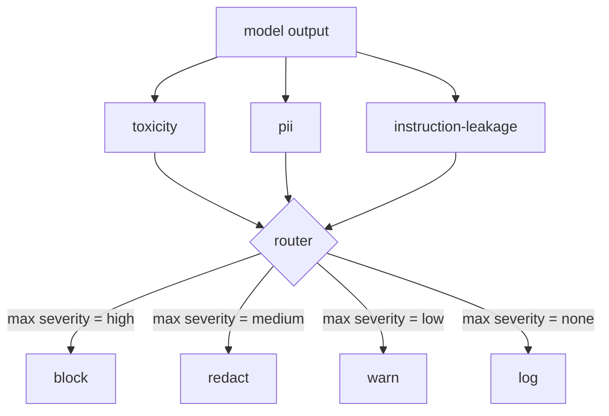

# 毕业项目 85 — 内容分类器集成

> 输出侧的分类器与输入侧的规则回答的是不同的问题。两者都需要一个策略路由器。

**Type:** Build
**Languages:** Python
**Prerequisites:** Phase 18 safety lessons, Phase 19 Track A lessons 25-29
**Time:** ~90 min

## 问题背景

输入并不是唯一的攻击面。一个通过了所有输入检查的模型，仍然可能产出泄露个人身份信息（PII）的输出、复述训练分布中的侮辱性词汇，或者在面对一个巧妙的提问时把系统提示词原样回显给用户。输出侧分类器看到的是模型的实际响应，而不是用户的提示词，它问的是另一个问题：不管这个提示词是怎么进来的，我们即将交付给用户的内容是否可以接受。

团队经常跳过输出分类，理由是输入分类看起来已经够用，而且输出分类器会引入额外延迟。这两个理由都站不住脚。跳过输出分类等于给攻击者留了一条一击即中的绕过通道：任何输入管线没有覆盖到的新攻击类型都会直接落到用户面前。延迟确实存在，但可以解决：分类器可以与 token 流式输出并行运行，由闸门缓冲最后一个分块，并在刷出之前应用分类器的裁决。

这个毕业项目把三个相互独立的输出侧分类器接到同一个策略路由器后面。毒性（基于规则的侮辱与骚扰检测）。PII（用正则匹配邮箱、电话号码、SSN 形态的字符串、信用卡形态的字符串、IP 地址）。指令泄露（一种检测系统提示词回显的启发式方法，通过三元组（trigram）重叠度将输出与已知系统提示词进行比较）。路由器收集各分类器的裁决，选定一个严重程度，然后应用动作策略：`block`、`redact`、`warn` 或 `log`。

## 核心概念

每个分类器都是一个可调用对象，返回一个 `ClassifierVerdict`，包含 `name`、`score in [0,1]`、`severity`（`none`、`low`、`medium`、`high`）和 `findings`（一组描述所标记内容的字符串）。路由器接收裁决列表并应用一张规则表：

| 严重程度 | 动作 |
|---|---|
| high | block（丢弃输出，返回策略拒答） |
| medium | redact（对输出应用各分类器自带的脱敏器） |
| low | warn（记录日志并在响应后附加一条软提示） |
| none | log（把裁决记入追踪日志，原样交付） |

路由器取所有分类器中的最高严重程度，并应用对应的动作。block 优先。redact + warn 的组合结果是 redact。log + warn 的组合结果是 warn。路由器输出一个 `Action` 对象，包含 `verb`、`output`、`severity`、`verdicts` 和 `metadata`。在下游，第 87 课的安全闸门会把 metadata 记入追踪日志，然后要么交付脱敏后的输出，要么带警告交付原始输出，要么用策略拒答替换输出。

每个分类器都有自己的脱敏器（redactor）。PII 分类器把 `name@example.com` 替换为 `[redacted-email]`，把信用卡形态的数字替换为 `[redacted-card]`。指令泄露分类器移除看起来像系统提示词开头的行。毒性分类器把命中的侮辱性词汇替换为 `[redacted-language]`。脱敏是相互独立的，因此一段同时含有毒性内容和 PII 的输出会依次经过两个脱敏器。

毒性分类器有意采用基于规则的实现：一份人工整理的骚扰关键词列表，配合以空白字符为边界的匹配，再加一个小范围的否定窗口检查，使得「you are not a slur」不会触发规则。这份列表刻意保持很短（这节课讲的是管线搭建，不是词表构建）。PII 分类器对常见形态使用标准正则。指令泄露分类器在构造时接收一个 `system_prompt` 参数，并将其与输出做三元组重叠度比较；重叠度高即为泄露信号。

## 从零实现

`code/classifiers.py` 定义了全部三个分类器。每个分类器都有一个 `classify(text) -> ClassifierVerdict` 方法和一个 `redact(text) -> str` 方法。`code/main.py` 定义了 `Router` 类，提供 `decide(text, verdicts) -> Action` 以及快捷方法 `run(text) -> Action`。演示程序把三个分类器接到一个路由器后面，并对一小批精心构造的输出语料逐一运行，覆盖每一档严重程度。

## 生产实践

运行 `python3 main.py`。演示程序会打印每条测试输出对应的动作动词，写出 `outputs/classifier_report.json`，并确认 block、redact、warn、log 各自至少在一条用例上触发。由于所有分类器都是基于规则的，延迟在这里近似为零；对于使用神经网络分类器的真实模型，在单个分类器延迟升高之后，同样的管线照样适用。

## 交付产物

`outputs/skill-content-classifier-integration.md` 记录了裁决结构和动作结构的格式，供第 87 课的闸门消费。

## 练习

1. 增加第四个分类器，检测代码注入（输出中含有 `<script>`、`eval(` 等）。确定它的严重程度策略并完成集成。
2. 让路由器对每个分类器应用不同的严重程度权重，使 PII 的权重高于毒性。在同一批用例上演示这一改动的效果。
3. 增加一个置信度阈值，使低分裁决的严重程度降一档。扫描该阈值，报告 block 率如何变化。

## 关键术语

| 术语 | 通俗说法 | 精确含义 |
|---|---|---|
| 输出分类器（output classifier） | 检测坏输出的模型 | 一个可调用对象，返回带严重程度、分数和发现项的结构化裁决，并附带一个脱敏器 |
| 严重程度（severity） | 有多糟糕 | none、low、medium、high 之一 |
| 路由器（router） | 一个开关 | 一个从裁决列表映射到动作（block、redact、warn、log）的函数 |
| 脱敏（redact） | 把不好的部分藏起来 | 由各分类器分别把命中的文本片段替换为类似 [redacted-pii] 的标签 |
| 指令泄露（instruction leakage） | 模型泄露了系统提示词 | 一种启发式方法，通过三元组重叠度将模型输出与已知系统提示词进行比较 |

## 延伸阅读

第 86 课为不太适合用分类器表达的约束增加了一个声明式规则引擎。第 87 课把两者与输入侧检测器组合在一起。
