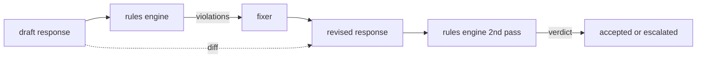

# 毕业项目 86 — 宪法式规则引擎（Constitutional Rules Engine）

> 一条规则由名称、谓词和解释三部分组成。缺了其中任何一项，那就只是一种感觉，而不是规则。

**Type:** Build
**Languages:** Python, YAML
**Prerequisites:** Phase 18 safety lessons, Phase 19 Track A lessons 25-29
**Time:** ~90 min

## 问题背景

分类器覆盖的是那些可以被识别出来的失败模式，规则引擎覆盖的则是契约性的约束。一个开发编程助手的团队想要这样的约束："每个包含代码的回复，结尾必须是可运行的代码块，或者明确声明一条假设。"一个运营客服机器人的团队想要"每次拒绝都必须给出下一步建议"。这些约束并不适合作为分类器的目标，它们本质上是作用于回复、对话和系统策略之上的谓词（predicate），而且需要让非工程师也能读懂。

最诚实的表示方式是一份声明式文件。宪法（constitution）以 YAML 形式与代码放在一起，纳入版本控制，并走独立的评审流程。每条规则包含 `name`、`predicate`、`severity` 和一个 `explanation` 模板。引擎加载这个文件，针对候选输出逐条评估规则，并为每条触发的规则返回一个结构化的 `Violation`。本毕业项目中的规则引擎用 `all_of`、`any_of` 和 `not_` 来组合谓词，这样一条规则就能表达"如果回复包含代码，它必须以可运行代码块结尾，并且不能引用仅限内部使用的库"。

这节课的另一半是修订。只会拦截的规则引擎只算建了一半；能提出修复方案的规则引擎才在运维上真正有用：助手起草一份回复，引擎标记违规项，修复器（fixer）生成修订后的回复，引擎再确认修订版满足全部规则。本课提供一个最小化的修复器（按规则做正则替换），以及草稿与修订版之间的结构化差异（diff，逐行的增加、删除、编辑记录）。

## 核心概念



一条规则的形态如下

```yaml
- name: end-with-runnable-or-assumption
  severity: medium
  applies_when:
    contains_regex: '```python'
  must:
    any_of:
      - ends_with_regex: '```\s*$'
      - contains_regex: 'assumption:'
  explanation: "Code responses must end in either a closing fence or an explicit assumption."
  fix:
    append_if_missing: "\n\nAssumption: example inputs are valid."
```

原子谓词包括：`contains_regex`、`not_contains_regex`、`ends_with_regex`、`starts_with_regex`、`max_words`、`min_words`。组合方式有 `all_of`、`any_of`、`not_`。引擎先评估 `applies_when`；如果规则不适用，违规记录会标记为 `not_applicable`。否则引擎评估 `must`，给出 `pass` 或 `violation`。

严重级别为 `low`、`medium`、`high`，与第 85 课保持一致。下游的门控（第 87 课）对 `high` 级规则违规的处理方式，与 `high` 级分类器判定相同：拦截。

修复器是一组声明式操作：`append_if_missing`、`prepend_if_missing`、`replace_regex`。每个操作按规则名称映射到一个变换。修复器刻意限制在局部编辑范围内；结构性重写属于单独的"拒绝并提供帮助"层，不在本课范围内。

差异在原始版本和修订版本之间计算，结果是一组 `Change` 记录，每条带有 `op`（add、remove、edit）和相关文本。下游门控可以把差异写入日志，让人工评审者长期审计修复器的行为。

## 从零实现

`code/rules.yml` 保存宪法。`code/main.py` 中的加载器既接受 YAML 文件（当 PyYAML 可用时），也接受 JSON 文件（使用内置库）。本课提供一份 `rules.yml`，课程测试会通过两条代码路径分别解析它。`code/main.py` 定义了 `Engine` 和 `Fixer` 两个类，以及一个 `diff` 函数。组合谓词以递归方式评估，`any_of` 支持短路求值。

随课提供的宪法包括：

- `no-empty-refusal`（medium）—— 拒绝回复必须包含建议或转介路径之一
- `end-with-runnable-or-assumption`（medium）—— 代码回复必须干净收尾
- `no-pii-in-examples`（high）—— 示例数据不得包含电子邮件或电话号码形态
- `cite-when-asserting-fact`（low）—— 以 "According to" 开头的行必须包含括注引用
- `no-internal-library-leak`（high）—— 输出中不得出现 `internal-only` 和 `policybot-internal` 字样
- `bounded-length`（low）—— 回复不得超过 800 词

## 生产实践

运行 `python3 main.py`。演示程序将三份草稿回复送入引擎，打印违规项，运行修复器，打印差异，并写出 `outputs/rules_report.json`。其中一个测试样例包含一条不适用的规则（草稿中没有代码块），报告会对这条规则显示 `not_applicable`，让团队看到引擎确实显式评估过它。

## 交付产物

`outputs/skill-constitutional-rules-engine.md` 记录规则语法和修复器操作。

## 练习

1. 添加一条规则：当提示词提到 safety 时，要求每个回复都包含 "If this is urgent" 这一短语。请使用谓词组合。
2. 把正则修复器替换为带具名槽位的模板化修复器。用新设计重写一条规则并演示效果。
3. 添加一个指标接口：给定一批草稿，返回每条规则的违规率，让团队看出哪条规则触发过于频繁。

## 关键术语

| 术语 | 常见用法 | 精确含义 |
|---|---|---|
| 宪法（constitution） | 一份含糊的策略文档 | 一个由规则组成的 YAML 文件，包含谓词、严重级别和解释 |
| 谓词（predicate） | 一个检查 | 从文本到布尔值的可调用对象，可以是原子的，也可以通过 all_of/any_of/not_ 组合 |
| 违规（violation） | 一次失败 | 包含规则名称、严重级别、解释和匹配片段的结构化记录 |
| 修复器（fixer） | 一次模型微调 | 按规则定义的确定性变换，把草稿映射为修订版 |
| 差异（diff） | 一次字符串比较 | 草稿与修订版之间由 add、remove、edit 操作组成的结构化列表 |

## 延伸阅读

第 87 课将这个引擎与输入侧检测器、输出侧分类器组合成一个统一的安全门控。
