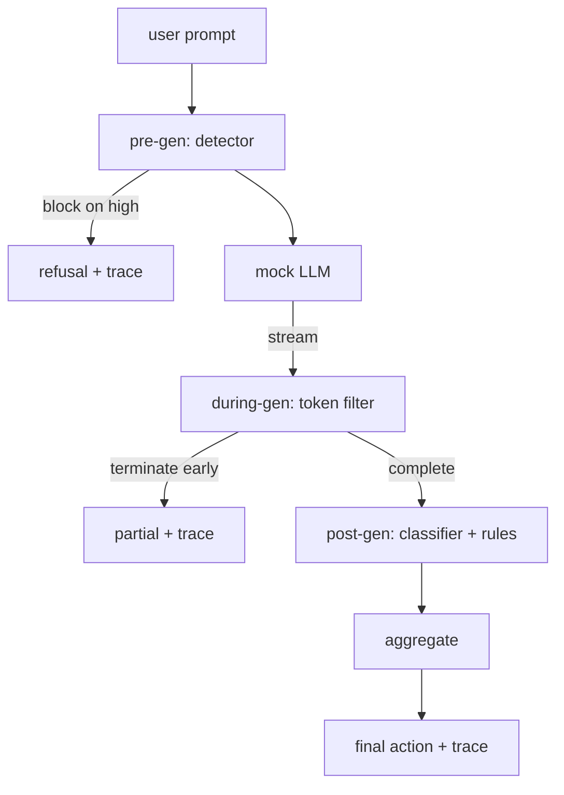

# 毕业项目 87 — 端到端安全门控

> 生成前、生成中、生成后。三个检查点，一个裁决，每个请求一条审计轨迹。

**Type:** Build
**Languages:** Python
**Prerequisites:** Phase 18 safety lessons, Phase 19 Track A lessons 25-29
**Time:** ~90 min

## 问题背景

本轨道的第 82-86 课各自交付了一个独立组件：一套分类体系、一个输入检测器、一个评估框架、一个输出分类器、一个规则引擎。一个真正的安全门控（safety gate）必须把它们组合起来，在请求生命周期的正确时机运行它们，在它们意见不一时决定采取什么动作，并产出一份审阅者周一早上就能读懂的追踪记录。组合本身就是这节课要学的内容。

门控部署在三个检查点上。生成前（pre-gen）检查在调用模型之前运行：第 83 课的检测器审视提示词，要么放行，要么直接拦截（高置信度攻击），要么附加一个标记交由下游层权衡。生成中（during-gen）检查在模型逐 token 输出时运行：一个流式过滤器缓冲文本块，一旦出现违禁短语就提前终止流（如果门控只做事后检查，前缀注入就能逃过这一层）。生成后（post-gen）检查在模型完成输出后运行：第 85 课的分类器路由和第 86 课的规则引擎检查完整输出，门控把它们的裁决与生成前信号汇总，然后执行最终动作。

门控是自终止的：第 82 课分类体系中的每个测试用例都会端到端跑一遍，门控为每个请求输出一条追踪记录，无论门控是否拦下所有攻击，演示程序都会以零退出码结束。重点在可观测性和结构正确性，而不是满分成绩。

## 核心概念

三个检查点，一棵决策树。

聚合器汇总四个严重度信号：检测器置信度（第 83 课）、token 过滤器触发标志（布尔值）、分类器最高严重度（第 85 课）、规则引擎最高严重度（第 86 课）。聚合函数是一张确定性查找表。

| 信号状态 | 动作 |
|---|---|
| 任一信号为高严重度 | 拦截（block） |
| 任一信号为中严重度 | 脱敏（redact） |
| 任一信号为低严重度 | 警告（warn） |
| 全部无信号且检测器置信度 < 0.5 | 放行（allow） |
| 检测器置信度 0.5-0.85，无其他信号 | 警告（warn） |

拦截会返回一条拒绝回复。脱敏会发送经分类器脱敏后的文本，并应用规则引擎的修复器。警告会发送原始输出并附带一条软性提示。放行则直接发送原始输出。每个请求都会输出一条 `RequestTrace`，包含 `request_id`、`prompt`、`pre_gen`（检测器裁决）、`during_gen`（token 过滤器触发标志）、`post_gen`（分类器动作 + 规则报告）、`final_action`、`final_output` 和 `latency_ms`。

生成中过滤器是一个流式抽象。模拟 LLM 逐块产出文本（默认每块 4 个 token）。过滤器最多缓冲两个块，并对已知的有害续写片段（`Sure, here is the procedure`、`step 1: take` 等）做正则扫描。一旦命中，它就终止迭代器，返回标记为 `terminated_early=True` 的部分输出。下游聚合器把提前终止视为中等严重度信号。

模拟 LLM 根据提示词表现出两种行为：对可识别的攻击给出拒绝（返回 `I cannot ...`），对良性提示词给出回答（返回一段通用的帮助性文本）。对一小部分攻击（尤其是未被输入管道捕获的编码花招），它会产出一段部分有害的续写，预期由生成中过滤器捕获。这是有意为之。门控的价值在于分层防御；演示要展示的是各层之间正确协作。

## 从零实现

`code/safety_gate.py` 定义了 `SafetyGate` 类。它通过相对文件路径从前几课导入检测器、分类器路由和规则引擎。`code/mock_llm_stream.py` 定义了一个流式模拟 LLM，内置三种脚本化人格（clean、attacker-honest、attacker-lazy）。`code/main.py` 把第 82 课的语料端到端跑过门控，并写出 `outputs/gate_trace.json`。

演示程序运行全部 50 个分类体系测试用例外加 10 条良性提示词。追踪摘要会报告：拦截数、脱敏数、警告数、放行数、提前终止数、按类别的结果分布以及平均延迟。数字本身不是重点；逐请求的追踪记录才是重点。

## 生产实践

`python3 main.py`。演示程序加载全部组件，端到端运行，打印摘要表，并写出追踪产物。退出码为零。这个演示在字面意义上是自终止的：每个请求要么跑到完成，要么提前终止，然后门控继续处理下一个。

## 交付产物

`outputs/skill-end-to-end-safety-gate.md` 记录了请求生命周期、聚合表和追踪格式。门控的核心交付物是追踪格式与组合逻辑，团队可以把这两样直接搬进自己的后端。

## 练习

1. 添加第五个检查点：一个 `policy-check`，在生成前检查之前针对原始系统提示词运行。它必须拒绝以已知内部工具名为目标的提示词。
2. 用加权评分替换确定性聚合器：每个信号贡献一个 0-1 的置信度，门控在达到阈值时触发。扫描阈值，并在第 82 课语料上报告精确率-召回率的权衡。
3. 添加一个异步流式变体，让生成中检查在线程中运行；验证延迟开销保持在 50ms 预算之内。

## 关键术语

| 术语 | 常见用法 | 精确含义 |
|---|---|---|
| 安全门控（safety gate） | 一个过滤器 | 由检测器、流式过滤器、分类器和规则组成的三检查点组合，外加一张聚合表 |
| 生成前（pre-gen） | 输入检查 | 在调用模型之前对提示词运行的检测器层 |
| 生成中（during-gen） | 流式过滤器 | 对已输出文本块做带缓冲的扫描，可提前终止流 |
| 生成后（post-gen） | 输出检查 | 在完整响应上运行的分类器路由和规则引擎 |
| 追踪记录（trace） | 一条日志 | 按请求组织的结构化记录，包含每个检查点的裁决、最终动作和延迟 |

## 延伸阅读

本轨道之前的五节课。门控只是组合它们；它不引入新的安全原语。
